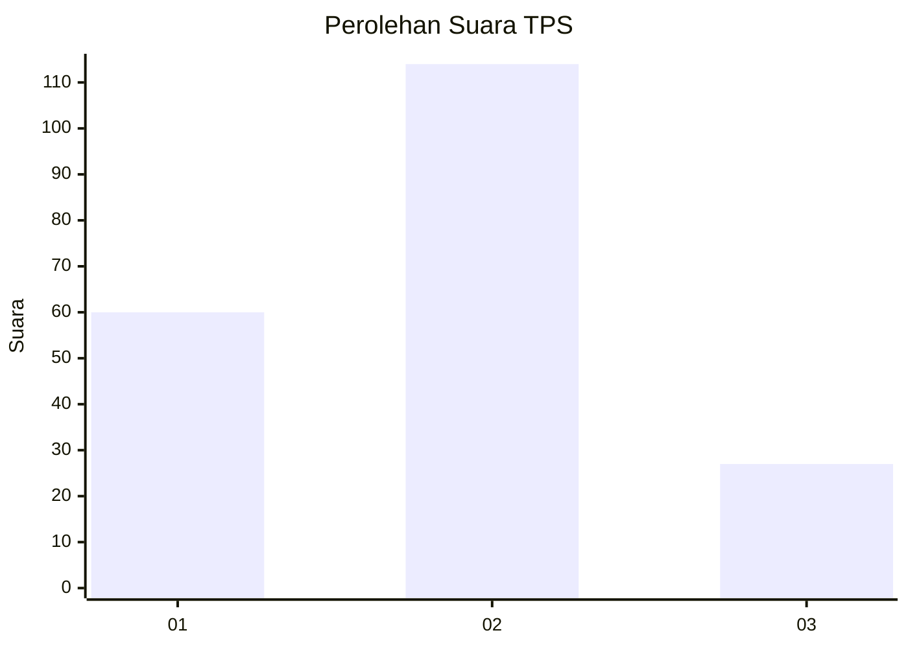
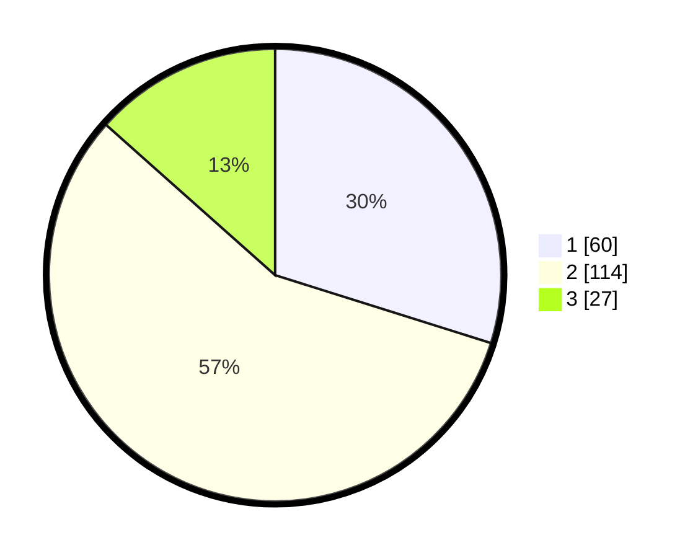

# Hasil

## Grafik

## Tabel

| No. | Nama Paslon    | Suara | Suara (raw) | Persentase |
|:--- |:-------------- | -----:| -----------:| ----------:|
| 1   | ANIES MUHAIMIN | 60    | [60][p-1]   | 29,85      |
| 2   | PRABOWO GIBRAN | 114   | [114][p-2]  | 56,72      |
| 3   | GANJAR MAHFUD  | 27    | [27][p-3]   | 13,43      |

[p-1]: https://github.com/gigit-pemilu/pemilu-2024-16-sumatera-selatan/blob/main/pilpres/hitung-suara/sub/16-sumatera-selatan/sub/07-banyuasin/sub/01-banyuasin-i/sub/1016-mariana/sub/003-tps/sub/paslon-1.txt
[p-2]: https://github.com/gigit-pemilu/pemilu-2024-16-sumatera-selatan/blob/main/pilpres/hitung-suara/sub/16-sumatera-selatan/sub/07-banyuasin/sub/01-banyuasin-i/sub/1016-mariana/sub/003-tps/sub/paslon-2.txt
[p-3]: https://github.com/gigit-pemilu/pemilu-2024-16-sumatera-selatan/blob/main/pilpres/hitung-suara/sub/16-sumatera-selatan/sub/07-banyuasin/sub/01-banyuasin-i/sub/1016-mariana/sub/003-tps/sub/paslon-3.txt

## Foto C Plano

https://sirekap-obj-formc.kpu.go.id/684c/pemilu/ppwp/16/07/01/10/16/1607011016003-20240215-032851--8b4908dd-3321-4afc-9a70-da77f56577b4.jpg

https://sirekap-obj-formc.kpu.go.id/684c/pemilu/ppwp/16/07/01/10/16/1607011016003-20240215-032853--49f5409f-ae6f-409b-b83d-fa91a8583802.jpg

https://sirekap-obj-formc.kpu.go.id/684c/pemilu/ppwp/16/07/01/10/16/1607011016003-20240215-032848--30ba6889-127a-4870-b3c5-f53d07f8a310.jpg

## Metadata

| Key        | Value               |
| ---------- | ------------------- |
| Time Stamp | 2024-02-15 15:00:29 |

