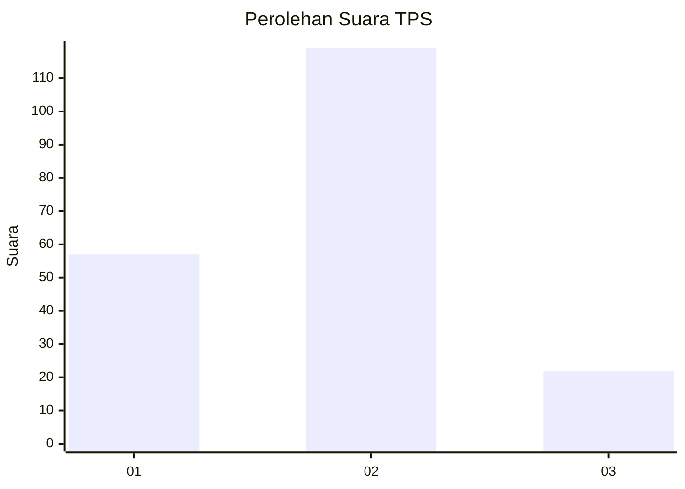
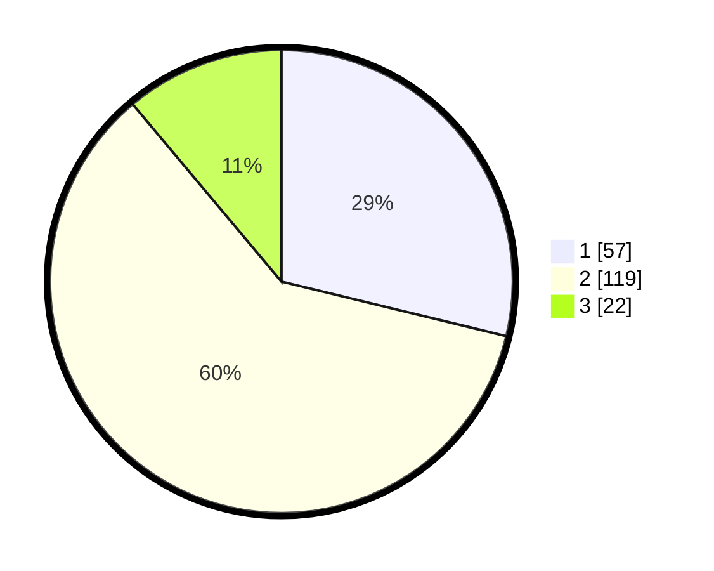

# Hasil

## Grafik

## Tabel

| No. | Nama Paslon    | Suara | Suara (raw) | Persentase |
|:--- |:-------------- | -----:| -----------:| ----------:|
| 1   | ANIES MUHAIMIN | 57    | [57][p-1]   | 28,79      |
| 2   | PRABOWO GIBRAN | 119   | [119][p-2]  | 60,10      |
| 3   | GANJAR MAHFUD  | 22    | [22][p-3]   | 11,11      |

[p-1]: https://github.com/gigit-pemilu/pemilu-2024-16-sumatera-selatan/blob/main/pilpres/hitung-suara/sub/16-sumatera-selatan/sub/07-banyuasin/sub/01-banyuasin-i/sub/1016-mariana/sub/004-tps/sub/paslon-1.txt
[p-2]: https://github.com/gigit-pemilu/pemilu-2024-16-sumatera-selatan/blob/main/pilpres/hitung-suara/sub/16-sumatera-selatan/sub/07-banyuasin/sub/01-banyuasin-i/sub/1016-mariana/sub/004-tps/sub/paslon-2.txt
[p-3]: https://github.com/gigit-pemilu/pemilu-2024-16-sumatera-selatan/blob/main/pilpres/hitung-suara/sub/16-sumatera-selatan/sub/07-banyuasin/sub/01-banyuasin-i/sub/1016-mariana/sub/004-tps/sub/paslon-3.txt

## Foto C Plano

https://sirekap-obj-formc.kpu.go.id/1345/pemilu/ppwp/16/07/01/10/16/1607011016004-20240222-195235--2397fc5c-8494-452b-a94d-f9d3a29d6540.jpg

https://sirekap-obj-formc.kpu.go.id/1345/pemilu/ppwp/16/07/01/10/16/1607011016004-20240215-002812--213ee8ca-69d7-401c-a341-6ab86eeffda6.jpg

https://sirekap-obj-formc.kpu.go.id/1345/pemilu/ppwp/16/07/01/10/16/1607011016004-20240215-002833--7519bf28-9c98-4b81-b64f-1a7baeddab76.jpg

## Metadata

| Key        | Value               |
| ---------- | ------------------- |
| Time Stamp | 2024-02-22 20:00:00 |

