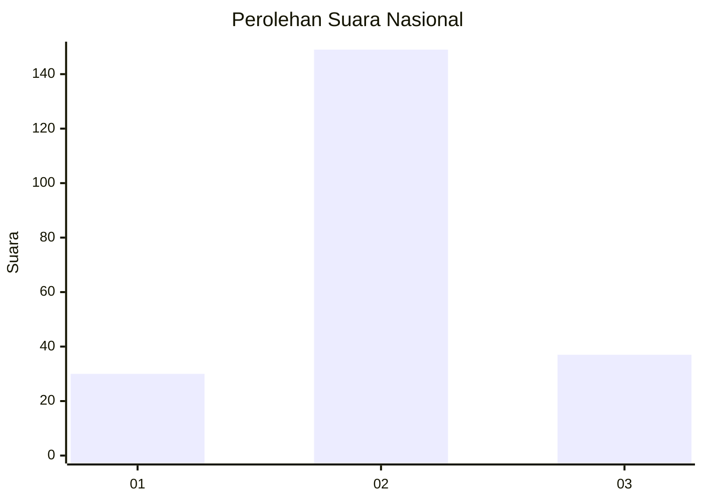
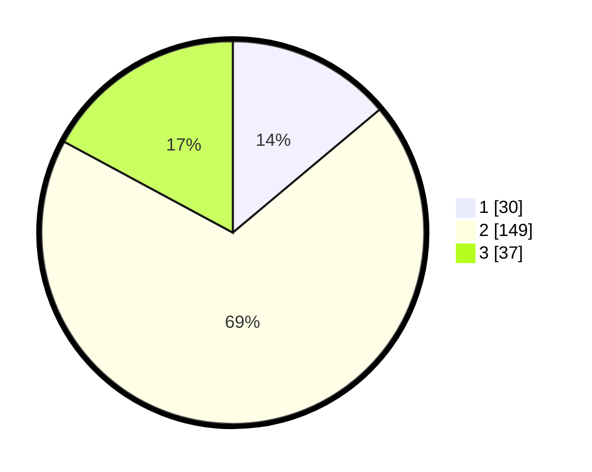

# Hasil

## Grafik

## Tabel

| No. | Nama Paslon    | Suara | Suara (raw) | Persentase |
|:--- |:-------------- | -----:| -----------:| ----------:|
| 1   | ANIES MUHAIMIN | 30    | [30][p-1]   | 13,89      |
| 2   | PRABOWO GIBRAN | 149   | [149][p-2]  | 68,98      |
| 3   | GANJAR MAHFUD  | 37    | [37][p-3]   | 17,13      |

[p-1]: https://github.com/gigit-pemilu/pemilu-2024/blob/main/pilpres/hitung-suara/sub/16-sumatera-selatan/sub/07-banyuasin/sub/01-banyuasin-i/sub/2002-sungai-gerong/sub/004-tps/sub/paslon-1.txt
[p-2]: https://github.com/gigit-pemilu/pemilu-2024/blob/main/pilpres/hitung-suara/sub/16-sumatera-selatan/sub/07-banyuasin/sub/01-banyuasin-i/sub/2002-sungai-gerong/sub/004-tps/sub/paslon-2.txt
[p-3]: https://github.com/gigit-pemilu/pemilu-2024/blob/main/pilpres/hitung-suara/sub/16-sumatera-selatan/sub/07-banyuasin/sub/01-banyuasin-i/sub/2002-sungai-gerong/sub/004-tps/sub/paslon-3.txt

## Foto C Plano

https://sirekap-obj-formc.kpu.go.id/9a9b/pemilu/ppwp/16/07/01/20/02/1607012002004-20240214-205813--8238fd64-6f01-4bea-87dc-ff89dea2c99d.jpg

https://sirekap-obj-formc.kpu.go.id/9a9b/pemilu/ppwp/16/07/01/20/02/1607012002004-20240214-205932--f867b6ca-5953-4be4-b05e-6983571d07ab.jpg

https://sirekap-obj-formc.kpu.go.id/9a9b/pemilu/ppwp/16/07/01/20/02/1607012002004-20240214-210030--93313c06-f55b-4d27-9330-1c1e1e0f04f4.jpg

## Metadata

| Key        | Value               |
| ---------- | ------------------- |
| Time Stamp | 2024-02-15 15:30:25 |

