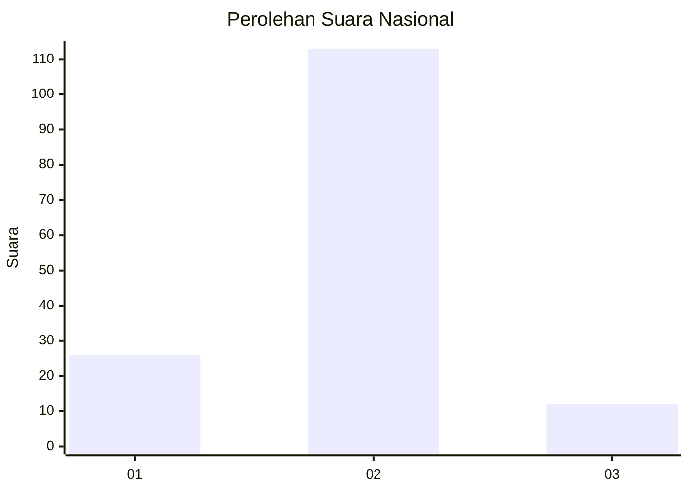
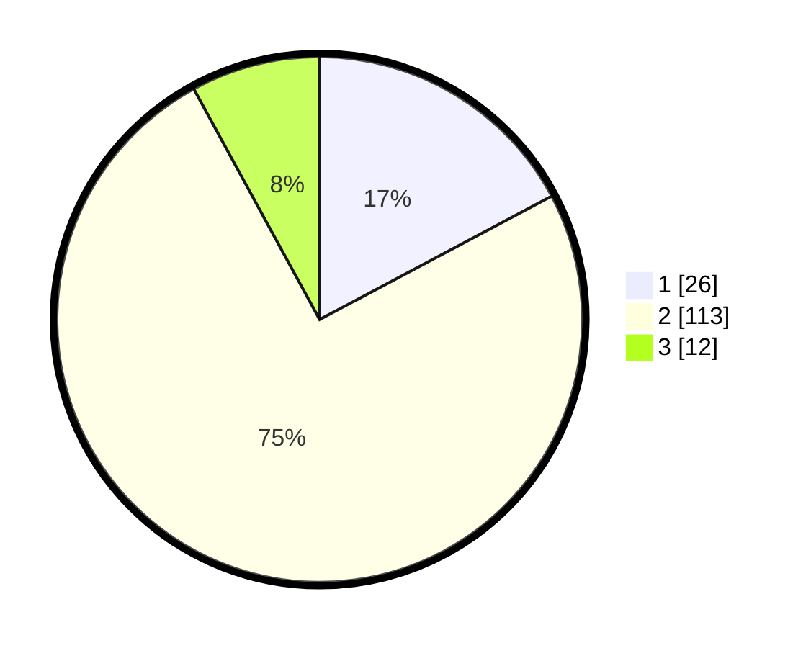

# Hasil

## Grafik

## Tabel

| No. | Nama Paslon    | Suara | Suara (raw) | Persentase |
|:--- |:-------------- | -----:| -----------:| ----------:|
| 1   | ANIES MUHAIMIN | 26    | [26][p-1]   | 17,22      |
| 2   | PRABOWO GIBRAN | 113   | [113][p-2]  | 74,83      |
| 3   | GANJAR MAHFUD  | 12    | [12][p-3]   | 7,95       |

[p-1]: https://github.com/gigit-pemilu/pemilu-2024/blob/main/pilpres/hitung-suara/sub/16-sumatera-selatan/sub/07-banyuasin/sub/01-banyuasin-i/sub/2003-merah-mata/sub/021-tps/sub/paslon-1.txt
[p-2]: https://github.com/gigit-pemilu/pemilu-2024/blob/main/pilpres/hitung-suara/sub/16-sumatera-selatan/sub/07-banyuasin/sub/01-banyuasin-i/sub/2003-merah-mata/sub/021-tps/sub/paslon-2.txt
[p-3]: https://github.com/gigit-pemilu/pemilu-2024/blob/main/pilpres/hitung-suara/sub/16-sumatera-selatan/sub/07-banyuasin/sub/01-banyuasin-i/sub/2003-merah-mata/sub/021-tps/sub/paslon-3.txt

## Foto C Plano

https://sirekap-obj-formc.kpu.go.id/d63c/pemilu/ppwp/16/07/01/20/03/1607012003021-20240214-212552--fe893887-1336-406e-ac52-45458ad3b847.jpg

https://sirekap-obj-formc.kpu.go.id/d63c/pemilu/ppwp/16/07/01/20/03/1607012003021-20240215-020946--d18159c1-98de-4a73-94a2-4b49d7ff2a41.jpg

https://sirekap-obj-formc.kpu.go.id/d63c/pemilu/ppwp/16/07/01/20/03/1607012003021-20240215-020948--e6d1fbe0-c8f8-4dee-b898-13754a052e34.jpg

## Metadata

| Key        | Value               |
| ---------- | ------------------- |
| Time Stamp | 2024-02-15 23:29:50 |

