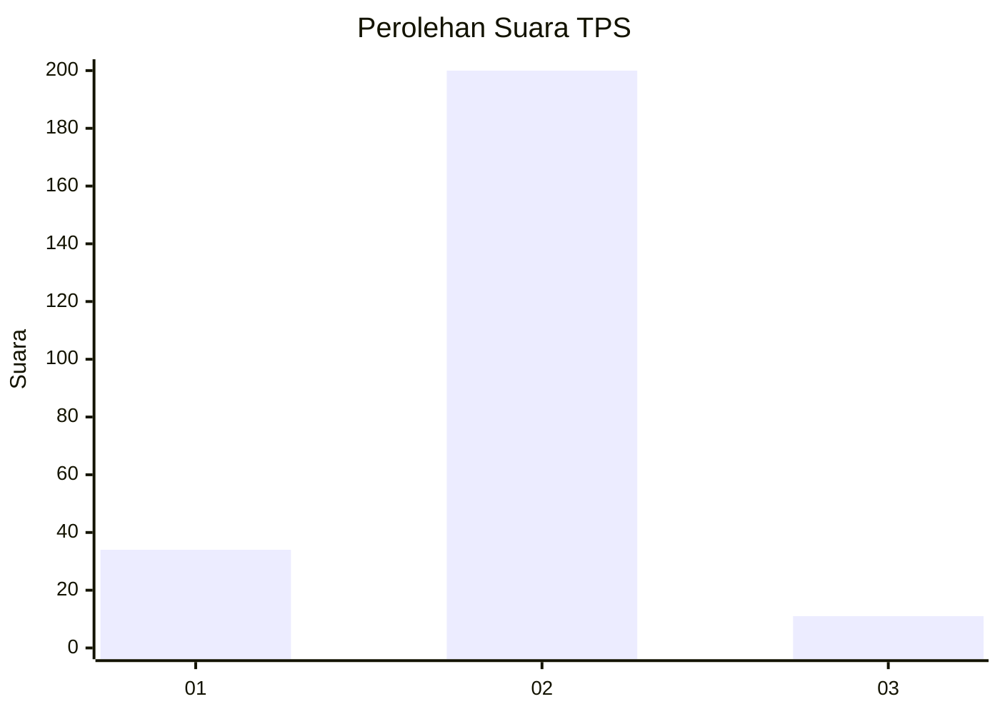
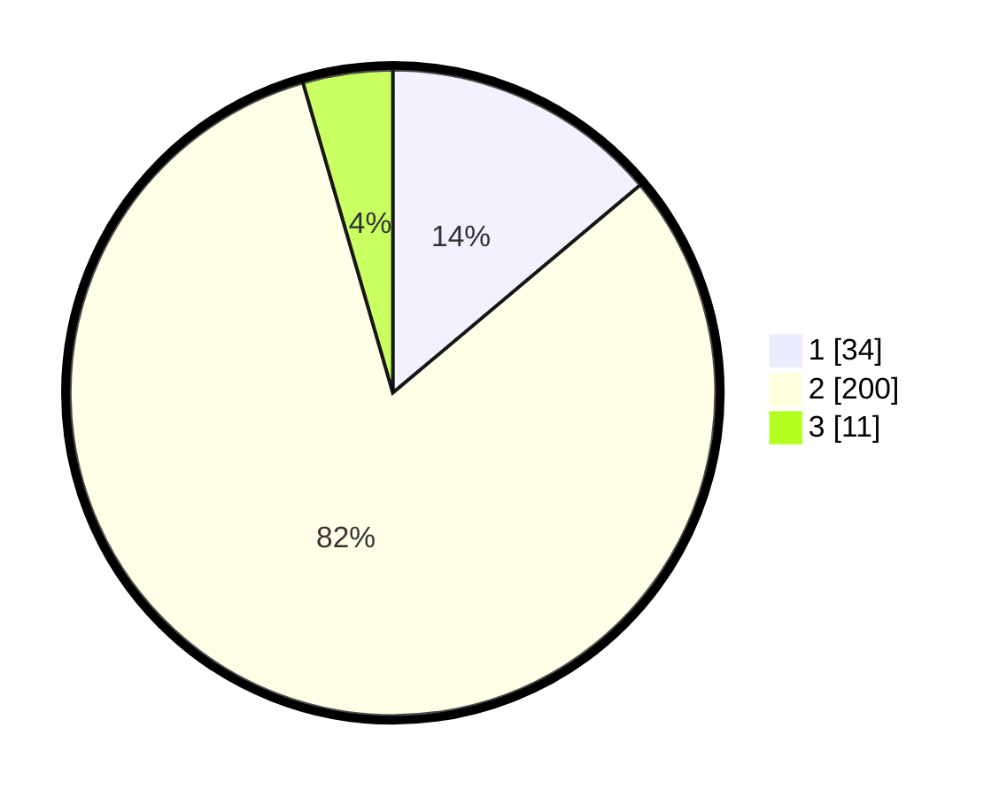

# Hasil

## Grafik

## Tabel

| No. | Nama Paslon    | Suara | Suara (raw) | Persentase |
|:--- |:-------------- | -----:| -----------:| ----------:|
| 1   | ANIES MUHAIMIN | 34    | [34][p-1]   | 13,88      |
| 2   | PRABOWO GIBRAN | 200   | [200][p-2]  | 81,63      |
| 3   | GANJAR MAHFUD  | 11    | [11][p-3]   | 4,49       |

[p-1]: https://github.com/gigit-pemilu/pemilu-2024-16-sumatera-selatan/blob/main/pilpres/hitung-suara/sub/16-sumatera-selatan/sub/07-banyuasin/sub/01-banyuasin-i/sub/2005-cinta-manis-lama/sub/002-tps/sub/paslon-1.txt
[p-2]: https://github.com/gigit-pemilu/pemilu-2024-16-sumatera-selatan/blob/main/pilpres/hitung-suara/sub/16-sumatera-selatan/sub/07-banyuasin/sub/01-banyuasin-i/sub/2005-cinta-manis-lama/sub/002-tps/sub/paslon-2.txt
[p-3]: https://github.com/gigit-pemilu/pemilu-2024-16-sumatera-selatan/blob/main/pilpres/hitung-suara/sub/16-sumatera-selatan/sub/07-banyuasin/sub/01-banyuasin-i/sub/2005-cinta-manis-lama/sub/002-tps/sub/paslon-3.txt

## Foto C Plano

https://sirekap-obj-formc.kpu.go.id/7880/pemilu/ppwp/16/07/01/20/05/1607012005002-20240215-131758--e621e033-d239-4b0a-98b5-876a8b5e9bb5.jpg

https://sirekap-obj-formc.kpu.go.id/7880/pemilu/ppwp/16/07/01/20/05/1607012005002-20240215-131827--0fece2ec-68a3-4c72-b97b-dabb4fd26ae9.jpg

https://sirekap-obj-formc.kpu.go.id/7880/pemilu/ppwp/16/07/01/20/05/1607012005002-20240215-131851--3a5be5be-e220-4645-8d2c-da855352f598.jpg

## Metadata

| Key        | Value               |
| ---------- | ------------------- |
| Time Stamp | 2024-02-15 17:30:25 |

