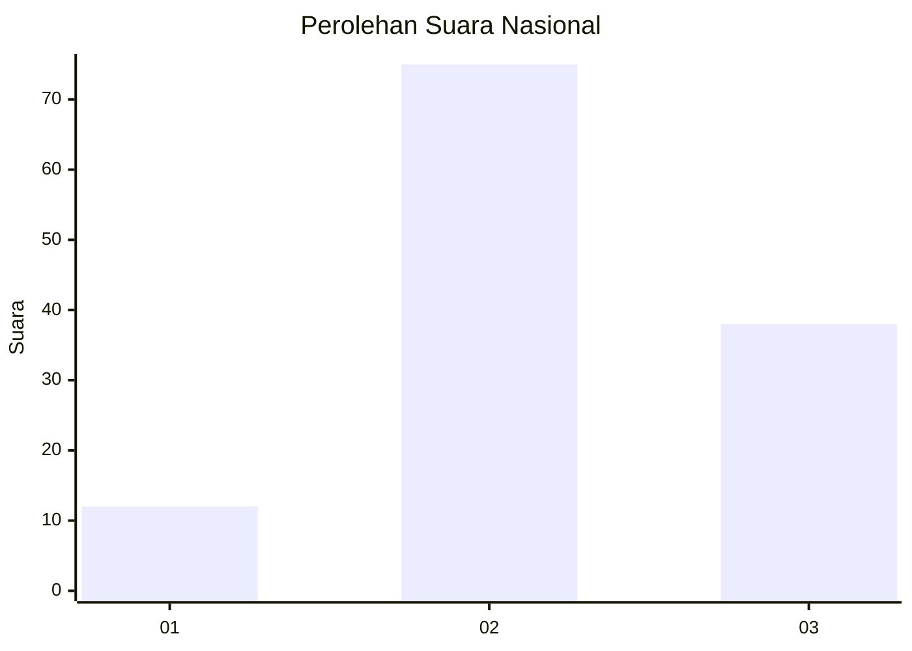
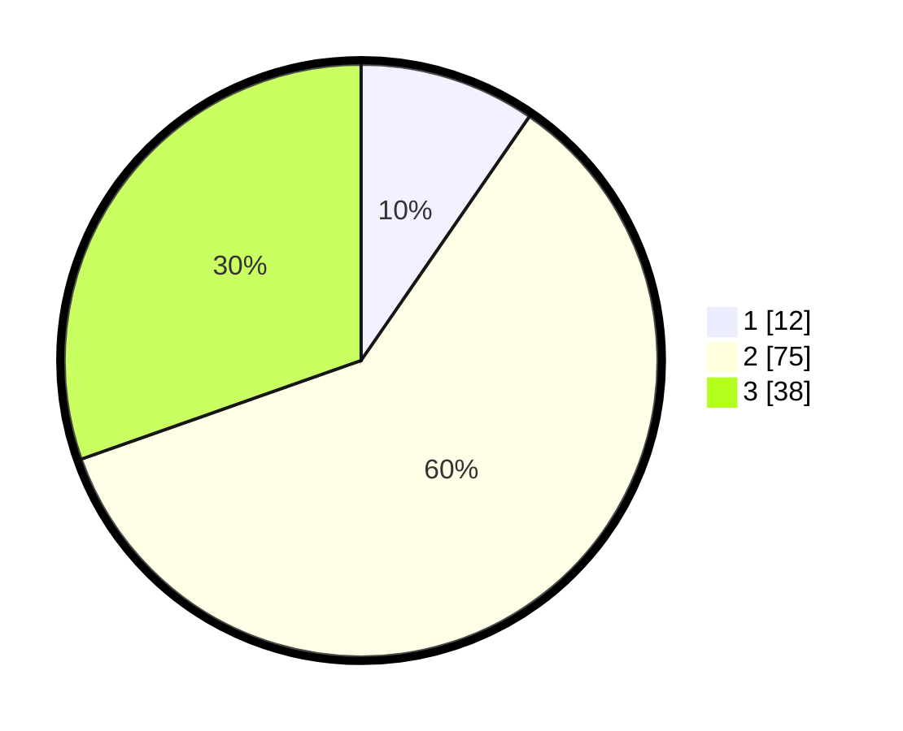

# Hasil

## Grafik

## Tabel

| No. | Nama Paslon    | Suara | Suara (raw) | Persentase |
|:--- |:-------------- | -----:| -----------:| ----------:|
| 1   | ANIES MUHAIMIN | 12    | [12][p-1]   | 9,60       |
| 2   | PRABOWO GIBRAN | 75    | [75][p-2]   | 60,00      |
| 3   | GANJAR MAHFUD  | 38    | [38][p-3]   | 30,40      |

[p-1]: https://github.com/gigit-pemilu/pemilu-2024/blob/main/pilpres/hitung-suara/sub/16-sumatera-selatan/sub/07-banyuasin/sub/01-banyuasin-i/sub/2005-cinta-manis-lama/sub/007-tps/sub/paslon-1.txt
[p-2]: https://github.com/gigit-pemilu/pemilu-2024/blob/main/pilpres/hitung-suara/sub/16-sumatera-selatan/sub/07-banyuasin/sub/01-banyuasin-i/sub/2005-cinta-manis-lama/sub/007-tps/sub/paslon-2.txt
[p-3]: https://github.com/gigit-pemilu/pemilu-2024/blob/main/pilpres/hitung-suara/sub/16-sumatera-selatan/sub/07-banyuasin/sub/01-banyuasin-i/sub/2005-cinta-manis-lama/sub/007-tps/sub/paslon-3.txt

## Foto C Plano

https://sirekap-obj-formc.kpu.go.id/d9c5/pemilu/ppwp/16/07/01/20/05/1607012005007-20240215-000522--ab5b8f0b-54cb-43bb-9656-de78b372503d.jpg

https://sirekap-obj-formc.kpu.go.id/d9c5/pemilu/ppwp/16/07/01/20/05/1607012005007-20240215-000323--bf8e73ab-174b-4001-85a8-efb73b65c4a9.jpg

https://sirekap-obj-formc.kpu.go.id/d9c5/pemilu/ppwp/16/07/01/20/05/1607012005007-20240215-000139--8cfef5ea-3382-42f5-8cf8-45076c784ea5.jpg

## Metadata

| Key        | Value               |
| ---------- | ------------------- |
| Time Stamp | 2024-02-15 23:29:50 |

