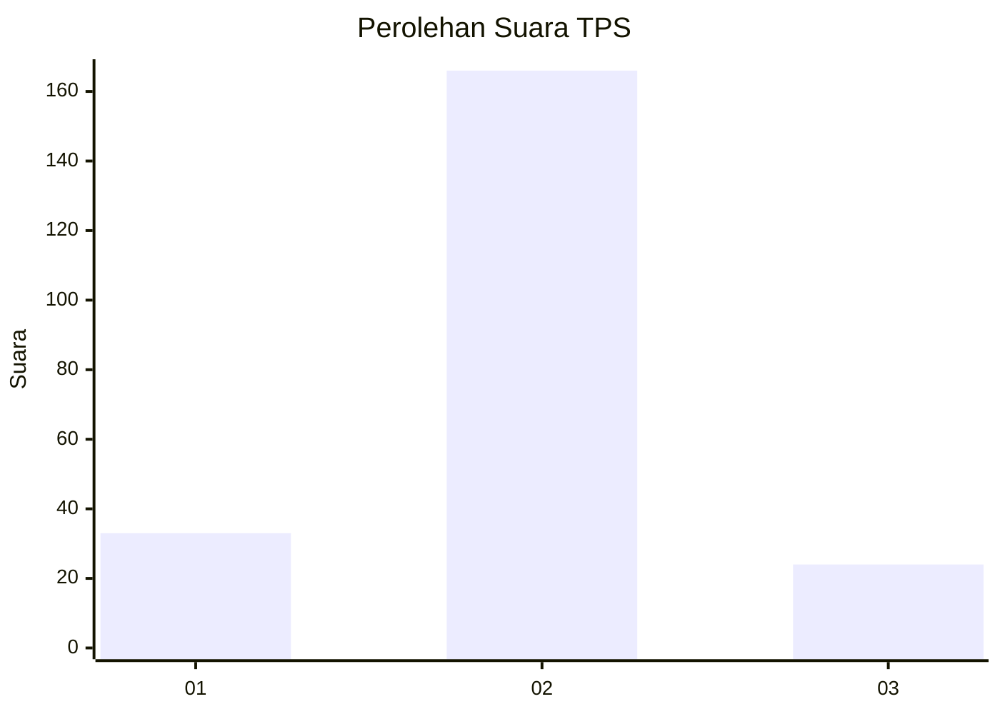
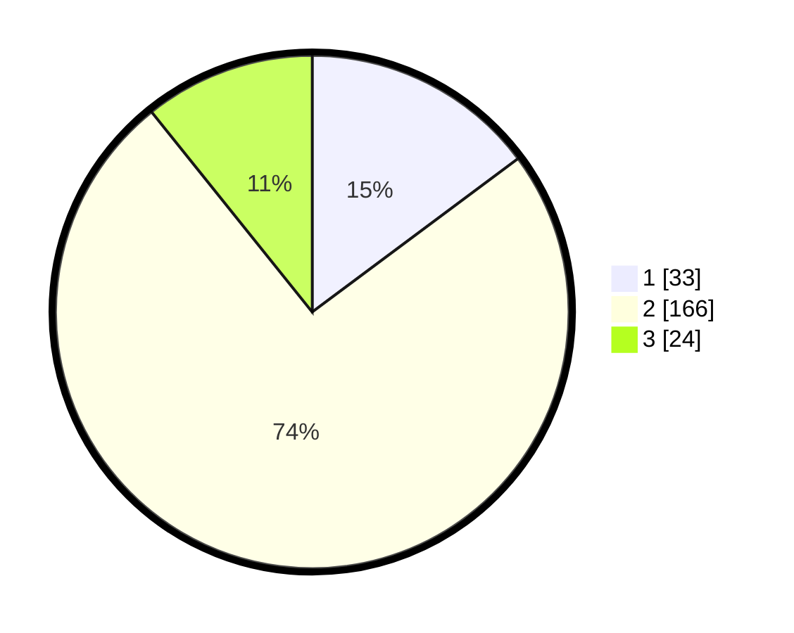

# Hasil

## Grafik

## Tabel

| No. | Nama Paslon    | Suara | Suara (raw) | Persentase |
|:--- |:-------------- | -----:| -----------:| ----------:|
| 1   | ANIES MUHAIMIN | 33    | [33][p-1]   | 14,80      |
| 2   | PRABOWO GIBRAN | 166   | [166][p-2]  | 74,44      |
| 3   | GANJAR MAHFUD  | 24    | [24][p-3]   | 10,76      |

[p-1]: https://github.com/gigit-pemilu/pemilu-2024-16-sumatera-selatan/blob/main/pilpres/hitung-suara/sub/16-sumatera-selatan/sub/07-banyuasin/sub/01-banyuasin-i/sub/2008-perambahan/sub/002-tps/sub/paslon-1.txt
[p-2]: https://github.com/gigit-pemilu/pemilu-2024-16-sumatera-selatan/blob/main/pilpres/hitung-suara/sub/16-sumatera-selatan/sub/07-banyuasin/sub/01-banyuasin-i/sub/2008-perambahan/sub/002-tps/sub/paslon-2.txt
[p-3]: https://github.com/gigit-pemilu/pemilu-2024-16-sumatera-selatan/blob/main/pilpres/hitung-suara/sub/16-sumatera-selatan/sub/07-banyuasin/sub/01-banyuasin-i/sub/2008-perambahan/sub/002-tps/sub/paslon-3.txt

## Foto C Plano

https://sirekap-obj-formc.kpu.go.id/22fd/pemilu/ppwp/16/07/01/20/08/1607012008002-20240214-210015--3cc021f9-7d72-41b1-b304-1cf8174b9d1a.jpg

https://sirekap-obj-formc.kpu.go.id/22fd/pemilu/ppwp/16/07/01/20/08/1607012008002-20240214-210156--6163335b-e159-470e-9c42-6a38f5344a78.jpg

https://sirekap-obj-formc.kpu.go.id/22fd/pemilu/ppwp/16/07/01/20/08/1607012008002-20240214-210257--031618ce-2903-445b-a0fd-95161f442a85.jpg

## Metadata

| Key        | Value               |
| ---------- | ------------------- |
| Time Stamp | 2024-02-15 18:00:26 |

## DATA PEMILIH TETAP

Jumlah pemilih dalam DPT: **225**.
 * L: **131**.
 * P: **124**.

## DATA PENGGUNA HAK PILIH

Jumlah pengguna hak pilih dalam DPT: **755**.
 * L: **121**.
 * P: **124**.

Jumlah pengguna hak pilih dalam DPTb: **550**.
 * L: **50**.
 * P: **0**.

Jumlah pengguna hak pilih dalam DPK: **502**.
 * L: **50**.
 * P: **0**.

Jumlah pengguna hak pilih: **255**.
 * L: **22**.
 * P: **0**.

## JUMLAH SUARA SAH DAN TIDAK SAH

JUMLAH SELURUH SUARA SAH: **223**.

JUMLAH SUARA TIDAK SAH: **2**.

JUMLAH SELURUH SUARA SAH DAN SUARA TIDAK SAH: **225**.

