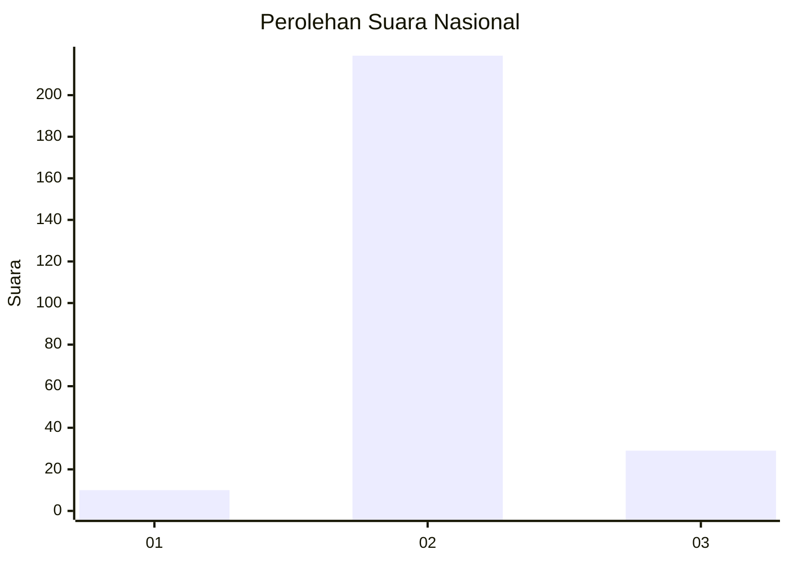
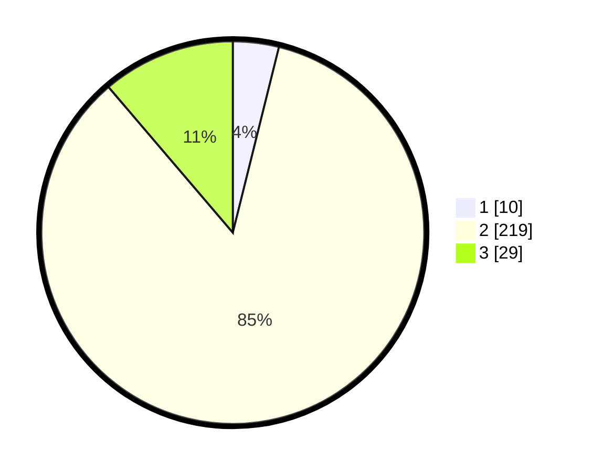

# Hasil

## Grafik

## Tabel

| No. | Nama Paslon    | Suara | Suara (raw) | Persentase |
|:--- |:-------------- | -----:| -----------:| ----------:|
| 1   | ANIES MUHAIMIN | 10    | [10][p-1]   | 3,88       |
| 2   | PRABOWO GIBRAN | 219   | [219][p-2]  | 84,88      |
| 3   | GANJAR MAHFUD  | 29    | [29][p-3]   | 11,24      |

[p-1]: https://github.com/gigit-pemilu/pemilu-2024/blob/main/pilpres/hitung-suara/sub/16-sumatera-selatan/sub/07-banyuasin/sub/01-banyuasin-i/sub/2014-pulauborang/sub/014-tps/sub/paslon-1.txt
[p-2]: https://github.com/gigit-pemilu/pemilu-2024/blob/main/pilpres/hitung-suara/sub/16-sumatera-selatan/sub/07-banyuasin/sub/01-banyuasin-i/sub/2014-pulauborang/sub/014-tps/sub/paslon-2.txt
[p-3]: https://github.com/gigit-pemilu/pemilu-2024/blob/main/pilpres/hitung-suara/sub/16-sumatera-selatan/sub/07-banyuasin/sub/01-banyuasin-i/sub/2014-pulauborang/sub/014-tps/sub/paslon-3.txt

## Foto C Plano

https://sirekap-obj-formc.kpu.go.id/d1f9/pemilu/ppwp/16/07/01/20/14/1607012014014-20240215-004255--d3dfde2e-f7e5-4839-aa8c-089e53643713.jpg

https://sirekap-obj-formc.kpu.go.id/d1f9/pemilu/ppwp/16/07/01/20/14/1607012014014-20240215-013544--0ac6768e-5622-4a02-a8d7-bc7c3037f374.jpg

https://sirekap-obj-formc.kpu.go.id/d1f9/pemilu/ppwp/16/07/01/20/14/1607012014014-20240215-005739--581c7646-fa6e-4c42-90f9-cbc8bd5aa58f.jpg

## Metadata

| Key        | Value               |
| ---------- | ------------------- |
| Time Stamp | 2024-02-15 16:00:26 |

