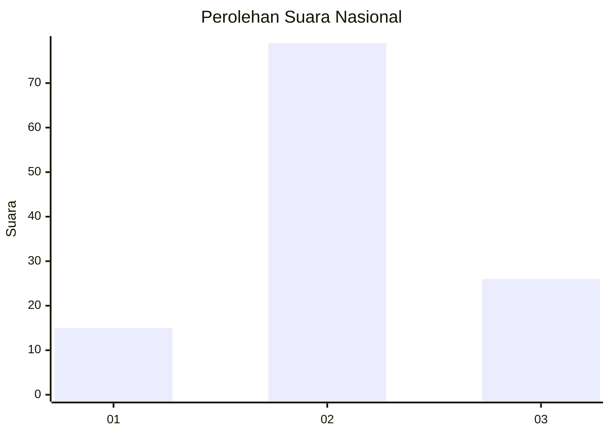
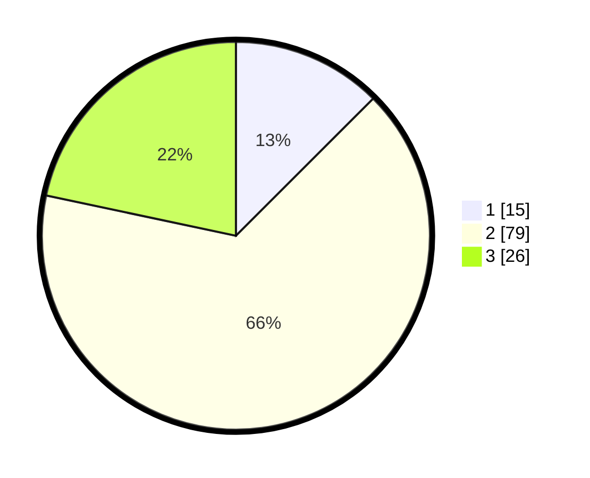

# Hasil

## Grafik

## Tabel

| No. | Nama Paslon    | Suara | Suara (raw) | Persentase |
|:--- |:-------------- | -----:| -----------:| ----------:|
| 1   | ANIES MUHAIMIN | 15    | [15][p-1]   | 12,50      |
| 2   | PRABOWO GIBRAN | 79    | [79][p-2]   | 65,83      |
| 3   | GANJAR MAHFUD  | 26    | [26][p-3]   | 21,67      |

[p-1]: https://github.com/gigit-pemilu/pemilu-2024/blob/main/pilpres/hitung-suara/sub/16-sumatera-selatan/sub/07-banyuasin/sub/01-banyuasin-i/sub/2025-perambahan-baru/sub/002-tps/sub/paslon-1.txt
[p-2]: https://github.com/gigit-pemilu/pemilu-2024/blob/main/pilpres/hitung-suara/sub/16-sumatera-selatan/sub/07-banyuasin/sub/01-banyuasin-i/sub/2025-perambahan-baru/sub/002-tps/sub/paslon-2.txt
[p-3]: https://github.com/gigit-pemilu/pemilu-2024/blob/main/pilpres/hitung-suara/sub/16-sumatera-selatan/sub/07-banyuasin/sub/01-banyuasin-i/sub/2025-perambahan-baru/sub/002-tps/sub/paslon-3.txt

## Foto C Plano

https://sirekap-obj-formc.kpu.go.id/d981/pemilu/ppwp/16/07/01/20/25/1607012025002-20240215-102204--5d7e7ff9-4c38-4e79-9927-628c50c23214.jpg

https://sirekap-obj-formc.kpu.go.id/d981/pemilu/ppwp/16/07/01/20/25/1607012025002-20240215-000046--29ec094d-faf6-45eb-863a-4ac58f97f344.jpg

https://sirekap-obj-formc.kpu.go.id/d981/pemilu/ppwp/16/07/01/20/25/1607012025002-20240215-000121--ae6ed0ba-2609-4de5-95ec-a5f434cdff30.jpg

## Metadata

| Key        | Value               |
| ---------- | ------------------- |
| Time Stamp | 2024-02-15 21:30:27 |

