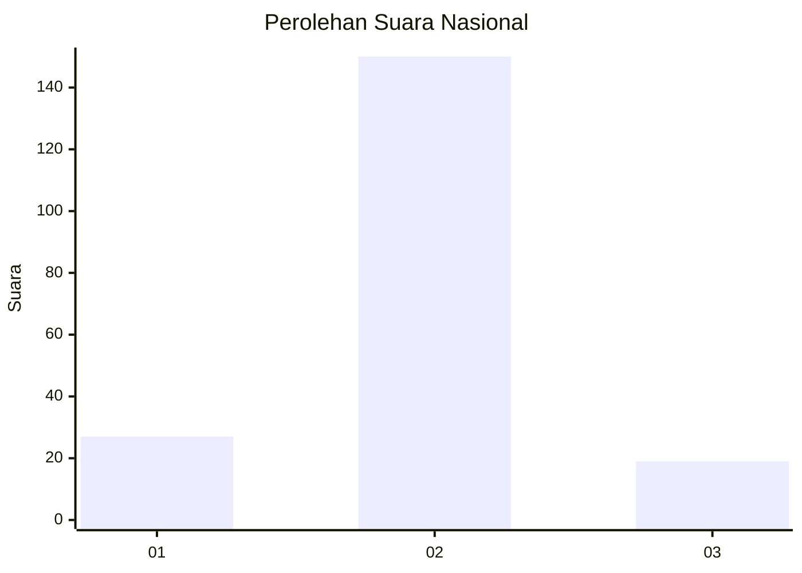
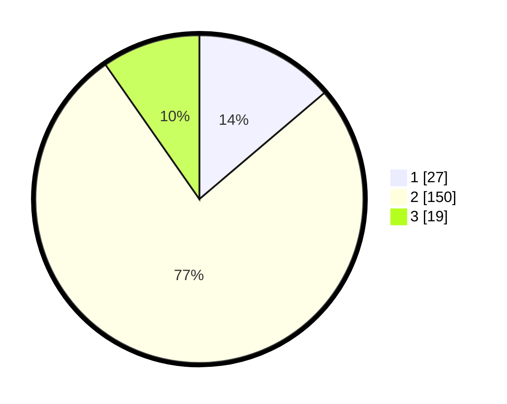

# Hasil

## Grafik

## Tabel

| No. | Nama Paslon    | Suara | Suara (raw) | Persentase |
|:--- |:-------------- | -----:| -----------:| ----------:|
| 1   | ANIES MUHAIMIN | 27    | [27][p-1]   | 13,78      |
| 2   | PRABOWO GIBRAN | 150   | [150][p-2]  | 76,53      |
| 3   | GANJAR MAHFUD  | 19    | [19][p-3]   | 9,69       |

[p-1]: https://github.com/gigit-pemilu/pemilu-2024/blob/main/pilpres/hitung-suara/sub/16-sumatera-selatan/sub/07-banyuasin/sub/02-banyuasin-ii/sub/2001-sungsang-i/sub/004-tps/sub/paslon-1.txt
[p-2]: https://github.com/gigit-pemilu/pemilu-2024/blob/main/pilpres/hitung-suara/sub/16-sumatera-selatan/sub/07-banyuasin/sub/02-banyuasin-ii/sub/2001-sungsang-i/sub/004-tps/sub/paslon-2.txt
[p-3]: https://github.com/gigit-pemilu/pemilu-2024/blob/main/pilpres/hitung-suara/sub/16-sumatera-selatan/sub/07-banyuasin/sub/02-banyuasin-ii/sub/2001-sungsang-i/sub/004-tps/sub/paslon-3.txt

## Foto C Plano

https://sirekap-obj-formc.kpu.go.id/59b9/pemilu/ppwp/16/07/02/20/01/1607022001004-20240215-010600--3e95f9aa-0c3c-4cb1-bf59-5ad6eadbd7a2.jpg

https://sirekap-obj-formc.kpu.go.id/59b9/pemilu/ppwp/16/07/02/20/01/1607022001004-20240215-010742--4158b2b2-244d-48ec-a309-d0af0118ae95.jpg

https://sirekap-obj-formc.kpu.go.id/59b9/pemilu/ppwp/16/07/02/20/01/1607022001004-20240215-010820--bd3e9b1d-6d48-4ef7-b4ec-3914848e0d0f.jpg

## Metadata

| Key        | Value               |
| ---------- | ------------------- |
| Time Stamp | 2024-02-15 16:30:25 |

