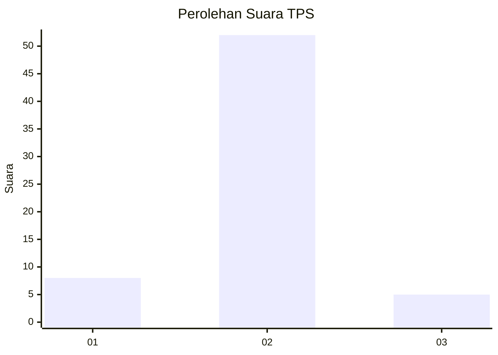
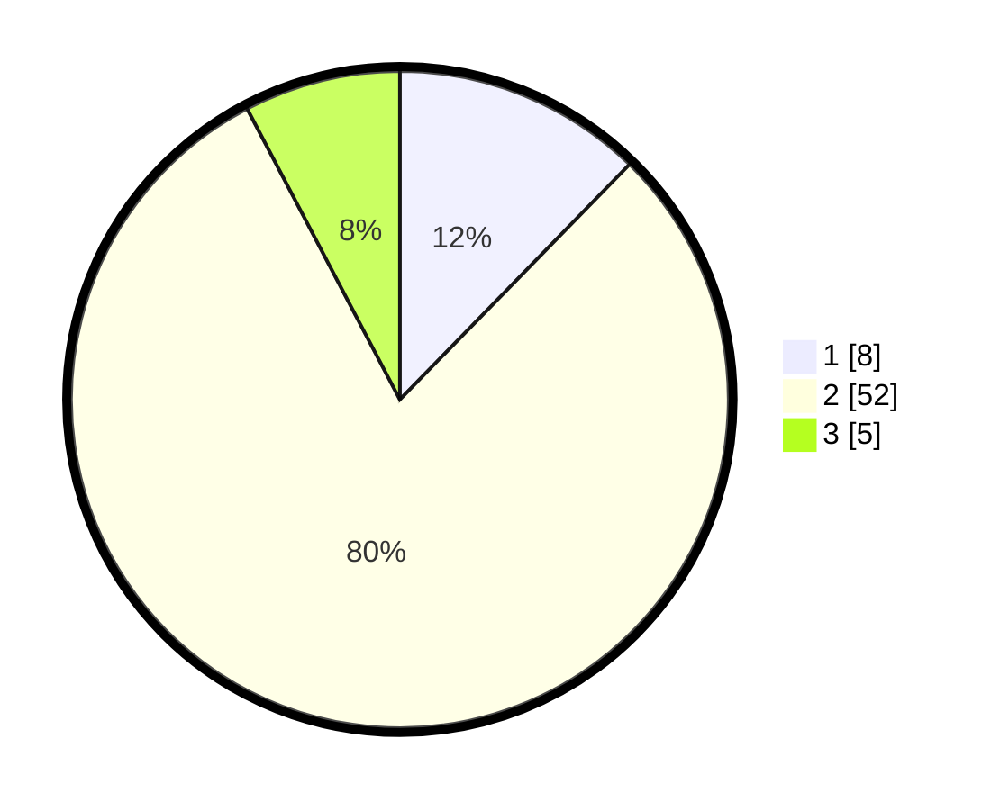

# Hasil

## Grafik

## Tabel

| No. | Nama Paslon    | Suara | Suara (raw) | Persentase |
|:--- |:-------------- | -----:| -----------:| ----------:|
| 1   | ANIES MUHAIMIN | 8     | [8][p-1]    | 12,31      |
| 2   | PRABOWO GIBRAN | 52    | [52][p-2]   | 80,00      |
| 3   | GANJAR MAHFUD  | 5     | [5][p-3]    | 7,69       |

[p-1]: https://github.com/gigit-pemilu/pemilu-2024-16-sumatera-selatan/blob/main/pilpres/hitung-suara/sub/16-sumatera-selatan/sub/07-banyuasin/sub/02-banyuasin-ii/sub/2001-sungsang-i/sub/014-tps/sub/paslon-1.txt
[p-2]: https://github.com/gigit-pemilu/pemilu-2024-16-sumatera-selatan/blob/main/pilpres/hitung-suara/sub/16-sumatera-selatan/sub/07-banyuasin/sub/02-banyuasin-ii/sub/2001-sungsang-i/sub/014-tps/sub/paslon-2.txt
[p-3]: https://github.com/gigit-pemilu/pemilu-2024-16-sumatera-selatan/blob/main/pilpres/hitung-suara/sub/16-sumatera-selatan/sub/07-banyuasin/sub/02-banyuasin-ii/sub/2001-sungsang-i/sub/014-tps/sub/paslon-3.txt

## Foto C Plano

https://sirekap-obj-formc.kpu.go.id/1737/pemilu/ppwp/16/07/02/20/01/1607022001014-20240215-110938--9a8cb506-fcce-4ffd-baad-a83950e92247.jpg

https://sirekap-obj-formc.kpu.go.id/1737/pemilu/ppwp/16/07/02/20/01/1607022001014-20240215-110950--841f76de-dbb6-4e88-9b4f-53f1ae0b4974.jpg

https://sirekap-obj-formc.kpu.go.id/1737/pemilu/ppwp/16/07/02/20/01/1607022001014-20240215-110958--3686ac29-f137-4fdd-b604-1d104adc15f3.jpg

## Metadata

| Key        | Value               |
| ---------- | ------------------- |
| Time Stamp | 2024-02-15 15:00:29 |

