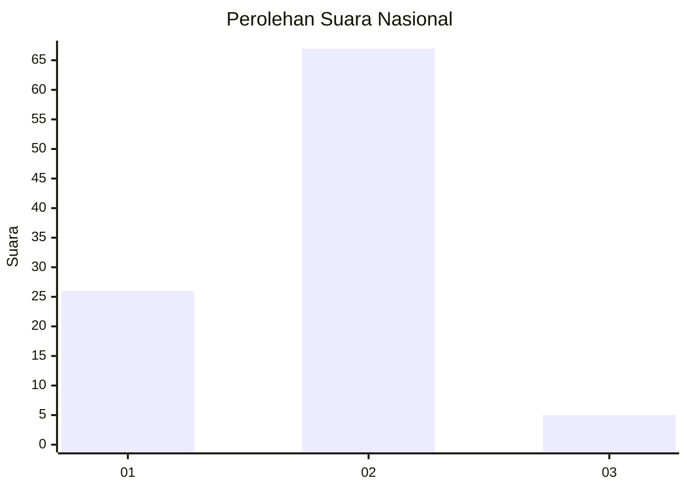
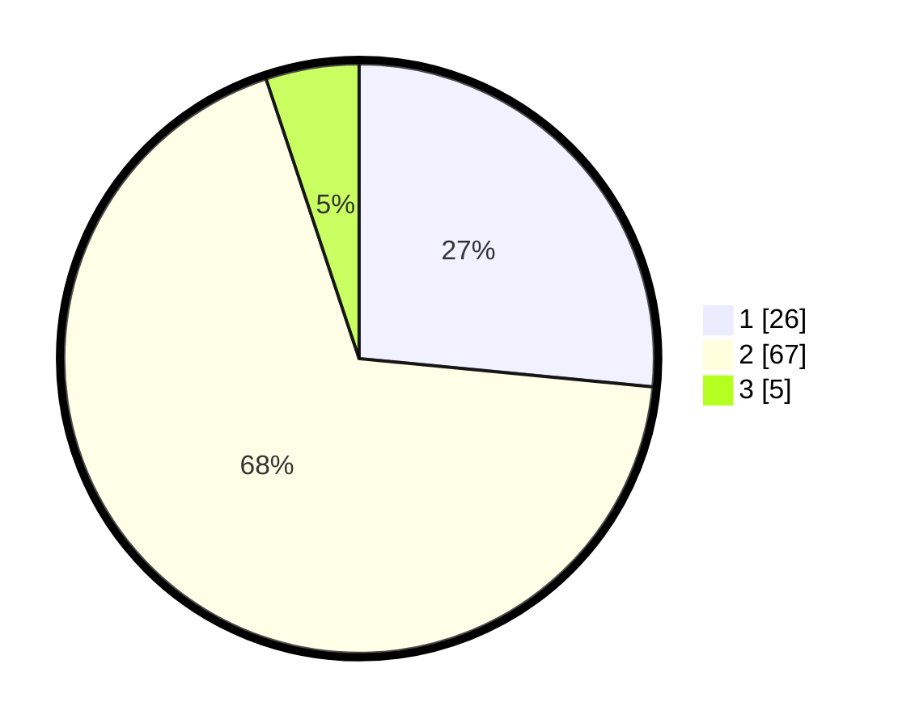

# Hasil

## Grafik

## Tabel

| No. | Nama Paslon    | Suara | Suara (raw) | Persentase |
|:--- |:-------------- | -----:| -----------:| ----------:|
| 1   | ANIES MUHAIMIN | 26    | [26][p-1]   | 26,53      |
| 2   | PRABOWO GIBRAN | 67    | [67][p-2]   | 68,37      |
| 3   | GANJAR MAHFUD  | 5     | [5][p-3]    | 5,10       |

[p-1]: https://github.com/gigit-pemilu/pemilu-2024/blob/main/pilpres/hitung-suara/sub/16-sumatera-selatan/sub/07-banyuasin/sub/02-banyuasin-ii/sub/2002-sungsang-ii/sub/013-tps/sub/paslon-1.txt
[p-2]: https://github.com/gigit-pemilu/pemilu-2024/blob/main/pilpres/hitung-suara/sub/16-sumatera-selatan/sub/07-banyuasin/sub/02-banyuasin-ii/sub/2002-sungsang-ii/sub/013-tps/sub/paslon-2.txt
[p-3]: https://github.com/gigit-pemilu/pemilu-2024/blob/main/pilpres/hitung-suara/sub/16-sumatera-selatan/sub/07-banyuasin/sub/02-banyuasin-ii/sub/2002-sungsang-ii/sub/013-tps/sub/paslon-3.txt

## Foto C Plano

https://sirekap-obj-formc.kpu.go.id/49dd/pemilu/ppwp/16/07/02/20/02/1607022002013-20240218-155742--2d7bb5c8-2adc-47ba-8ee2-c1b2cd83ab6f.jpg

https://sirekap-obj-formc.kpu.go.id/49dd/pemilu/ppwp/16/07/02/20/02/1607022002013-20240218-155820--d6b2f8b0-d564-4f89-a9c2-bc1342114069.jpg

https://sirekap-obj-formc.kpu.go.id/49dd/pemilu/ppwp/16/07/02/20/02/1607022002013-20240218-155938--66184094-993e-48f1-a58f-29ffb430b844.jpg

## Metadata

| Key        | Value               |
| ---------- | ------------------- |
| Time Stamp | 2024-02-25 16:00:00 |

