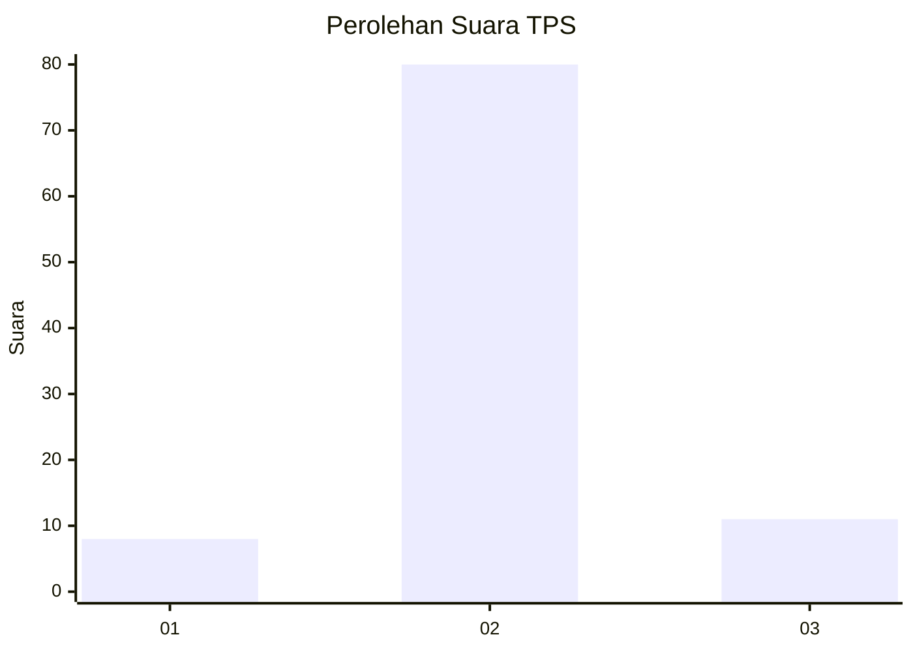
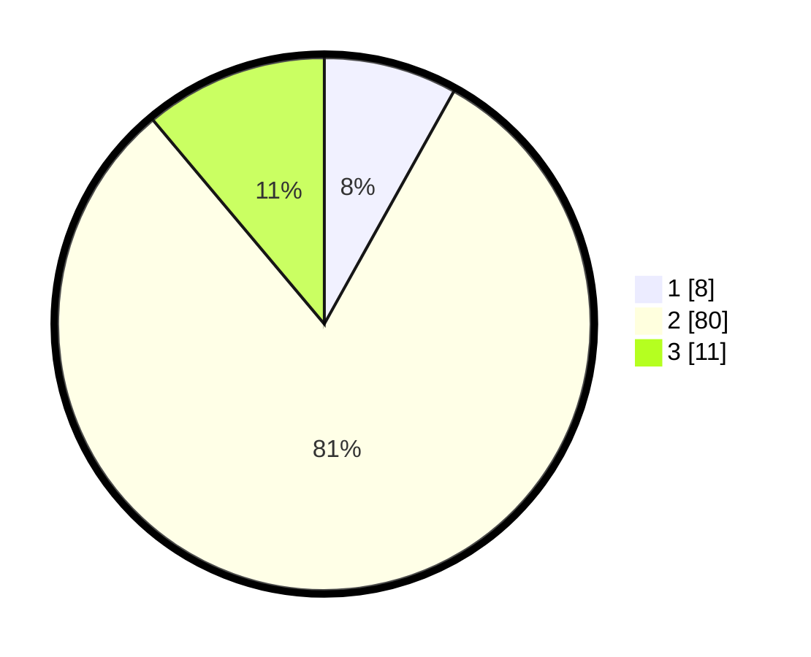

# Hasil

## Grafik

## Tabel

| No. | Nama Paslon    | Suara | Suara (raw) | Persentase |
|:--- |:-------------- | -----:| -----------:| ----------:|
| 1   | ANIES MUHAIMIN | 8     | [8][p-1]    | 8,08       |
| 2   | PRABOWO GIBRAN | 80    | [80][p-2]   | 80,81      |
| 3   | GANJAR MAHFUD  | 11    | [11][p-3]   | 11,11      |

[p-1]: https://github.com/gigit-pemilu/pemilu-2024-16-sumatera-selatan/blob/main/pilpres/hitung-suara/sub/16-sumatera-selatan/sub/07-banyuasin/sub/02-banyuasin-ii/sub/2002-sungsang-ii/sub/015-tps/sub/paslon-1.txt
[p-2]: https://github.com/gigit-pemilu/pemilu-2024-16-sumatera-selatan/blob/main/pilpres/hitung-suara/sub/16-sumatera-selatan/sub/07-banyuasin/sub/02-banyuasin-ii/sub/2002-sungsang-ii/sub/015-tps/sub/paslon-2.txt
[p-3]: https://github.com/gigit-pemilu/pemilu-2024-16-sumatera-selatan/blob/main/pilpres/hitung-suara/sub/16-sumatera-selatan/sub/07-banyuasin/sub/02-banyuasin-ii/sub/2002-sungsang-ii/sub/015-tps/sub/paslon-3.txt

## Foto C Plano

https://sirekap-obj-formc.kpu.go.id/bbbd/pemilu/ppwp/16/07/02/20/02/1607022002015-20240218-160043--7a95020b-334e-4e0d-be4e-b72c540ca769.jpg

https://sirekap-obj-formc.kpu.go.id/bbbd/pemilu/ppwp/16/07/02/20/02/1607022002015-20240218-160118--0d2ebc2b-dbc7-47d3-a1a4-3c7384b3aa40.jpg

https://sirekap-obj-formc.kpu.go.id/bbbd/pemilu/ppwp/16/07/02/20/02/1607022002015-20240218-160151--7506ae69-51f7-4f0e-bf47-fbb459cdf5af.jpg

## Metadata

| Key        | Value               |
| ---------- | ------------------- |
| Time Stamp | 2024-02-25 11:00:00 |

