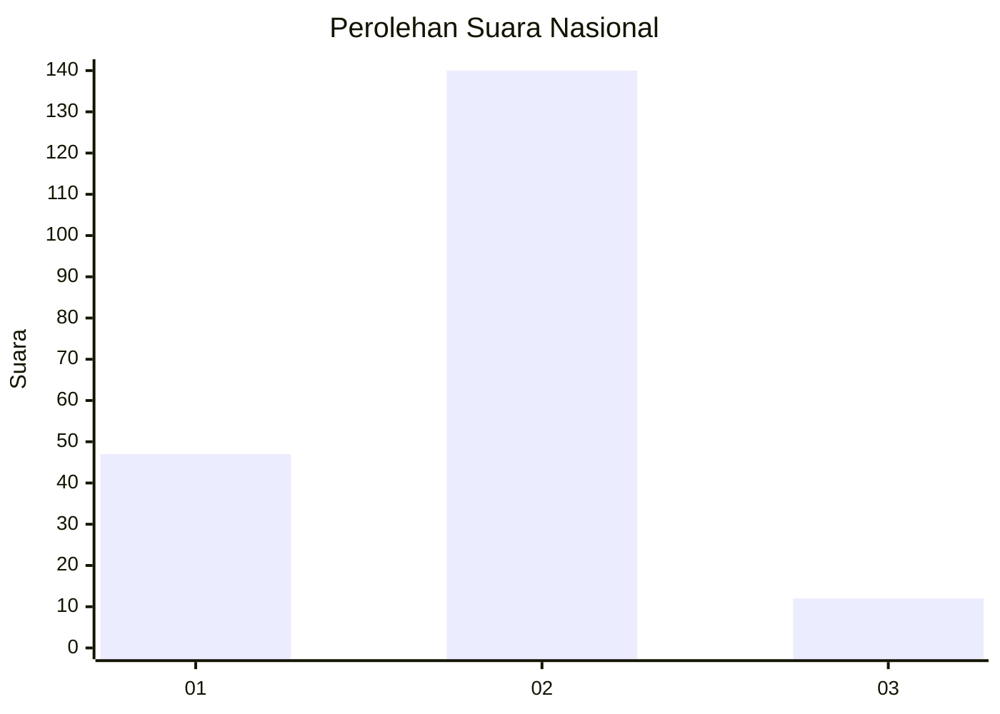

# Hasil

## Grafik

## Tabel

| No. | Nama Paslon    | Suara | Suara (raw) | Persentase |
|:--- |:-------------- | -----:| -----------:| ----------:|
| 1   | ANIES MUHAIMIN | 47    | [47][p-1]   | 23,62      |
| 2   | PRABOWO GIBRAN | 140   | [140][p-2]  | 70,35      |
| 3   | GANJAR MAHFUD  | 12    | [12][p-3]   | 6,03       |

[p-1]: https://github.com/gigit-pemilu/pemilu-2024/blob/main/pilpres/hitung-suara/sub/16-sumatera-selatan/sub/07-banyuasin/sub/02-banyuasin-ii/sub/2003-sungsang-iii/sub/005-tps/sub/paslon-1.txt
[p-2]: https://github.com/gigit-pemilu/pemilu-2024/blob/main/pilpres/hitung-suara/sub/16-sumatera-selatan/sub/07-banyuasin/sub/02-banyuasin-ii/sub/2003-sungsang-iii/sub/005-tps/sub/paslon-2.txt
[p-3]: https://github.com/gigit-pemilu/pemilu-2024/blob/main/pilpres/hitung-suara/sub/16-sumatera-selatan/sub/07-banyuasin/sub/02-banyuasin-ii/sub/2003-sungsang-iii/sub/005-tps/sub/paslon-3.txt

## Foto C Plano

https://sirekap-obj-formc.kpu.go.id/16ef/pemilu/ppwp/16/07/02/20/03/1607022003005-20240215-104602--a3e8f9bc-e64b-4fc0-a942-8baeb517c9a3.jpg

https://sirekap-obj-formc.kpu.go.id/16ef/pemilu/ppwp/16/07/02/20/03/1607022003005-20240215-104905--a43ecf0d-c297-4802-a8e5-ddb4dff97d47.jpg

https://sirekap-obj-formc.kpu.go.id/16ef/pemilu/ppwp/16/07/02/20/03/1607022003005-20240215-105030--2619f4f2-807c-4f63-a1c5-ee3f89a9c31c.jpg

## Metadata

| Key        | Value               |
| ---------- | ------------------- |
| Time Stamp | 2024-02-15 15:00:29 |

