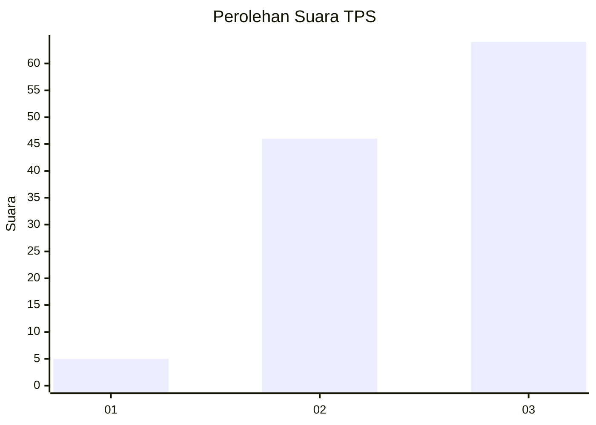
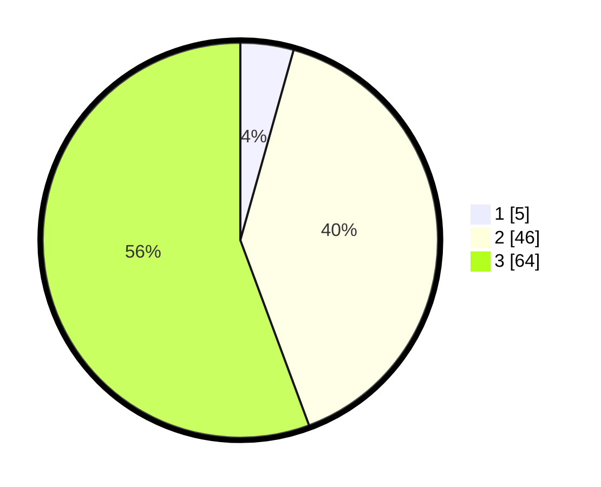

# Hasil

## Grafik

## Tabel

| No. | Nama Paslon    | Suara | Suara (raw) | Persentase |
|:--- |:-------------- | -----:| -----------:| ----------:|
| 1   | ANIES MUHAIMIN | 5     | [5][p-1]    | 4,35       |
| 2   | PRABOWO GIBRAN | 46    | [46][p-2]   | 40,00      |
| 3   | GANJAR MAHFUD  | 64    | [64][p-3]   | 55,65      |

[p-1]: https://github.com/gigit-pemilu/pemilu-2024-16-sumatera-selatan/blob/main/pilpres/hitung-suara/sub/16-sumatera-selatan/sub/07-banyuasin/sub/02-banyuasin-ii/sub/2003-sungsang-iii/sub/010-tps/sub/paslon-1.txt
[p-2]: https://github.com/gigit-pemilu/pemilu-2024-16-sumatera-selatan/blob/main/pilpres/hitung-suara/sub/16-sumatera-selatan/sub/07-banyuasin/sub/02-banyuasin-ii/sub/2003-sungsang-iii/sub/010-tps/sub/paslon-2.txt
[p-3]: https://github.com/gigit-pemilu/pemilu-2024-16-sumatera-selatan/blob/main/pilpres/hitung-suara/sub/16-sumatera-selatan/sub/07-banyuasin/sub/02-banyuasin-ii/sub/2003-sungsang-iii/sub/010-tps/sub/paslon-3.txt

## Foto C Plano

https://sirekap-obj-formc.kpu.go.id/cbdd/pemilu/ppwp/16/07/02/20/03/1607022003010-20240218-161908--2cfb117b-c52c-41a6-9789-934ea308a4ab.jpg

https://sirekap-obj-formc.kpu.go.id/cbdd/pemilu/ppwp/16/07/02/20/03/1607022003010-20240218-161948--55c0c706-0078-4439-b8a6-c4d0e948a8a4.jpg

https://sirekap-obj-formc.kpu.go.id/cbdd/pemilu/ppwp/16/07/02/20/03/1607022003010-20240218-162027--bcfcce7b-043d-45f5-9f03-954407cfb17e.jpg

## Metadata

| Key        | Value               |
| ---------- | ------------------- |
| Time Stamp | 2024-02-25 11:00:00 |

