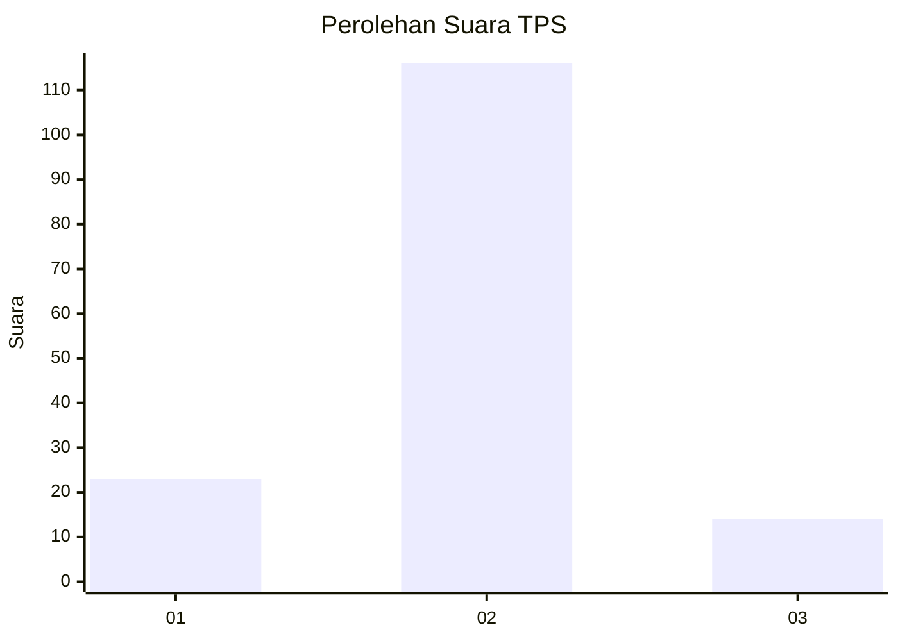
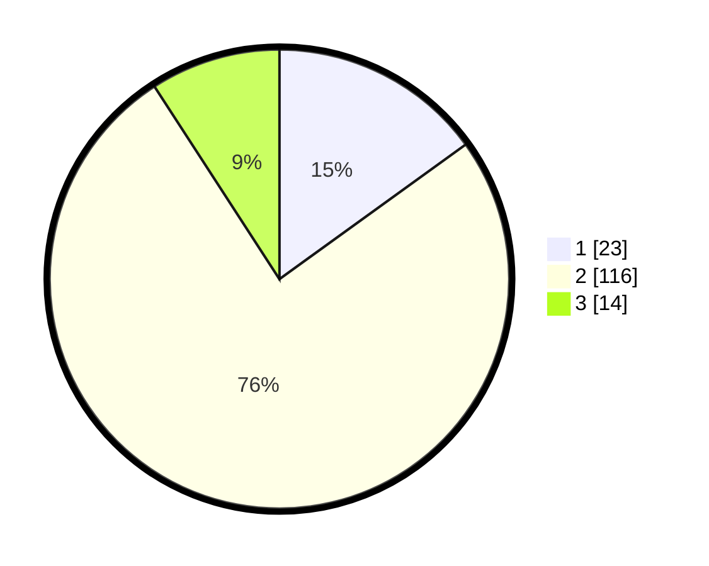

# Hasil

## Grafik

## Tabel

| No. | Nama Paslon    | Suara | Suara (raw) | Persentase |
|:--- |:-------------- | -----:| -----------:| ----------:|
| 1   | ANIES MUHAIMIN | 23    | [23][p-1]   | 15,03      |
| 2   | PRABOWO GIBRAN | 116   | [116][p-2]  | 75,82      |
| 3   | GANJAR MAHFUD  | 14    | [14][p-3]   | 9,15       |

[p-1]: https://github.com/gigit-pemilu/pemilu-2024-16-sumatera-selatan/blob/main/pilpres/hitung-suara/sub/16-sumatera-selatan/sub/07-banyuasin/sub/02-banyuasin-ii/sub/2004-sungsang-iv/sub/001-tps/sub/paslon-1.txt
[p-2]: https://github.com/gigit-pemilu/pemilu-2024-16-sumatera-selatan/blob/main/pilpres/hitung-suara/sub/16-sumatera-selatan/sub/07-banyuasin/sub/02-banyuasin-ii/sub/2004-sungsang-iv/sub/001-tps/sub/paslon-2.txt
[p-3]: https://github.com/gigit-pemilu/pemilu-2024-16-sumatera-selatan/blob/main/pilpres/hitung-suara/sub/16-sumatera-selatan/sub/07-banyuasin/sub/02-banyuasin-ii/sub/2004-sungsang-iv/sub/001-tps/sub/paslon-3.txt

## Foto C Plano

https://sirekap-obj-formc.kpu.go.id/ef4d/pemilu/ppwp/16/07/02/20/04/1607022004001-20240218-175052--6aabedea-a677-49c6-ab8e-cfd0064949ac.jpg

https://sirekap-obj-formc.kpu.go.id/ef4d/pemilu/ppwp/16/07/02/20/04/1607022004001-20240218-175126--796f9b70-808a-4a82-9611-e9a168d9bded.jpg

https://sirekap-obj-formc.kpu.go.id/ef4d/pemilu/ppwp/16/07/02/20/04/1607022004001-20240218-175308--248c21f8-a296-4514-b75c-346b7364b304.jpg

## Metadata

| Key        | Value               |
| ---------- | ------------------- |
| Time Stamp | 2024-02-24 22:31:28 |

