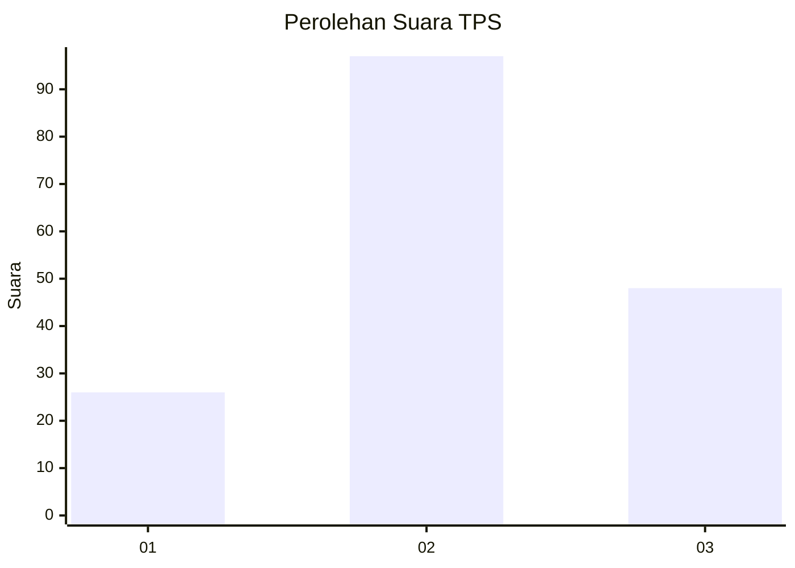
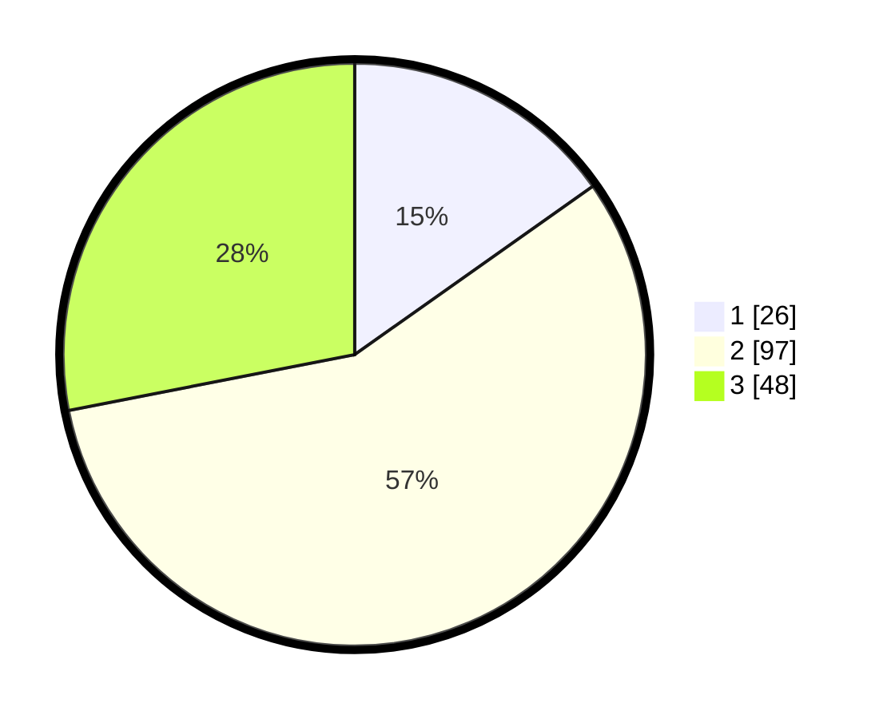

# Hasil

## Grafik

## Tabel

| No. | Nama Paslon    | Suara | Suara (raw) | Persentase |
|:--- |:-------------- | -----:| -----------:| ----------:|
| 1   | ANIES MUHAIMIN | 26    | [26][p-1]   | 15,20      |
| 2   | PRABOWO GIBRAN | 97    | [97][p-2]   | 56,73      |
| 3   | GANJAR MAHFUD  | 48    | [48][p-3]   | 28,07      |

[p-1]: https://github.com/gigit-pemilu/pemilu-2024-16-sumatera-selatan/blob/main/pilpres/hitung-suara/sub/16-sumatera-selatan/sub/07-banyuasin/sub/02-banyuasin-ii/sub/2004-sungsang-iv/sub/005-tps/sub/paslon-1.txt
[p-2]: https://github.com/gigit-pemilu/pemilu-2024-16-sumatera-selatan/blob/main/pilpres/hitung-suara/sub/16-sumatera-selatan/sub/07-banyuasin/sub/02-banyuasin-ii/sub/2004-sungsang-iv/sub/005-tps/sub/paslon-2.txt
[p-3]: https://github.com/gigit-pemilu/pemilu-2024-16-sumatera-selatan/blob/main/pilpres/hitung-suara/sub/16-sumatera-selatan/sub/07-banyuasin/sub/02-banyuasin-ii/sub/2004-sungsang-iv/sub/005-tps/sub/paslon-3.txt

## Foto C Plano

https://sirekap-obj-formc.kpu.go.id/f897/pemilu/ppwp/16/07/02/20/04/1607022004005-20240218-172438--a227c1be-8d7b-45ba-b30d-e8eee7b494f4.jpg

https://sirekap-obj-formc.kpu.go.id/f897/pemilu/ppwp/16/07/02/20/04/1607022004005-20240218-172518--3350e0b8-e323-443f-9d2e-08560dd4615c.jpg

https://sirekap-obj-formc.kpu.go.id/f897/pemilu/ppwp/16/07/02/20/04/1607022004005-20240218-172920--331644d7-7168-4659-b42f-c5c663f0983b.jpg

## Metadata

| Key        | Value               |
| ---------- | ------------------- |
| Time Stamp | 2024-02-24 22:31:28 |

