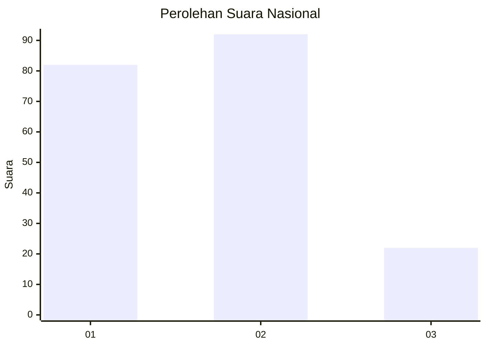
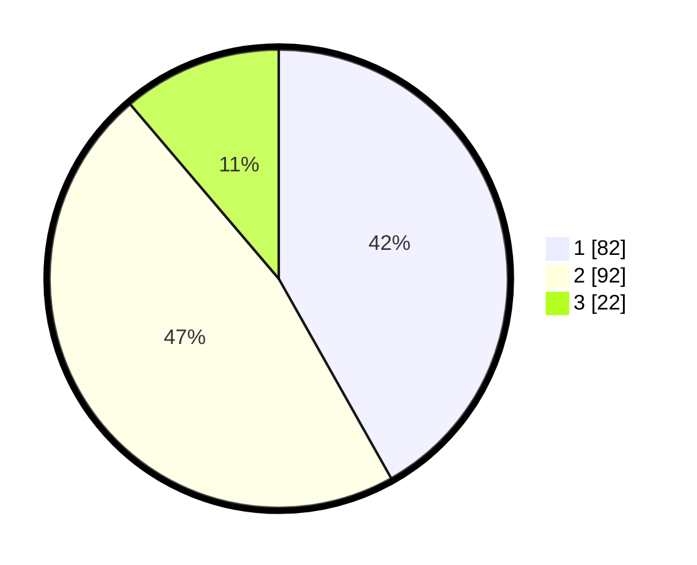

# Hasil

## Grafik

## Tabel

| No. | Nama Paslon    | Suara | Suara (raw) | Persentase |
|:--- |:-------------- | -----:| -----------:| ----------:|
| 1   | ANIES MUHAIMIN | 82    | [82][p-1]   | 41,84      |
| 2   | PRABOWO GIBRAN | 92    | [92][p-2]   | 46,94      |
| 3   | GANJAR MAHFUD  | 22    | [22][p-3]   | 11,22      |

[p-1]: https://github.com/gigit-pemilu/pemilu-2024/blob/main/pilpres/hitung-suara/sub/16-sumatera-selatan/sub/07-banyuasin/sub/02-banyuasin-ii/sub/2010-teluk-payo/sub/005-tps/sub/paslon-1.txt
[p-2]: https://github.com/gigit-pemilu/pemilu-2024/blob/main/pilpres/hitung-suara/sub/16-sumatera-selatan/sub/07-banyuasin/sub/02-banyuasin-ii/sub/2010-teluk-payo/sub/005-tps/sub/paslon-2.txt
[p-3]: https://github.com/gigit-pemilu/pemilu-2024/blob/main/pilpres/hitung-suara/sub/16-sumatera-selatan/sub/07-banyuasin/sub/02-banyuasin-ii/sub/2010-teluk-payo/sub/005-tps/sub/paslon-3.txt

## Foto C Plano

https://sirekap-obj-formc.kpu.go.id/602b/pemilu/ppwp/16/07/02/20/10/1607022010005-20240215-002804--59137763-7c1a-453b-b06b-3f94e53fab30.jpg

https://sirekap-obj-formc.kpu.go.id/602b/pemilu/ppwp/16/07/02/20/10/1607022010005-20240214-235501--2a29b638-ceef-4d47-864e-1fb18355a839.jpg

https://sirekap-obj-formc.kpu.go.id/602b/pemilu/ppwp/16/07/02/20/10/1607022010005-20240214-235624--4f5288d4-3666-4698-9748-340106b831d4.jpg

## Metadata

| Key        | Value               |
| ---------- | ------------------- |
| Time Stamp | 2024-02-15 22:40:13 |

