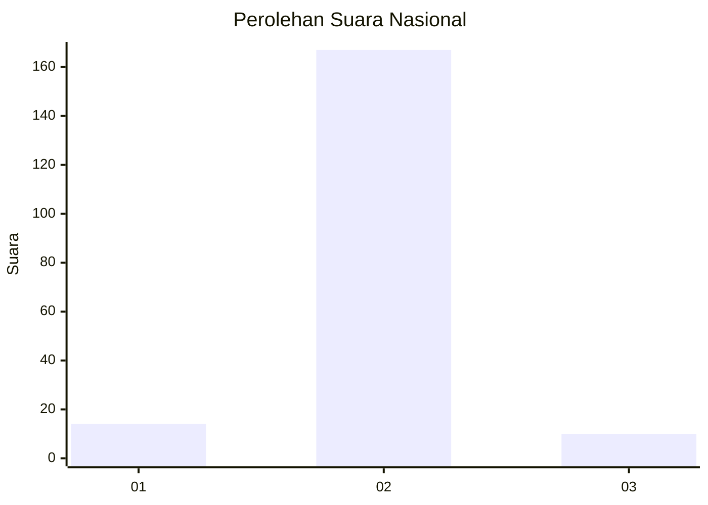
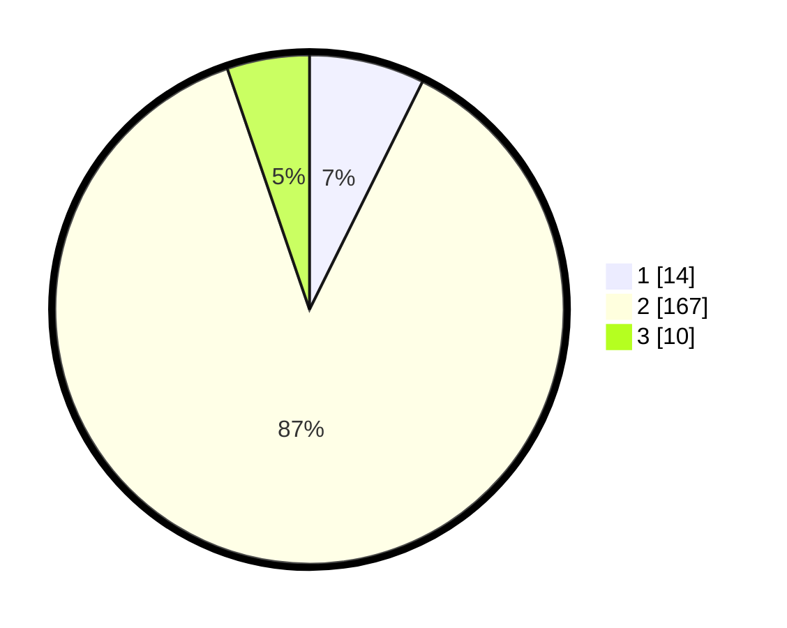

# Hasil

## Grafik

## Tabel

| No. | Nama Paslon    | Suara | Suara (raw) | Persentase |
|:--- |:-------------- | -----:| -----------:| ----------:|
| 1   | ANIES MUHAIMIN | 14    | [14][p-1]   | 7,33       |
| 2   | PRABOWO GIBRAN | 167   | [167][p-2]  | 87,43      |
| 3   | GANJAR MAHFUD  | 10    | [10][p-3]   | 5,24       |

[p-1]: https://github.com/gigit-pemilu/pemilu-2024/blob/main/pilpres/hitung-suara/sub/16-sumatera-selatan/sub/07-banyuasin/sub/02-banyuasin-ii/sub/2018-marga-sungsang/sub/002-tps/sub/paslon-1.txt
[p-2]: https://github.com/gigit-pemilu/pemilu-2024/blob/main/pilpres/hitung-suara/sub/16-sumatera-selatan/sub/07-banyuasin/sub/02-banyuasin-ii/sub/2018-marga-sungsang/sub/002-tps/sub/paslon-2.txt
[p-3]: https://github.com/gigit-pemilu/pemilu-2024/blob/main/pilpres/hitung-suara/sub/16-sumatera-selatan/sub/07-banyuasin/sub/02-banyuasin-ii/sub/2018-marga-sungsang/sub/002-tps/sub/paslon-3.txt

## Foto C Plano

https://sirekap-obj-formc.kpu.go.id/fe04/pemilu/ppwp/16/07/02/20/18/1607022018002-20240215-045249--204b176c-796a-4a79-b3a3-55c35f46a0ff.jpg

https://sirekap-obj-formc.kpu.go.id/fe04/pemilu/ppwp/16/07/02/20/18/1607022018002-20240215-045354--fdb8a919-9f7f-4106-9a33-bde984c052aa.jpg

https://sirekap-obj-formc.kpu.go.id/fe04/pemilu/ppwp/16/07/02/20/18/1607022018002-20240215-045439--2b97a8e6-d30f-4c38-9d47-44a31c76808c.jpg

## Metadata

| Key        | Value               |
| ---------- | ------------------- |
| Time Stamp | 2024-02-16 22:01:00 |

