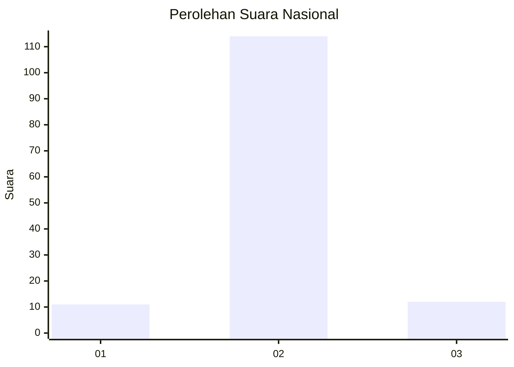
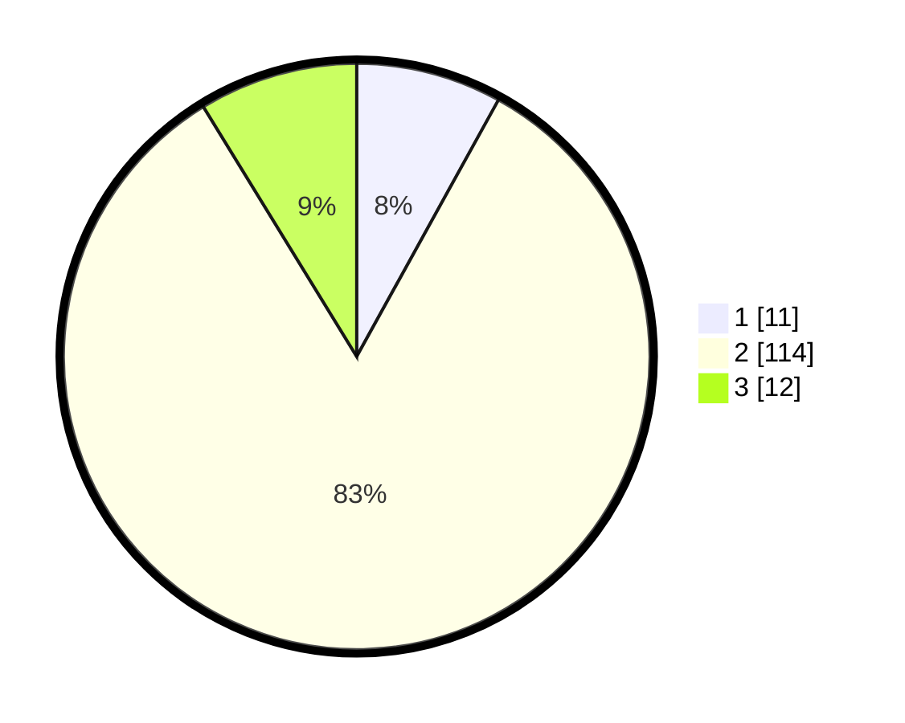

# Hasil

## Grafik

## Tabel

| No. | Nama Paslon    | Suara | Suara (raw) | Persentase |
|:--- |:-------------- | -----:| -----------:| ----------:|
| 1   | ANIES MUHAIMIN | 11    | [11][p-1]   | 8,03       |
| 2   | PRABOWO GIBRAN | 114   | [114][p-2]  | 83,21      |
| 3   | GANJAR MAHFUD  | 12    | [12][p-3]   | 8,76       |

[p-1]: https://github.com/gigit-pemilu/pemilu-2024/blob/main/pilpres/hitung-suara/sub/16-sumatera-selatan/sub/07-banyuasin/sub/02-banyuasin-ii/sub/2018-marga-sungsang/sub/009-tps/sub/paslon-1.txt
[p-2]: https://github.com/gigit-pemilu/pemilu-2024/blob/main/pilpres/hitung-suara/sub/16-sumatera-selatan/sub/07-banyuasin/sub/02-banyuasin-ii/sub/2018-marga-sungsang/sub/009-tps/sub/paslon-2.txt
[p-3]: https://github.com/gigit-pemilu/pemilu-2024/blob/main/pilpres/hitung-suara/sub/16-sumatera-selatan/sub/07-banyuasin/sub/02-banyuasin-ii/sub/2018-marga-sungsang/sub/009-tps/sub/paslon-3.txt

## Foto C Plano

https://sirekap-obj-formc.kpu.go.id/1bb7/pemilu/ppwp/16/07/02/20/18/1607022018009-20240219-001241--7a76b34f-b1ae-4b84-80ff-67ccfdf999b3.jpg

https://sirekap-obj-formc.kpu.go.id/1bb7/pemilu/ppwp/16/07/02/20/18/1607022018009-20240219-001534--fb76f1f9-23d2-4b0b-a46c-88e05f8993c6.jpg

https://sirekap-obj-formc.kpu.go.id/1bb7/pemilu/ppwp/16/07/02/20/18/1607022018009-20240219-001612--56273f72-0f11-48e3-a111-5fd43f7f31fb.jpg

## Metadata

| Key        | Value               |
| ---------- | ------------------- |
| Time Stamp | 2024-02-24 22:31:28 |

