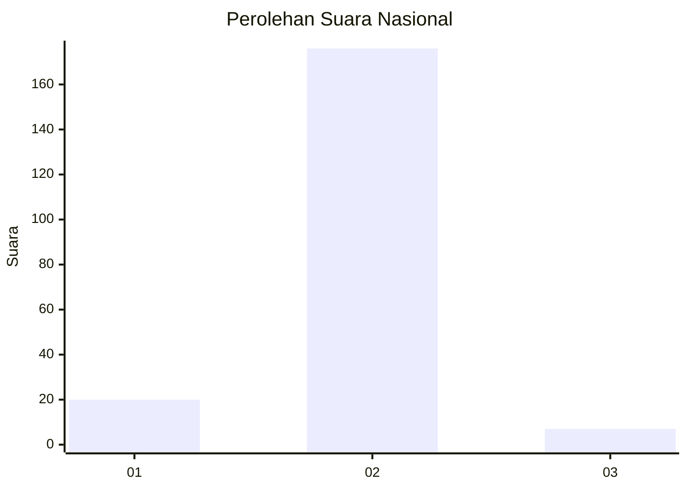
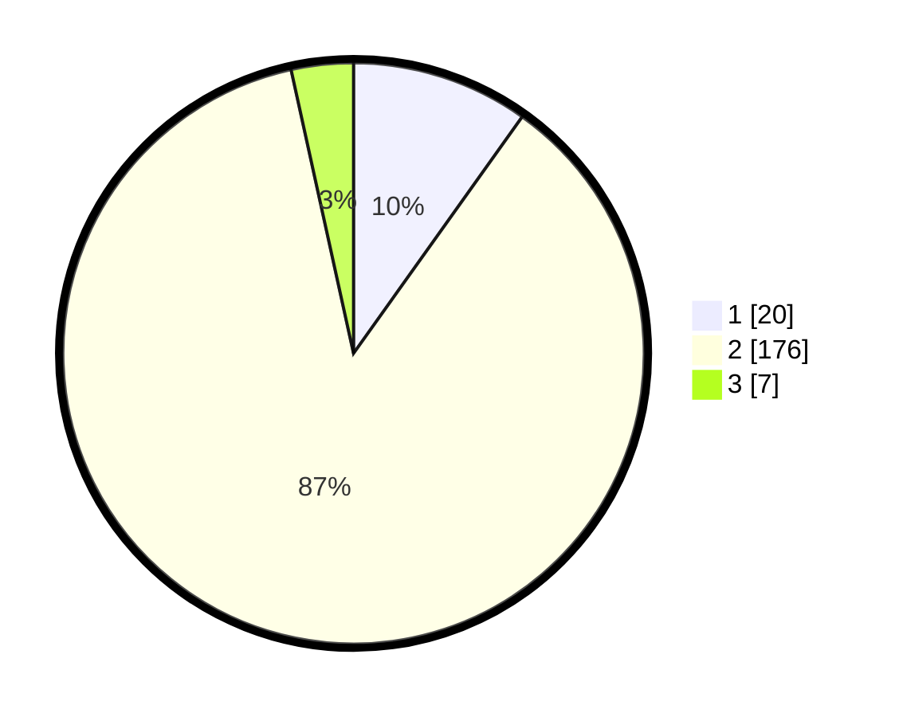

# Hasil

## Grafik

## Tabel

| No. | Nama Paslon    | Suara | Suara (raw) | Persentase |
|:--- |:-------------- | -----:| -----------:| ----------:|
| 1   | ANIES MUHAIMIN | 20    | [20][p-1]   | 9,85       |
| 2   | PRABOWO GIBRAN | 176   | [176][p-2]  | 86,70      |
| 3   | GANJAR MAHFUD  | 7     | [7][p-3]    | 3,45       |

[p-1]: https://github.com/gigit-pemilu/pemilu-2024/blob/main/pilpres/hitung-suara/sub/16-sumatera-selatan/sub/07-banyuasin/sub/03-banyuasin-iii/sub/2016-rimba-alai/sub/002-tps/sub/paslon-1.txt
[p-2]: https://github.com/gigit-pemilu/pemilu-2024/blob/main/pilpres/hitung-suara/sub/16-sumatera-selatan/sub/07-banyuasin/sub/03-banyuasin-iii/sub/2016-rimba-alai/sub/002-tps/sub/paslon-2.txt
[p-3]: https://github.com/gigit-pemilu/pemilu-2024/blob/main/pilpres/hitung-suara/sub/16-sumatera-selatan/sub/07-banyuasin/sub/03-banyuasin-iii/sub/2016-rimba-alai/sub/002-tps/sub/paslon-3.txt

## Foto C Plano

https://sirekap-obj-formc.kpu.go.id/22c4/pemilu/ppwp/16/07/03/20/16/1607032016002-20240214-231554--01bcbeea-b9c8-47f3-a63d-015b07ab62a8.jpg

https://sirekap-obj-formc.kpu.go.id/22c4/pemilu/ppwp/16/07/03/20/16/1607032016002-20240214-231936--9cf7d97e-c61d-4e26-b55b-7b09d220210f.jpg

https://sirekap-obj-formc.kpu.go.id/22c4/pemilu/ppwp/16/07/03/20/16/1607032016002-20240214-232014--4d43bb66-ff75-4fd5-8d19-43fe91432368.jpg

## Metadata

| Key        | Value               |
| ---------- | ------------------- |
| Time Stamp | 2024-02-15 12:00:28 |

