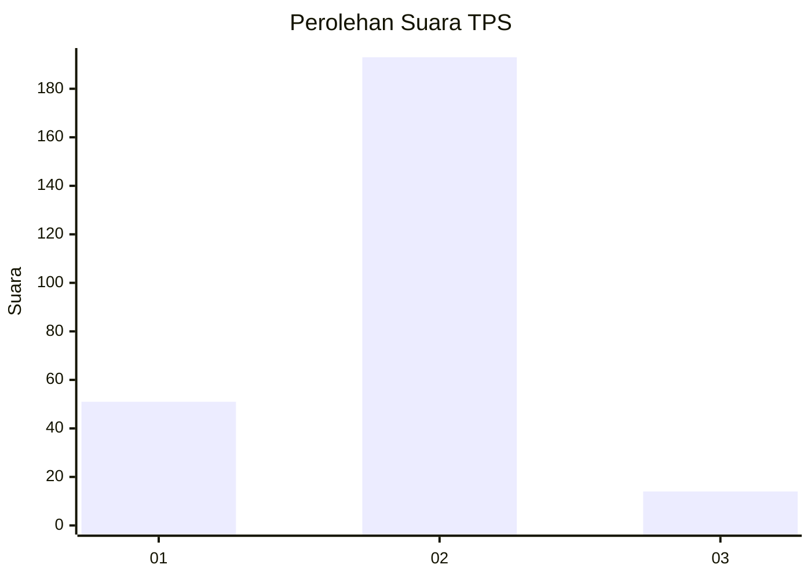
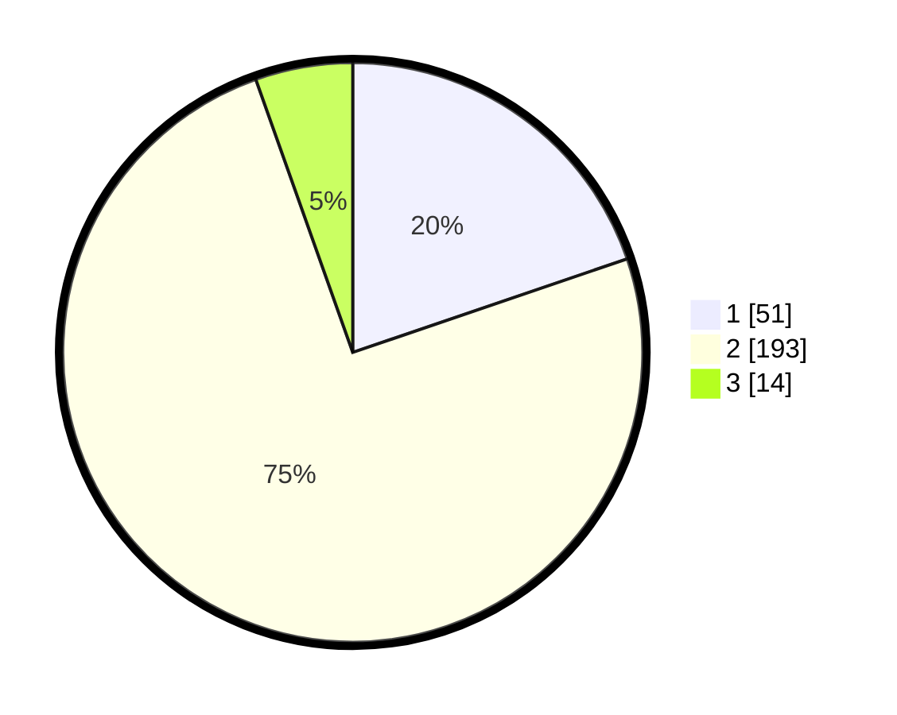

# Hasil

## Grafik

## Tabel

| No. | Nama Paslon    | Suara | Suara (raw) | Persentase |
|:--- |:-------------- | -----:| -----------:| ----------:|
| 1   | ANIES MUHAIMIN | 51    | [51][p-1]   | 19,77      |
| 2   | PRABOWO GIBRAN | 193   | [193][p-2]  | 74,81      |
| 3   | GANJAR MAHFUD  | 14    | [14][p-3]   | 5,43       |

[p-1]: https://github.com/gigit-pemilu/pemilu-2024-16-sumatera-selatan/blob/main/pilpres/hitung-suara/sub/16-sumatera-selatan/sub/07-banyuasin/sub/03-banyuasin-iii/sub/2018-regan-agung/sub/002-tps/sub/paslon-1.txt
[p-2]: https://github.com/gigit-pemilu/pemilu-2024-16-sumatera-selatan/blob/main/pilpres/hitung-suara/sub/16-sumatera-selatan/sub/07-banyuasin/sub/03-banyuasin-iii/sub/2018-regan-agung/sub/002-tps/sub/paslon-2.txt
[p-3]: https://github.com/gigit-pemilu/pemilu-2024-16-sumatera-selatan/blob/main/pilpres/hitung-suara/sub/16-sumatera-selatan/sub/07-banyuasin/sub/03-banyuasin-iii/sub/2018-regan-agung/sub/002-tps/sub/paslon-3.txt

## Foto C Plano

https://sirekap-obj-formc.kpu.go.id/7338/pemilu/ppwp/16/07/03/20/18/1607032018002-20240215-052506--7afbe345-2721-4443-bfb7-a69a0ebe5394.jpg

https://sirekap-obj-formc.kpu.go.id/7338/pemilu/ppwp/16/07/03/20/18/1607032018002-20240215-082116--031ea3ba-5faf-4de8-869a-1c8201282df0.jpg

https://sirekap-obj-formc.kpu.go.id/7338/pemilu/ppwp/16/07/03/20/18/1607032018002-20240215-082212--c9397cdb-0a34-446d-b4a0-1c4bb76ebfe9.jpg

## Metadata

| Key        | Value               |
| ---------- | ------------------- |
| Time Stamp | 2024-02-15 22:30:27 |

