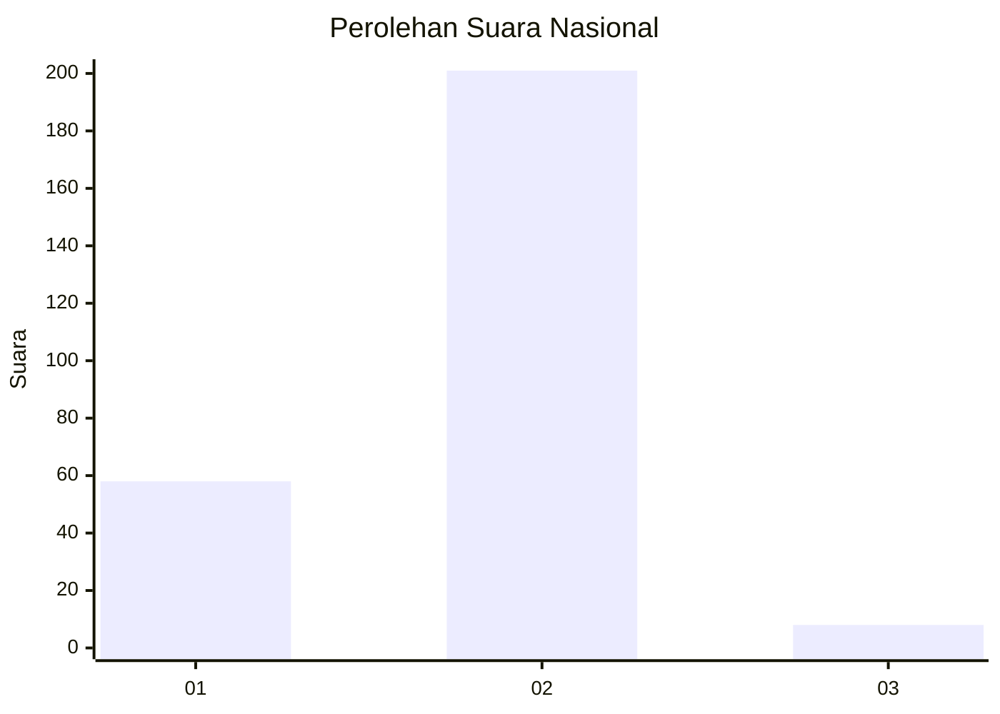

# Hasil

## Grafik

## Tabel

| No. | Nama Paslon    | Suara | Suara (raw) | Persentase |
|:--- |:-------------- | -----:| -----------:| ----------:|
| 1   | ANIES MUHAIMIN | 58    | [58][p-1]   | 21,72      |
| 2   | PRABOWO GIBRAN | 201   | [201][p-2]  | 75,28      |
| 3   | GANJAR MAHFUD  | 8     | [8][p-3]    | 3,00       |

[p-1]: https://github.com/gigit-pemilu/pemilu-2024/blob/main/pilpres/hitung-suara/sub/16-sumatera-selatan/sub/07-banyuasin/sub/03-banyuasin-iii/sub/2018-regan-agung/sub/005-tps/sub/paslon-1.txt
[p-2]: https://github.com/gigit-pemilu/pemilu-2024/blob/main/pilpres/hitung-suara/sub/16-sumatera-selatan/sub/07-banyuasin/sub/03-banyuasin-iii/sub/2018-regan-agung/sub/005-tps/sub/paslon-2.txt
[p-3]: https://github.com/gigit-pemilu/pemilu-2024/blob/main/pilpres/hitung-suara/sub/16-sumatera-selatan/sub/07-banyuasin/sub/03-banyuasin-iii/sub/2018-regan-agung/sub/005-tps/sub/paslon-3.txt

## Foto C Plano

https://sirekap-obj-formc.kpu.go.id/161c/pemilu/ppwp/16/07/03/20/18/1607032018005-20240215-053317--5997b85a-cb2f-4770-9510-df8cdbf27229.jpg

https://sirekap-obj-formc.kpu.go.id/161c/pemilu/ppwp/16/07/03/20/18/1607032018005-20240215-053349--7c99c298-4969-454d-94fc-e1a279d7d077.jpg

https://sirekap-obj-formc.kpu.go.id/161c/pemilu/ppwp/16/07/03/20/18/1607032018005-20240215-053424--8ed5f974-a9af-48f2-858c-ce3e66241737.jpg

## Metadata

| Key        | Value               |
| ---------- | ------------------- |
| Time Stamp | 2024-02-15 22:40:13 |

