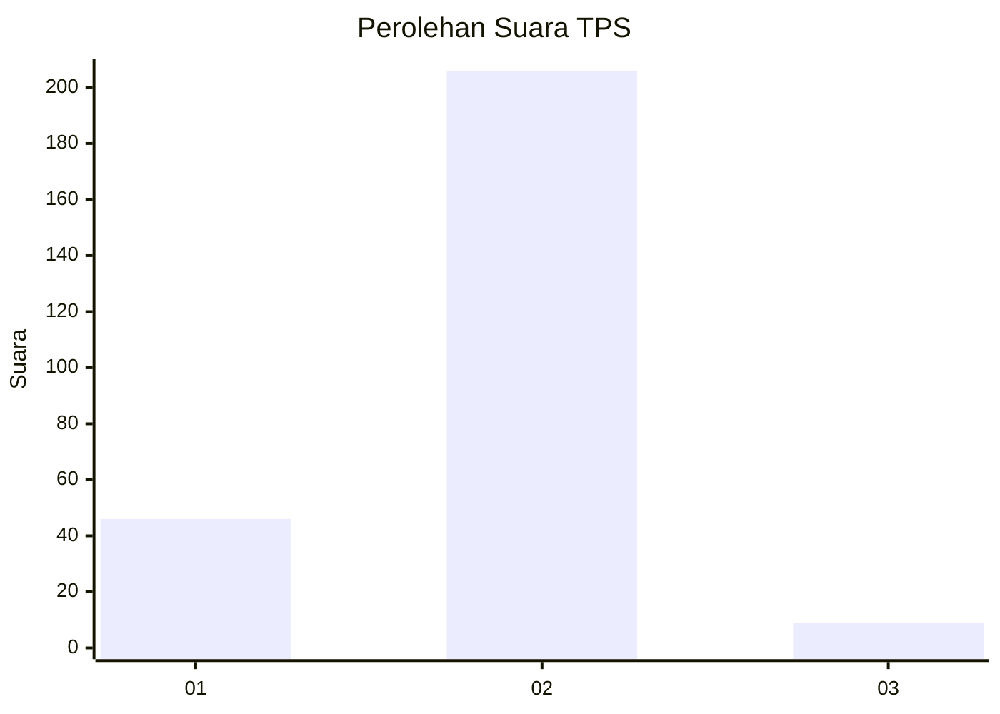
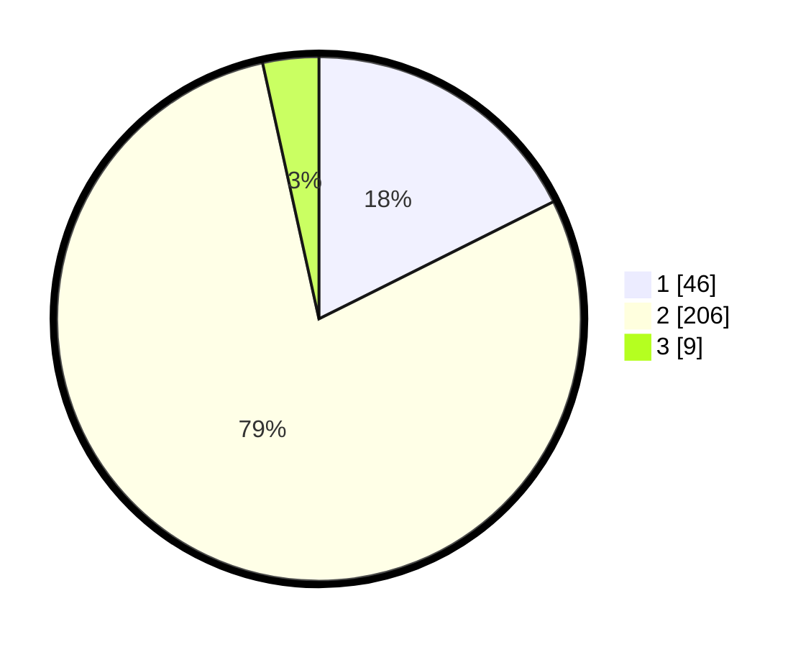

# Hasil

## Grafik

## Tabel

| No. | Nama Paslon    | Suara | Suara (raw) | Persentase |
|:--- |:-------------- | -----:| -----------:| ----------:|
| 1   | ANIES MUHAIMIN | 46    | [46][p-1]   | 17,62      |
| 2   | PRABOWO GIBRAN | 206   | [206][p-2]  | 78,93      |
| 3   | GANJAR MAHFUD  | 9     | [9][p-3]    | 3,45       |

[p-1]: https://github.com/gigit-pemilu/pemilu-2024-16-sumatera-selatan/blob/main/pilpres/hitung-suara/sub/16-sumatera-selatan/sub/07-banyuasin/sub/03-banyuasin-iii/sub/2021-tanjung-menang/sub/004-tps/sub/paslon-1.txt
[p-2]: https://github.com/gigit-pemilu/pemilu-2024-16-sumatera-selatan/blob/main/pilpres/hitung-suara/sub/16-sumatera-selatan/sub/07-banyuasin/sub/03-banyuasin-iii/sub/2021-tanjung-menang/sub/004-tps/sub/paslon-2.txt
[p-3]: https://github.com/gigit-pemilu/pemilu-2024-16-sumatera-selatan/blob/main/pilpres/hitung-suara/sub/16-sumatera-selatan/sub/07-banyuasin/sub/03-banyuasin-iii/sub/2021-tanjung-menang/sub/004-tps/sub/paslon-3.txt

## Foto C Plano

https://sirekap-obj-formc.kpu.go.id/3b56/pemilu/ppwp/16/07/03/20/21/1607032021004-20240215-223325--957b54f0-7134-46c4-8359-9f5b263a545b.jpg

https://sirekap-obj-formc.kpu.go.id/3b56/pemilu/ppwp/16/07/03/20/21/1607032021004-20240215-224029--367e6656-4ca9-49ea-ad6b-2e2824ae2b69.jpg

https://sirekap-obj-formc.kpu.go.id/3b56/pemilu/ppwp/16/07/03/20/21/1607032021004-20240215-224421--bc58f4c5-d9ea-4480-9e63-86b2c030d3ff.jpg

## Metadata

| Key        | Value               |
| ---------- | ------------------- |
| Time Stamp | 2024-02-16 00:00:26 |

