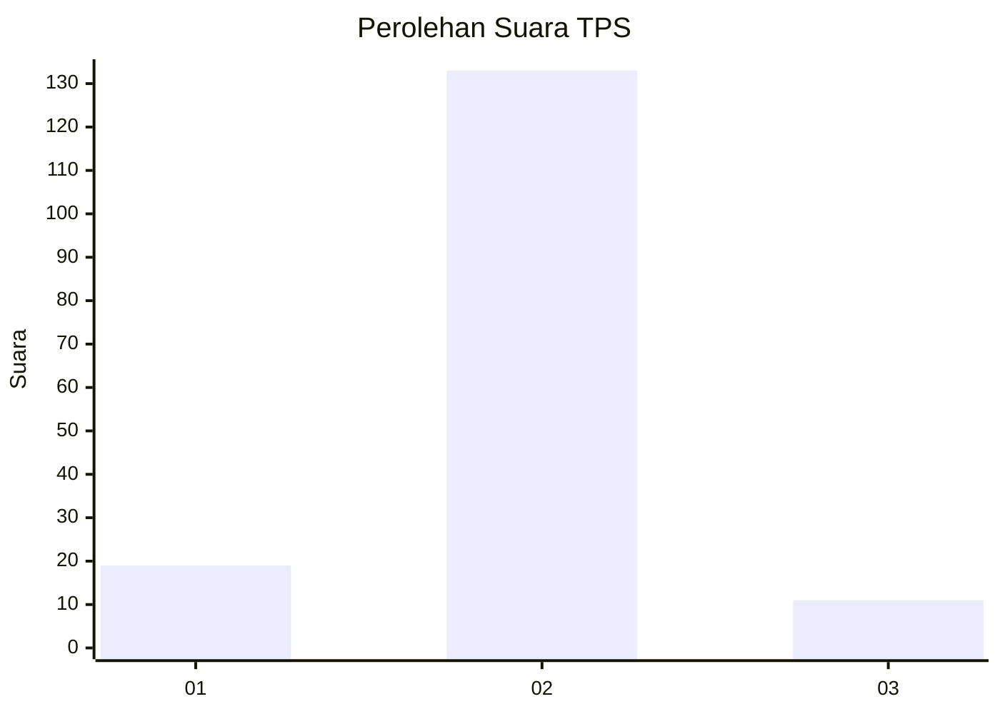
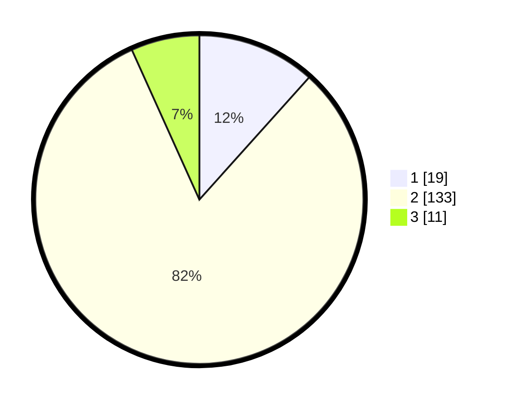

# Hasil

## Grafik

## Tabel

| No. | Nama Paslon    | Suara | Suara (raw) | Persentase |
|:--- |:-------------- | -----:| -----------:| ----------:|
| 1   | ANIES MUHAIMIN | 19    | [19][p-1]   | 11,66      |
| 2   | PRABOWO GIBRAN | 133   | [133][p-2]  | 81,60      |
| 3   | GANJAR MAHFUD  | 11    | [11][p-3]   | 6,75       |

[p-1]: https://github.com/gigit-pemilu/pemilu-2024-16-sumatera-selatan/blob/main/pilpres/hitung-suara/sub/16-sumatera-selatan/sub/07-banyuasin/sub/04-pulau-rimau/sub/2002-teluk-betung/sub/002-tps/sub/paslon-1.txt
[p-2]: https://github.com/gigit-pemilu/pemilu-2024-16-sumatera-selatan/blob/main/pilpres/hitung-suara/sub/16-sumatera-selatan/sub/07-banyuasin/sub/04-pulau-rimau/sub/2002-teluk-betung/sub/002-tps/sub/paslon-2.txt
[p-3]: https://github.com/gigit-pemilu/pemilu-2024-16-sumatera-selatan/blob/main/pilpres/hitung-suara/sub/16-sumatera-selatan/sub/07-banyuasin/sub/04-pulau-rimau/sub/2002-teluk-betung/sub/002-tps/sub/paslon-3.txt

## Foto C Plano

https://sirekap-obj-formc.kpu.go.id/6214/pemilu/ppwp/16/07/04/20/02/1607042002002-20240214-203011--e628ce11-abaa-4cc8-92c3-3a87ea8e99b6.jpg

https://sirekap-obj-formc.kpu.go.id/6214/pemilu/ppwp/16/07/04/20/02/1607042002002-20240214-203210--69c5c3e8-b6b8-485d-ab1e-53894e9d8868.jpg

https://sirekap-obj-formc.kpu.go.id/6214/pemilu/ppwp/16/07/04/20/02/1607042002002-20240214-203217--98863ddb-aaaa-4d31-916c-143c939b471a.jpg

## Metadata

| Key        | Value               |
| ---------- | ------------------- |
| Time Stamp | 2024-02-15 15:00:29 |

