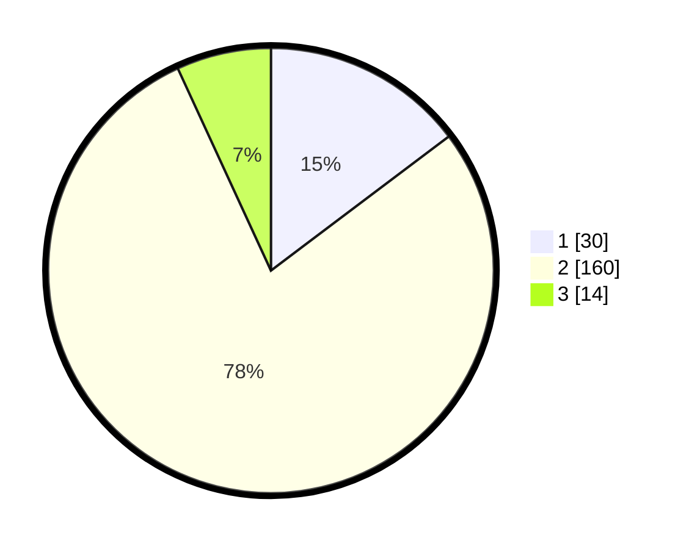

# Hasil

## Grafik

## Tabel

| No. | Nama Paslon    | Suara | Suara (raw) | Persentase |
|:--- |:-------------- | -----:| -----------:| ----------:|
| 1   | ANIES MUHAIMIN | 30    | [30][p-1]   | 14,71      |
| 2   | PRABOWO GIBRAN | 160   | [160][p-2]  | 78,43      |
| 3   | GANJAR MAHFUD  | 14    | [14][p-3]   | 6,86       |

[p-1]: https://github.com/gigit-pemilu/pemilu-2024-16-sumatera-selatan/blob/main/pilpres/hitung-suara/sub/16-sumatera-selatan/sub/07-banyuasin/sub/04-pulau-rimau/sub/2002-teluk-betung/sub/004-tps/sub/paslon-1.txt
[p-2]: https://github.com/gigit-pemilu/pemilu-2024-16-sumatera-selatan/blob/main/pilpres/hitung-suara/sub/16-sumatera-selatan/sub/07-banyuasin/sub/04-pulau-rimau/sub/2002-teluk-betung/sub/004-tps/sub/paslon-2.txt
[p-3]: https://github.com/gigit-pemilu/pemilu-2024-16-sumatera-selatan/blob/main/pilpres/hitung-suara/sub/16-sumatera-selatan/sub/07-banyuasin/sub/04-pulau-rimau/sub/2002-teluk-betung/sub/004-tps/sub/paslon-3.txt

## Foto C Plano

https://sirekap-obj-formc.kpu.go.id/5ed4/pemilu/ppwp/16/07/04/20/02/1607042002004-20240216-133738--b89f140b-0564-470f-9ec1-28273338051e.jpg

https://sirekap-obj-formc.kpu.go.id/5ed4/pemilu/ppwp/16/07/04/20/02/1607042002004-20240214-195159--d9d78ffb-3cc8-4bb3-af17-6e188950f001.jpg

https://sirekap-obj-formc.kpu.go.id/5ed4/pemilu/ppwp/16/07/04/20/02/1607042002004-20240214-195205--4fc2a31a-d8e1-4f90-bfd0-5ca62d884402.jpg

## Metadata

| Key        | Value               |
| ---------- | ------------------- |
| Time Stamp | 2024-02-16 14:00:34 |

