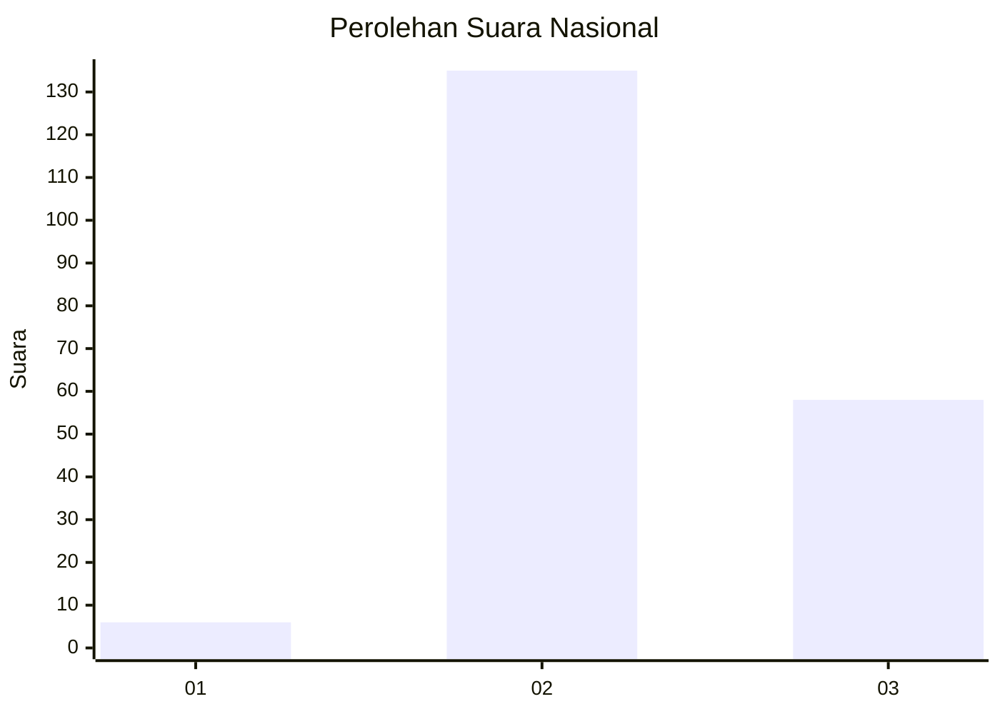

# Hasil

## Grafik

## Tabel

| No. | Nama Paslon    | Suara | Suara (raw) | Persentase |
|:--- |:-------------- | -----:| -----------:| ----------:|
| 1   | ANIES MUHAIMIN | 6     | [6][p-1]    | 3,02       |
| 2   | PRABOWO GIBRAN | 135   | [135][p-2]  | 67,84      |
| 3   | GANJAR MAHFUD  | 58    | [58][p-3]   | 29,15      |

[p-1]: https://github.com/gigit-pemilu/pemilu-2024/blob/main/pilpres/hitung-suara/sub/16-sumatera-selatan/sub/07-banyuasin/sub/04-pulau-rimau/sub/2006-sumber-rejeki/sub/004-tps/sub/paslon-1.txt
[p-2]: https://github.com/gigit-pemilu/pemilu-2024/blob/main/pilpres/hitung-suara/sub/16-sumatera-selatan/sub/07-banyuasin/sub/04-pulau-rimau/sub/2006-sumber-rejeki/sub/004-tps/sub/paslon-2.txt
[p-3]: https://github.com/gigit-pemilu/pemilu-2024/blob/main/pilpres/hitung-suara/sub/16-sumatera-selatan/sub/07-banyuasin/sub/04-pulau-rimau/sub/2006-sumber-rejeki/sub/004-tps/sub/paslon-3.txt

## Foto C Plano

https://sirekap-obj-formc.kpu.go.id/e176/pemilu/ppwp/16/07/04/20/06/1607042006004-20240215-001552--1ed20d12-45db-4fb6-b557-0ff27f589460.jpg

https://sirekap-obj-formc.kpu.go.id/e176/pemilu/ppwp/16/07/04/20/06/1607042006004-20240215-001726--46968c55-0f07-4071-91b8-fb8ea332b5fa.jpg

https://sirekap-obj-formc.kpu.go.id/e176/pemilu/ppwp/16/07/04/20/06/1607042006004-20240215-001914--f8b74b04-fb6a-4c13-8aac-9bcccef1523d.jpg

## Metadata

| Key        | Value               |
| ---------- | ------------------- |
| Time Stamp | 2024-02-15 19:00:26 |

