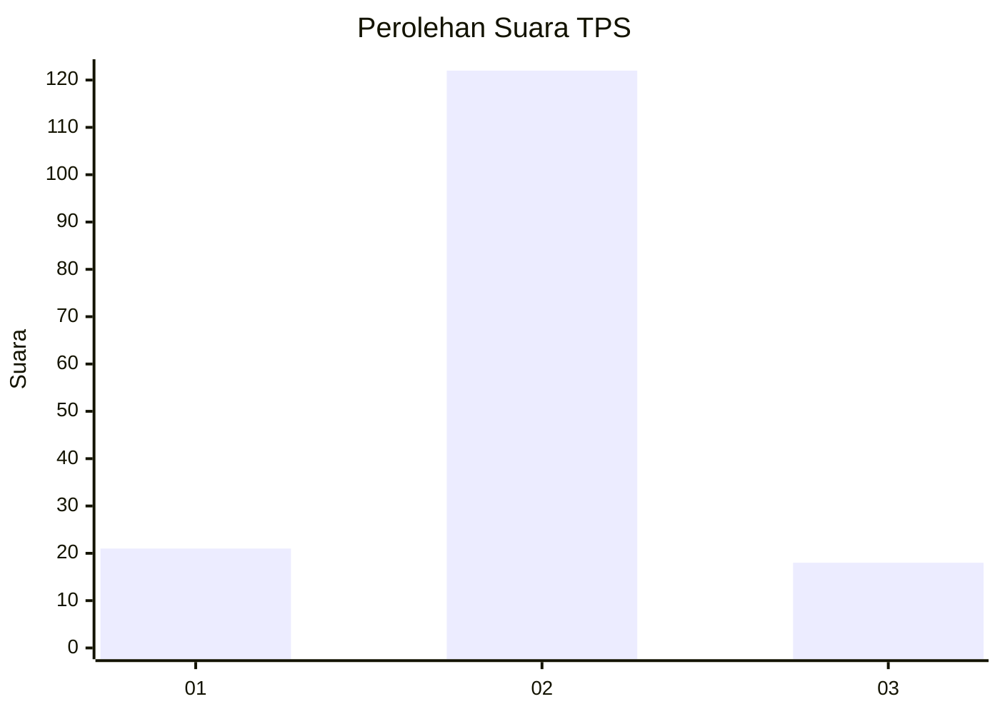
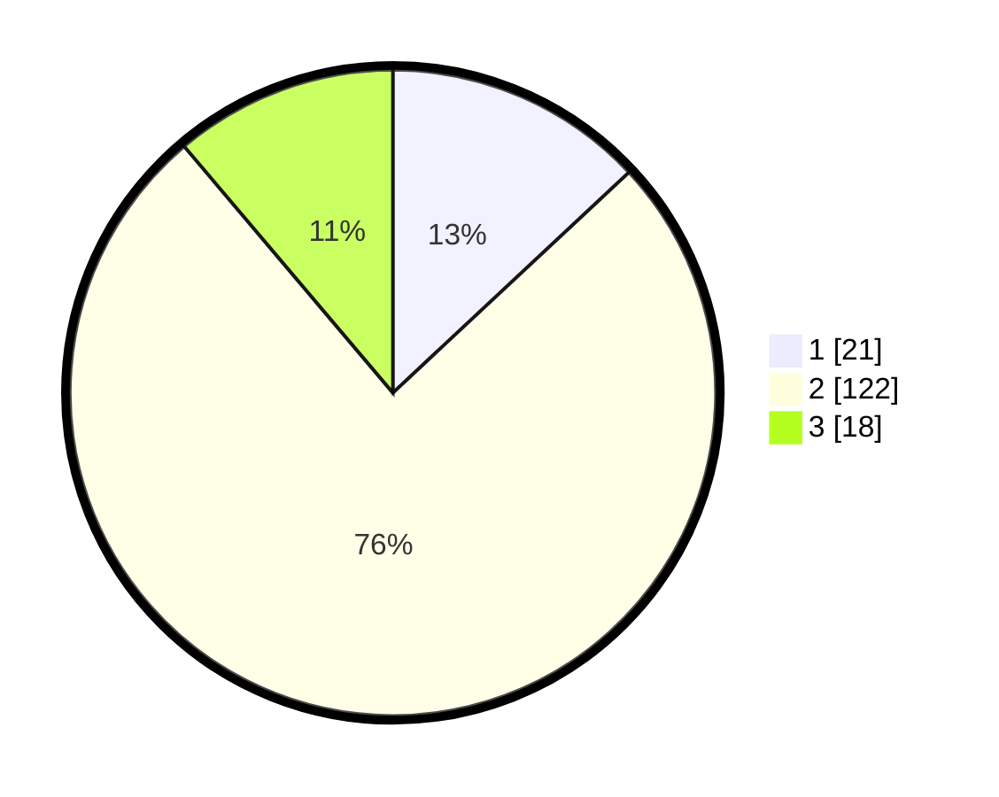

# Hasil

## Grafik

## Tabel

| No. | Nama Paslon    | Suara | Suara (raw) | Persentase |
|:--- |:-------------- | -----:| -----------:| ----------:|
| 1   | ANIES MUHAIMIN | 21    | [21][p-1]   | 13,04      |
| 2   | PRABOWO GIBRAN | 122   | [122][p-2]  | 75,78      |
| 3   | GANJAR MAHFUD  | 18    | [18][p-3]   | 11,18      |

[p-1]: https://github.com/gigit-pemilu/pemilu-2024-16-sumatera-selatan/blob/main/pilpres/hitung-suara/sub/16-sumatera-selatan/sub/07-banyuasin/sub/04-pulau-rimau/sub/2041-tabuan-asri/sub/003-tps/sub/paslon-1.txt
[p-2]: https://github.com/gigit-pemilu/pemilu-2024-16-sumatera-selatan/blob/main/pilpres/hitung-suara/sub/16-sumatera-selatan/sub/07-banyuasin/sub/04-pulau-rimau/sub/2041-tabuan-asri/sub/003-tps/sub/paslon-2.txt
[p-3]: https://github.com/gigit-pemilu/pemilu-2024-16-sumatera-selatan/blob/main/pilpres/hitung-suara/sub/16-sumatera-selatan/sub/07-banyuasin/sub/04-pulau-rimau/sub/2041-tabuan-asri/sub/003-tps/sub/paslon-3.txt

## Foto C Plano

https://sirekap-obj-formc.kpu.go.id/b7a6/pemilu/ppwp/16/07/04/20/41/1607042041003-20240214-222017--ace26c7d-4976-4947-8dbf-99ee770fbcae.jpg

https://sirekap-obj-formc.kpu.go.id/b7a6/pemilu/ppwp/16/07/04/20/41/1607042041003-20240214-222150--9ec1d1bd-4e9a-4bf1-8105-2de0cc8f5f05.jpg

https://sirekap-obj-formc.kpu.go.id/b7a6/pemilu/ppwp/16/07/04/20/41/1607042041003-20240214-222309--5d7bb8dc-5d8c-4599-be19-60778e5bf423.jpg

## Metadata

| Key        | Value               |
| ---------- | ------------------- |
| Time Stamp | 2024-02-15 21:30:27 |

