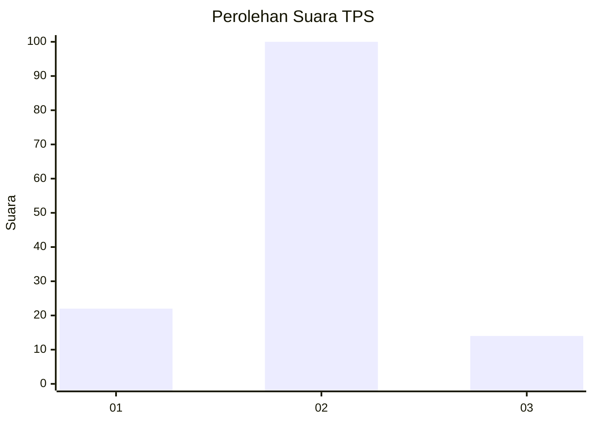
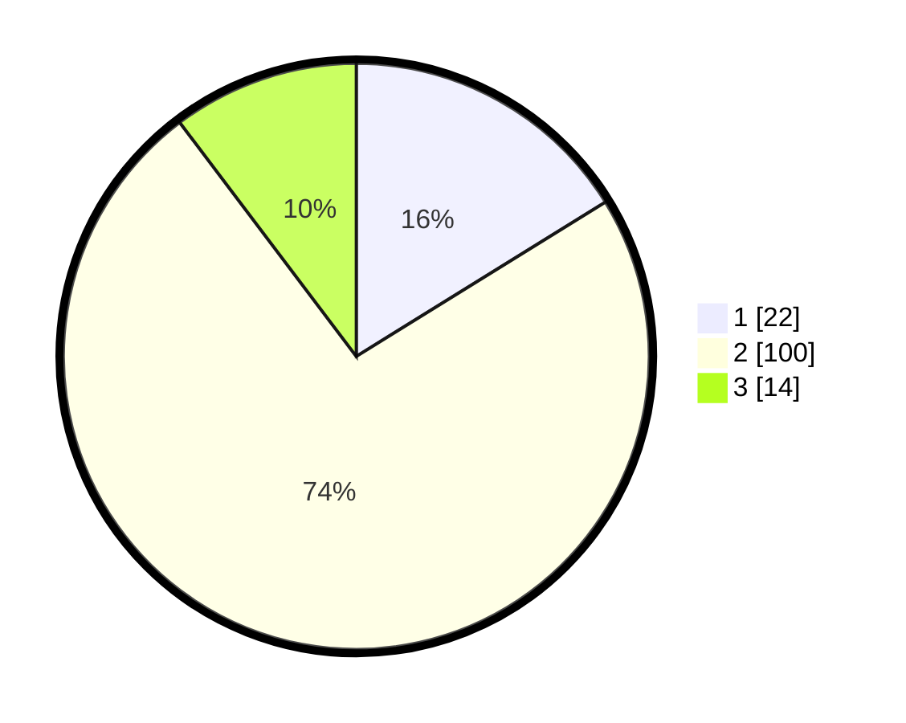

# Hasil

## Grafik

## Tabel

| No. | Nama Paslon    | Suara | Suara (raw) | Persentase |
|:--- |:-------------- | -----:| -----------:| ----------:|
| 1   | ANIES MUHAIMIN | 22    | [22][p-1]   | 16,18      |
| 2   | PRABOWO GIBRAN | 100   | [100][p-2]  | 73,53      |
| 3   | GANJAR MAHFUD  | 14    | [14][p-3]   | 10,29      |

[p-1]: https://github.com/gigit-pemilu/pemilu-2024-16-sumatera-selatan/blob/main/pilpres/hitung-suara/sub/16-sumatera-selatan/sub/07-banyuasin/sub/05-betung/sub/1017-betung/sub/011-tps/sub/paslon-1.txt
[p-2]: https://github.com/gigit-pemilu/pemilu-2024-16-sumatera-selatan/blob/main/pilpres/hitung-suara/sub/16-sumatera-selatan/sub/07-banyuasin/sub/05-betung/sub/1017-betung/sub/011-tps/sub/paslon-2.txt
[p-3]: https://github.com/gigit-pemilu/pemilu-2024-16-sumatera-selatan/blob/main/pilpres/hitung-suara/sub/16-sumatera-selatan/sub/07-banyuasin/sub/05-betung/sub/1017-betung/sub/011-tps/sub/paslon-3.txt

## Foto C Plano

https://sirekap-obj-formc.kpu.go.id/0c81/pemilu/ppwp/16/07/05/10/17/1607051017011-20240215-142140--47e9435e-1c7d-4ae8-9329-4813de370c80.jpg

https://sirekap-obj-formc.kpu.go.id/0c81/pemilu/ppwp/16/07/05/10/17/1607051017011-20240215-143017--c11d41f2-e8ef-476d-beb9-7fb49be3c847.jpg

https://sirekap-obj-formc.kpu.go.id/0c81/pemilu/ppwp/16/07/05/10/17/1607051017011-20240215-143223--510a3306-c151-4f34-9ed4-139b16863d90.jpg

## Metadata

| Key        | Value               |
| ---------- | ------------------- |
| Time Stamp | 2024-02-15 21:30:27 |

