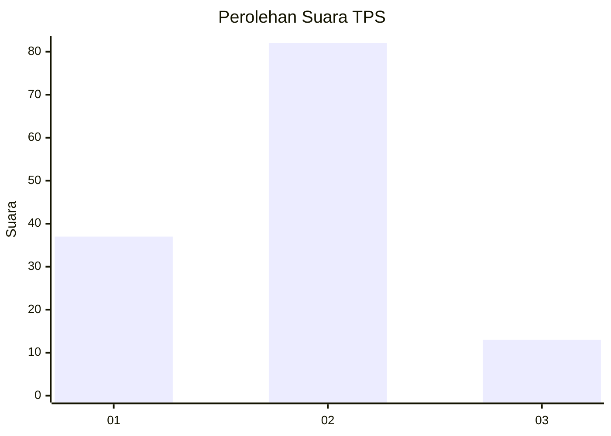
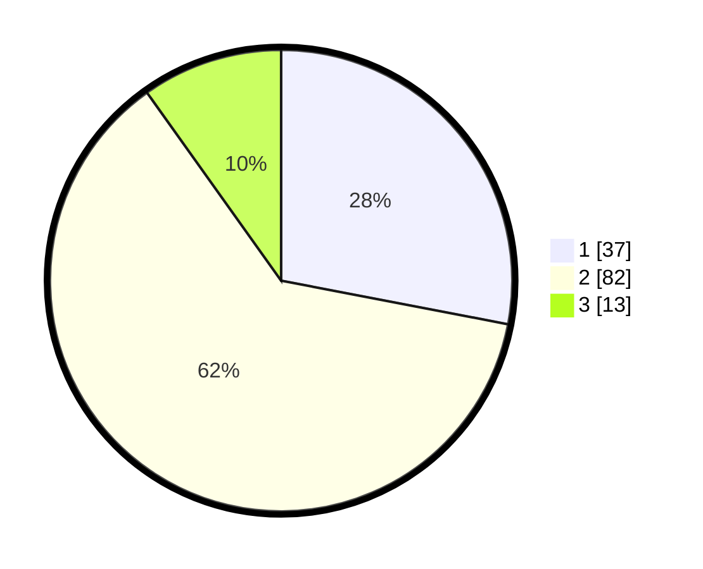

# Hasil

## Grafik

## Tabel

| No. | Nama Paslon    | Suara | Suara (raw) | Persentase |
|:--- |:-------------- | -----:| -----------:| ----------:|
| 1   | ANIES MUHAIMIN | 37    | [37][p-1]   | 28,03      |
| 2   | PRABOWO GIBRAN | 82    | [82][p-2]   | 62,12      |
| 3   | GANJAR MAHFUD  | 13    | [13][p-3]   | 9,85       |

[p-1]: https://github.com/gigit-pemilu/pemilu-2024-16-sumatera-selatan/blob/main/pilpres/hitung-suara/sub/16-sumatera-selatan/sub/07-banyuasin/sub/05-betung/sub/1021-rimba-asam/sub/001-tps/sub/paslon-1.txt
[p-2]: https://github.com/gigit-pemilu/pemilu-2024-16-sumatera-selatan/blob/main/pilpres/hitung-suara/sub/16-sumatera-selatan/sub/07-banyuasin/sub/05-betung/sub/1021-rimba-asam/sub/001-tps/sub/paslon-2.txt
[p-3]: https://github.com/gigit-pemilu/pemilu-2024-16-sumatera-selatan/blob/main/pilpres/hitung-suara/sub/16-sumatera-selatan/sub/07-banyuasin/sub/05-betung/sub/1021-rimba-asam/sub/001-tps/sub/paslon-3.txt

## Foto C Plano

https://sirekap-obj-formc.kpu.go.id/2750/pemilu/ppwp/16/07/05/10/21/1607051021001-20240214-224253--71a835e1-577c-43bf-99d7-04890c531a5d.jpg

https://sirekap-obj-formc.kpu.go.id/2750/pemilu/ppwp/16/07/05/10/21/1607051021001-20240214-224008--98bd407f-8d21-4946-acc7-b4962d877f05.jpg

https://sirekap-obj-formc.kpu.go.id/2750/pemilu/ppwp/16/07/05/10/21/1607051021001-20240214-223241--dfef87c0-abd5-4bfc-89b0-11fc4c6bc96a.jpg

## Metadata

| Key        | Value               |
| ---------- | ------------------- |
| Time Stamp | 2024-02-15 22:00:27 |

