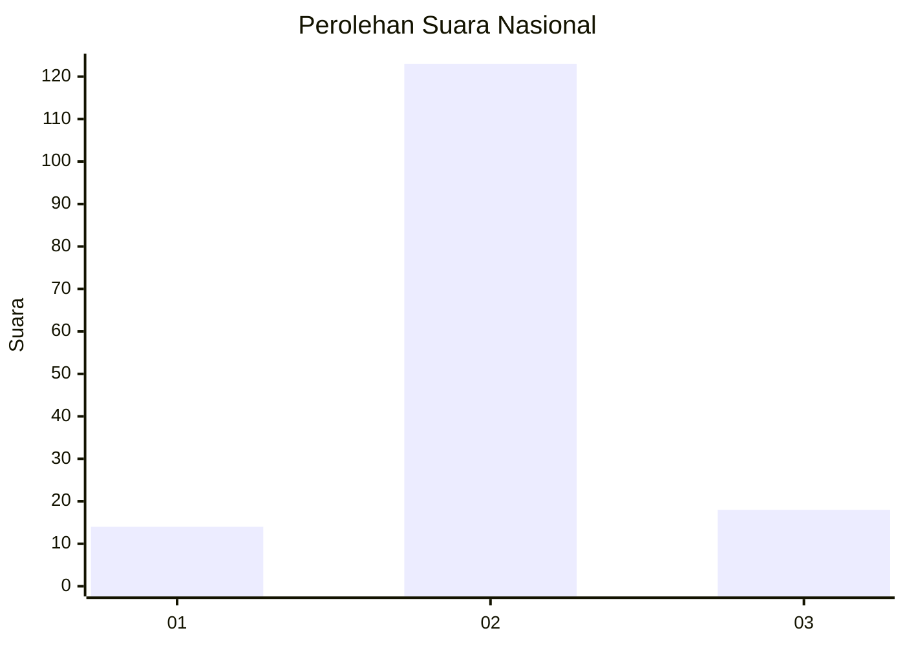
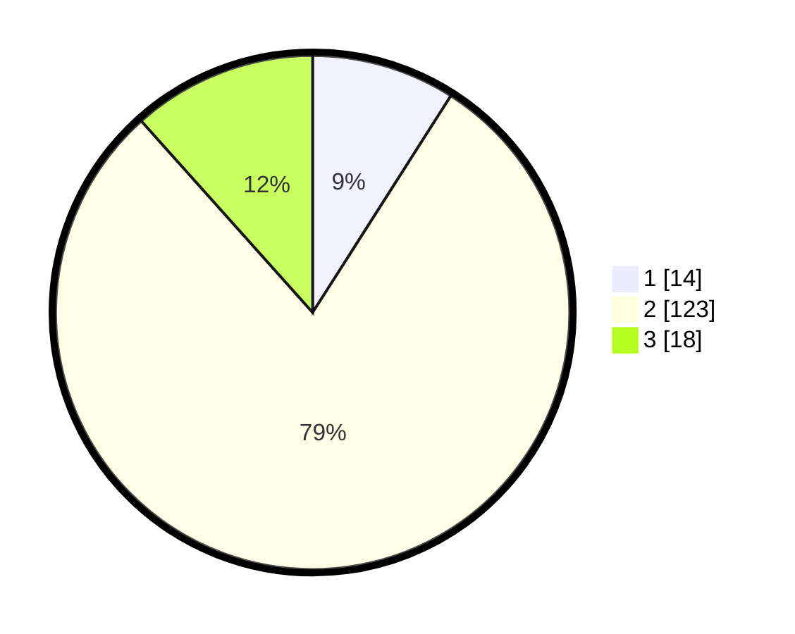

# Hasil

## Grafik

## Tabel

| No. | Nama Paslon    | Suara | Suara (raw) | Persentase |
|:--- |:-------------- | -----:| -----------:| ----------:|
| 1   | ANIES MUHAIMIN | 14    | [14][p-1]   | 9,03       |
| 2   | PRABOWO GIBRAN | 123   | [123][p-2]  | 79,35      |
| 3   | GANJAR MAHFUD  | 18    | [18][p-3]   | 11,61      |

[p-1]: https://github.com/gigit-pemilu/pemilu-2024/blob/main/pilpres/hitung-suara/sub/16-sumatera-selatan/sub/07-banyuasin/sub/05-betung/sub/1021-rimba-asam/sub/002-tps/sub/paslon-1.txt
[p-2]: https://github.com/gigit-pemilu/pemilu-2024/blob/main/pilpres/hitung-suara/sub/16-sumatera-selatan/sub/07-banyuasin/sub/05-betung/sub/1021-rimba-asam/sub/002-tps/sub/paslon-2.txt
[p-3]: https://github.com/gigit-pemilu/pemilu-2024/blob/main/pilpres/hitung-suara/sub/16-sumatera-selatan/sub/07-banyuasin/sub/05-betung/sub/1021-rimba-asam/sub/002-tps/sub/paslon-3.txt

## Foto C Plano

https://sirekap-obj-formc.kpu.go.id/172f/pemilu/ppwp/16/07/05/10/21/1607051021002-20240214-215441--12c8d333-0d7f-428b-b93d-a27e2ea7a4e4.jpg

https://sirekap-obj-formc.kpu.go.id/172f/pemilu/ppwp/16/07/05/10/21/1607051021002-20240214-215456--fa067093-1148-46b7-a3d7-c07be1922f43.jpg

https://sirekap-obj-formc.kpu.go.id/172f/pemilu/ppwp/16/07/05/10/21/1607051021002-20240214-215459--1140bee4-f60d-41ee-96f5-31fd2be6e644.jpg

## Metadata

| Key        | Value               |
| ---------- | ------------------- |
| Time Stamp | 2024-02-15 12:00:28 |

