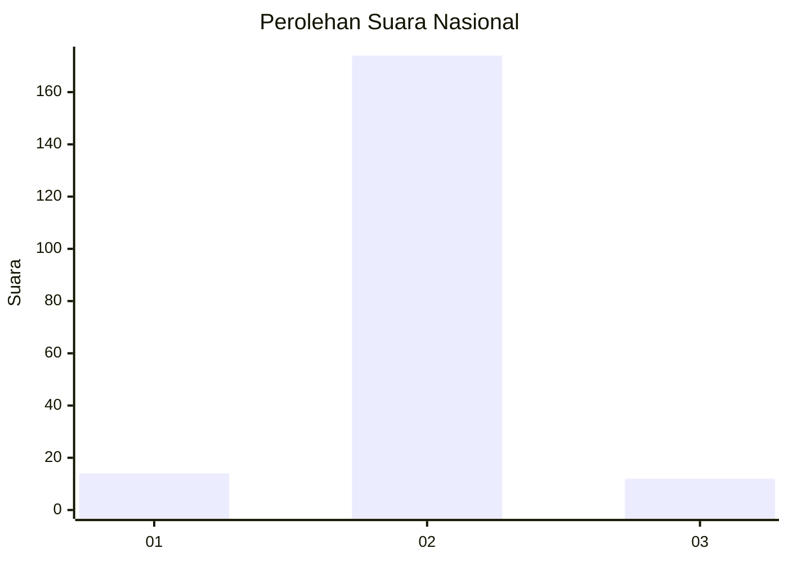
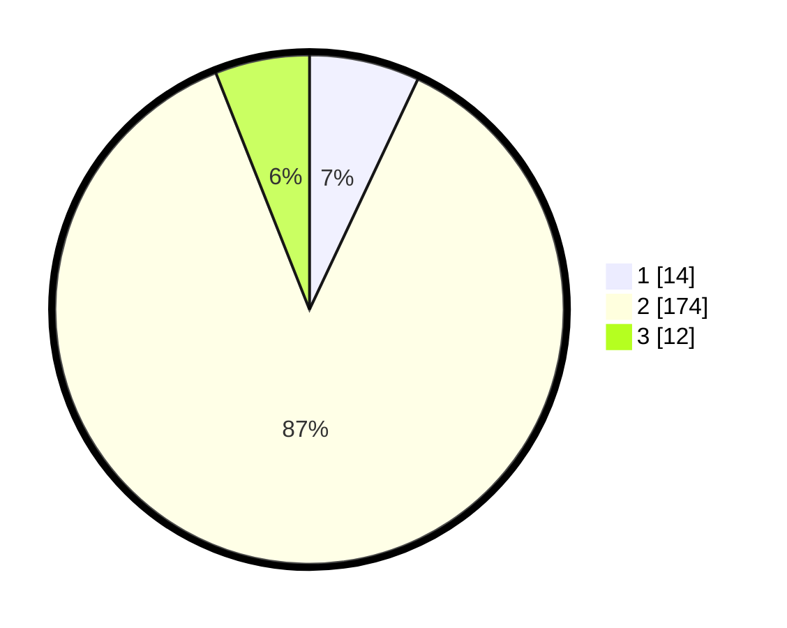

# Hasil

## Grafik

## Tabel

| No. | Nama Paslon    | Suara | Suara (raw) | Persentase |
|:--- |:-------------- | -----:| -----------:| ----------:|
| 1   | ANIES MUHAIMIN | 14    | [14][p-1]   | 7,00       |
| 2   | PRABOWO GIBRAN | 174   | [174][p-2]  | 87,00      |
| 3   | GANJAR MAHFUD  | 12    | [12][p-3]   | 6,00       |

[p-1]: https://github.com/gigit-pemilu/pemilu-2024/blob/main/pilpres/hitung-suara/sub/16-sumatera-selatan/sub/07-banyuasin/sub/05-betung/sub/2003-bukit/sub/006-tps/sub/paslon-1.txt
[p-2]: https://github.com/gigit-pemilu/pemilu-2024/blob/main/pilpres/hitung-suara/sub/16-sumatera-selatan/sub/07-banyuasin/sub/05-betung/sub/2003-bukit/sub/006-tps/sub/paslon-2.txt
[p-3]: https://github.com/gigit-pemilu/pemilu-2024/blob/main/pilpres/hitung-suara/sub/16-sumatera-selatan/sub/07-banyuasin/sub/05-betung/sub/2003-bukit/sub/006-tps/sub/paslon-3.txt

## Foto C Plano

https://sirekap-obj-formc.kpu.go.id/0a0c/pemilu/ppwp/16/07/05/20/03/1607052003006-20240214-155922--b07b0b73-d88c-45d9-bbb9-3a41065f4ea5.jpg

https://sirekap-obj-formc.kpu.go.id/0a0c/pemilu/ppwp/16/07/05/20/03/1607052003006-20240214-221254--9ad34769-1bd2-46ea-8462-7f1e45fb3f22.jpg

https://sirekap-obj-formc.kpu.go.id/0a0c/pemilu/ppwp/16/07/05/20/03/1607052003006-20240215-031955--d84cff4c-af8a-4b51-a45b-fedc3f346c08.jpg

## Metadata

| Key        | Value               |
| ---------- | ------------------- |
| Time Stamp | 2024-02-15 18:00:26 |

