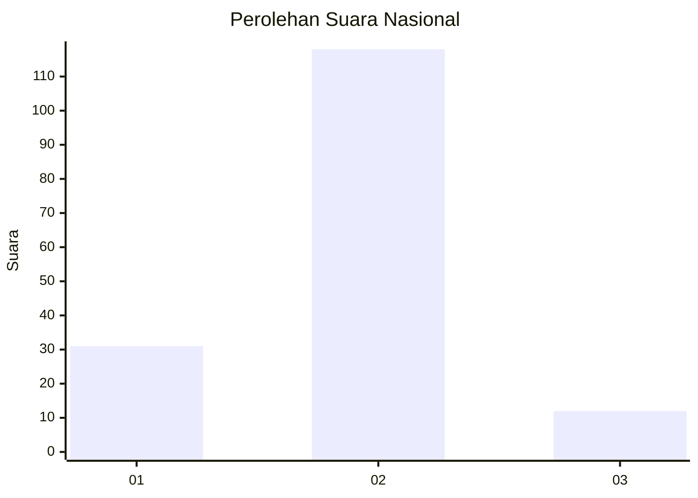
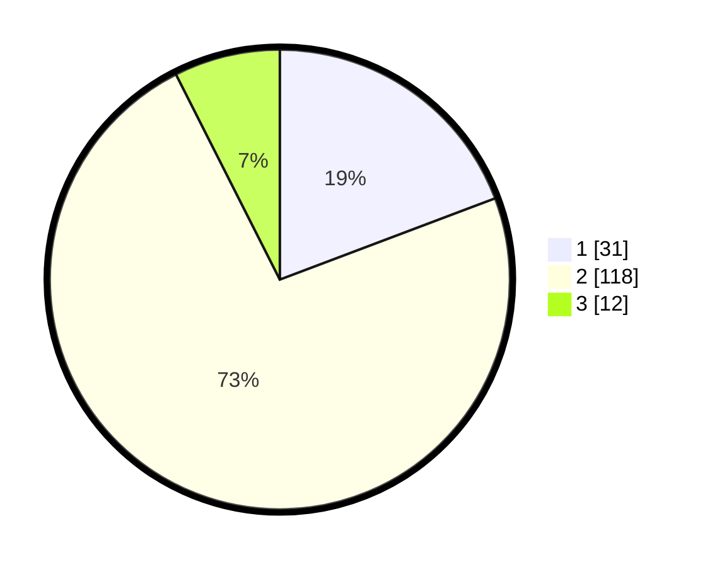

# Hasil

## Grafik

## Tabel

| No. | Nama Paslon    | Suara | Suara (raw) | Persentase |
|:--- |:-------------- | -----:| -----------:| ----------:|
| 1   | ANIES MUHAIMIN | 31    | [31][p-1]   | 19,25      |
| 2   | PRABOWO GIBRAN | 118   | [118][p-2]  | 73,29      |
| 3   | GANJAR MAHFUD  | 12    | [12][p-3]   | 7,45       |

[p-1]: https://github.com/gigit-pemilu/pemilu-2024/blob/main/pilpres/hitung-suara/sub/16-sumatera-selatan/sub/07-banyuasin/sub/05-betung/sub/2005-lubuk-karet/sub/012-tps/sub/paslon-1.txt
[p-2]: https://github.com/gigit-pemilu/pemilu-2024/blob/main/pilpres/hitung-suara/sub/16-sumatera-selatan/sub/07-banyuasin/sub/05-betung/sub/2005-lubuk-karet/sub/012-tps/sub/paslon-2.txt
[p-3]: https://github.com/gigit-pemilu/pemilu-2024/blob/main/pilpres/hitung-suara/sub/16-sumatera-selatan/sub/07-banyuasin/sub/05-betung/sub/2005-lubuk-karet/sub/012-tps/sub/paslon-3.txt

## Foto C Plano

https://sirekap-obj-formc.kpu.go.id/4955/pemilu/ppwp/16/07/05/20/05/1607052005012-20240214-224131--c8afd885-850b-4c72-8c26-98455fa4355f.jpg

https://sirekap-obj-formc.kpu.go.id/4955/pemilu/ppwp/16/07/05/20/05/1607052005012-20240214-224035--936fff6d-6e1d-47c8-a8b8-44b72e970424.jpg

https://sirekap-obj-formc.kpu.go.id/4955/pemilu/ppwp/16/07/05/20/05/1607052005012-20240214-224253--d06c6d65-9359-4a59-959c-1da869710bb7.jpg

## Metadata

| Key        | Value               |
| ---------- | ------------------- |
| Time Stamp | 2024-02-15 12:00:28 |

