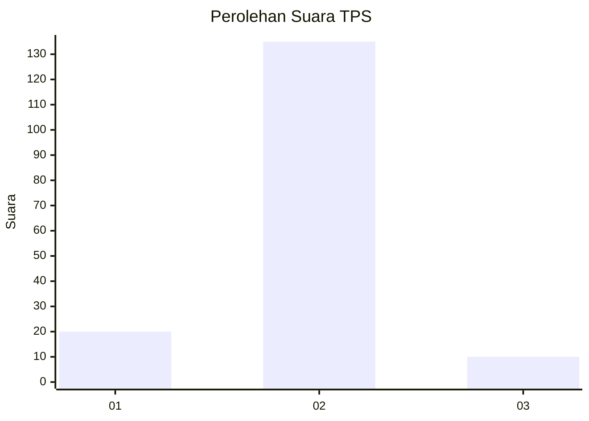
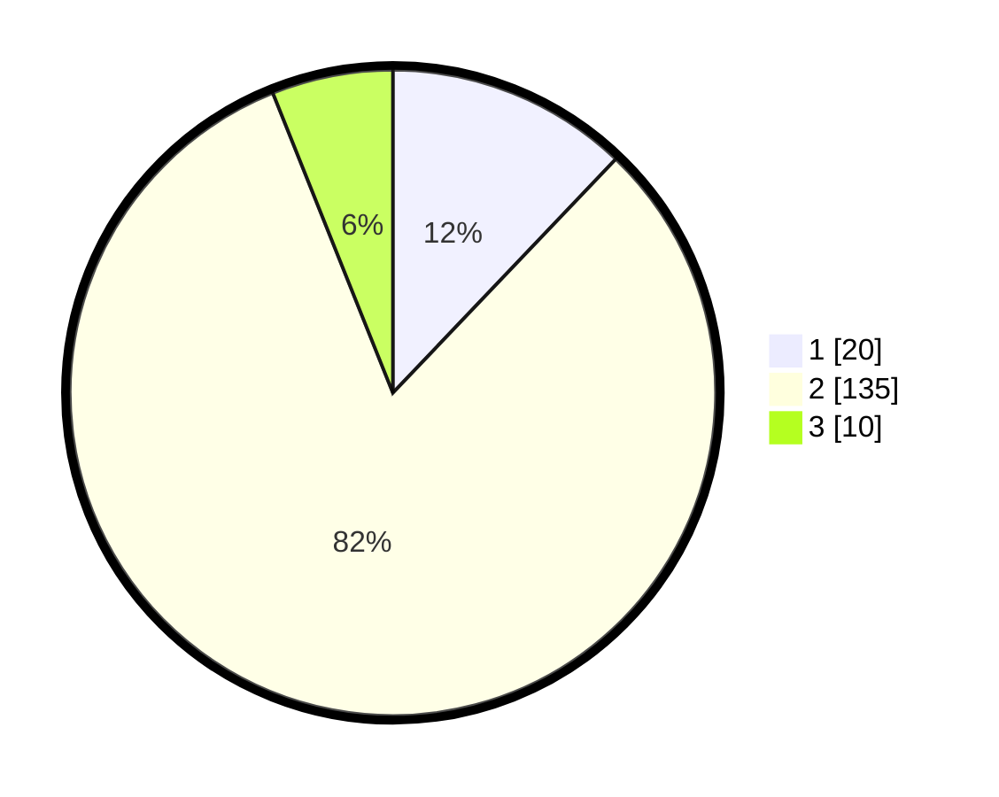

# Hasil

## Grafik

## Tabel

| No. | Nama Paslon    | Suara | Suara (raw) | Persentase |
|:--- |:-------------- | -----:| -----------:| ----------:|
| 1   | ANIES MUHAIMIN | 20    | [20][p-1]   | 12,12      |
| 2   | PRABOWO GIBRAN | 135   | [135][p-2]  | 81,82      |
| 3   | GANJAR MAHFUD  | 10    | [10][p-3]   | 6,06       |

[p-1]: https://github.com/gigit-pemilu/pemilu-2024-16-sumatera-selatan/blob/main/pilpres/hitung-suara/sub/16-sumatera-selatan/sub/07-banyuasin/sub/05-betung/sub/2016-taja-indah/sub/002-tps/sub/paslon-1.txt
[p-2]: https://github.com/gigit-pemilu/pemilu-2024-16-sumatera-selatan/blob/main/pilpres/hitung-suara/sub/16-sumatera-selatan/sub/07-banyuasin/sub/05-betung/sub/2016-taja-indah/sub/002-tps/sub/paslon-2.txt
[p-3]: https://github.com/gigit-pemilu/pemilu-2024-16-sumatera-selatan/blob/main/pilpres/hitung-suara/sub/16-sumatera-selatan/sub/07-banyuasin/sub/05-betung/sub/2016-taja-indah/sub/002-tps/sub/paslon-3.txt

## Foto C Plano

https://sirekap-obj-formc.kpu.go.id/deea/pemilu/ppwp/16/07/05/20/16/1607052016002-20240214-184737--b51dca81-21f9-48de-9d8c-9fbc3f616c9c.jpg

https://sirekap-obj-formc.kpu.go.id/deea/pemilu/ppwp/16/07/05/20/16/1607052016002-20240214-184746--96776606-103d-44fe-84c8-d1a1efeafff1.jpg

https://sirekap-obj-formc.kpu.go.id/deea/pemilu/ppwp/16/07/05/20/16/1607052016002-20240214-184752--897e990c-0c59-467d-be52-681c5c453995.jpg

## Metadata

| Key        | Value               |
| ---------- | ------------------- |
| Time Stamp | 2024-02-15 22:40:13 |

