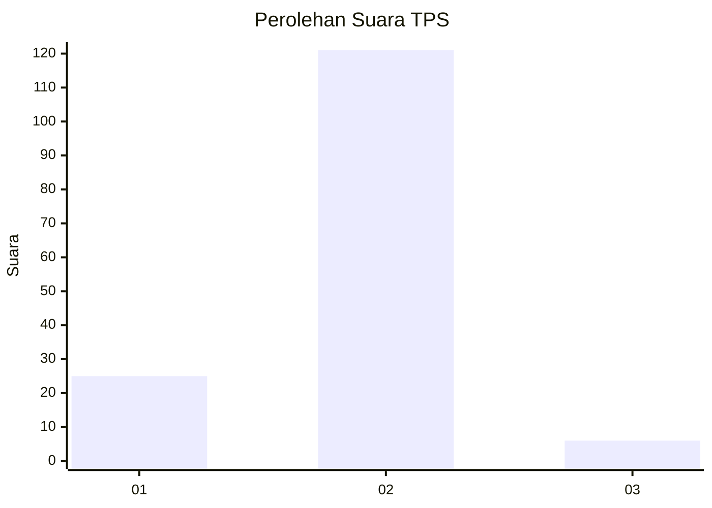
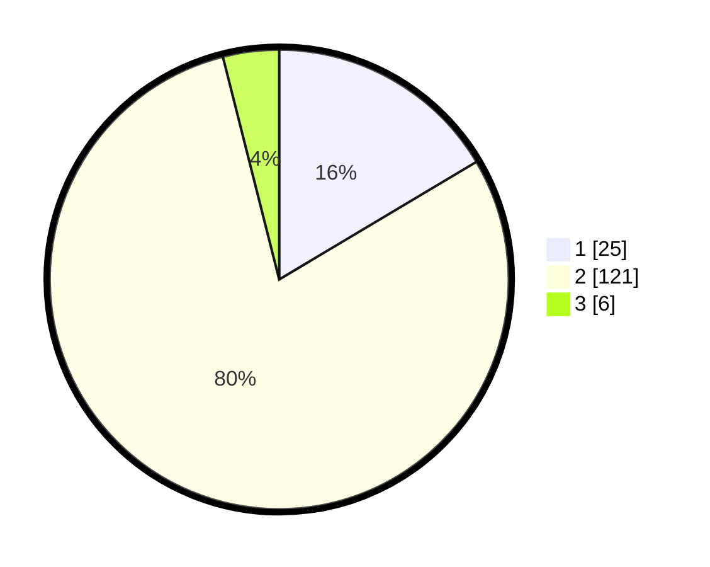

# Hasil

## Grafik

## Tabel

| No. | Nama Paslon    | Suara | Suara (raw) | Persentase |
|:--- |:-------------- | -----:| -----------:| ----------:|
| 1   | ANIES MUHAIMIN | 25    | [25][p-1]   | 16,45      |
| 2   | PRABOWO GIBRAN | 121   | [121][p-2]  | 79,61      |
| 3   | GANJAR MAHFUD  | 6     | [6][p-3]    | 3,95       |

[p-1]: https://github.com/gigit-pemilu/pemilu-2024-16-sumatera-selatan/blob/main/pilpres/hitung-suara/sub/16-sumatera-selatan/sub/07-banyuasin/sub/05-betung/sub/2016-taja-indah/sub/007-tps/sub/paslon-1.txt
[p-2]: https://github.com/gigit-pemilu/pemilu-2024-16-sumatera-selatan/blob/main/pilpres/hitung-suara/sub/16-sumatera-selatan/sub/07-banyuasin/sub/05-betung/sub/2016-taja-indah/sub/007-tps/sub/paslon-2.txt
[p-3]: https://github.com/gigit-pemilu/pemilu-2024-16-sumatera-selatan/blob/main/pilpres/hitung-suara/sub/16-sumatera-selatan/sub/07-banyuasin/sub/05-betung/sub/2016-taja-indah/sub/007-tps/sub/paslon-3.txt

## Foto C Plano

https://sirekap-obj-formc.kpu.go.id/7391/pemilu/ppwp/16/07/05/20/16/1607052016007-20240215-001518--207d8243-11ad-4006-8d0f-5e3fd5ae4a24.jpg

https://sirekap-obj-formc.kpu.go.id/7391/pemilu/ppwp/16/07/05/20/16/1607052016007-20240215-001724--3e996574-e020-4bf5-8ec1-f8d5a2a3bd43.jpg

https://sirekap-obj-formc.kpu.go.id/7391/pemilu/ppwp/16/07/05/20/16/1607052016007-20240215-001843--a3200090-02b7-40a3-9caf-9bdaf9a4e423.jpg

## Metadata

| Key        | Value               |
| ---------- | ------------------- |
| Time Stamp | 2024-02-15 12:00:28 |

