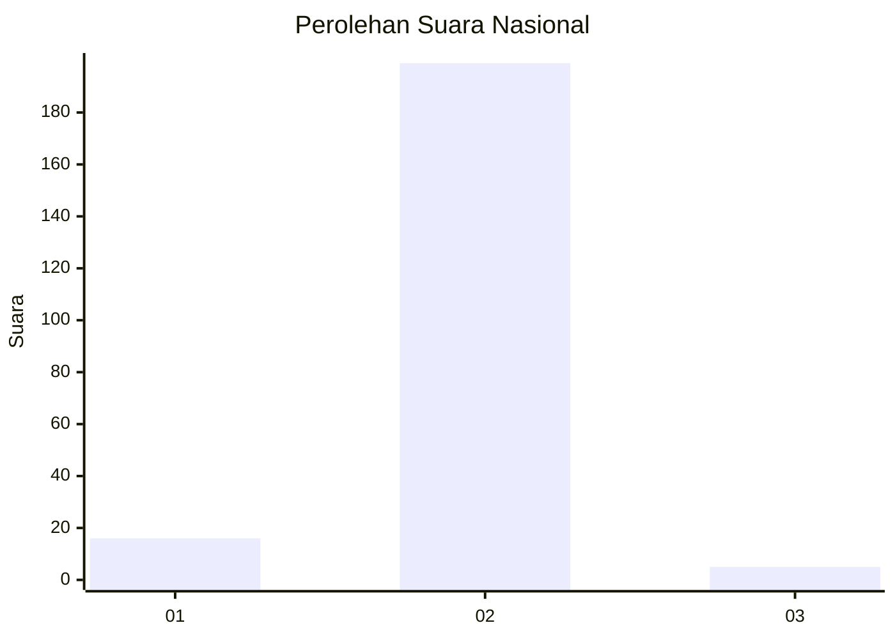
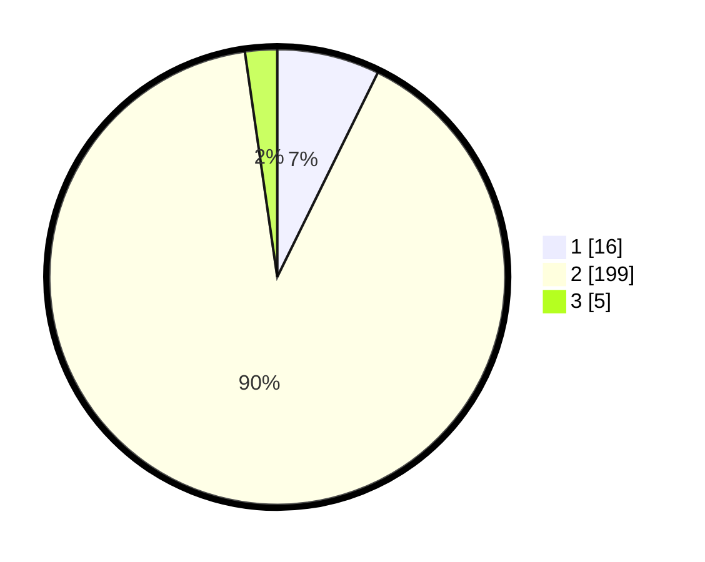

# Hasil

## Grafik

## Tabel

| No. | Nama Paslon    | Suara | Suara (raw) | Persentase |
|:--- |:-------------- | -----:| -----------:| ----------:|
| 1   | ANIES MUHAIMIN | 16    | [16][p-1]   | 7,27       |
| 2   | PRABOWO GIBRAN | 199   | [199][p-2]  | 90,45      |
| 3   | GANJAR MAHFUD  | 5     | [5][p-3]    | 2,27       |

[p-1]: https://github.com/gigit-pemilu/pemilu-2024/blob/main/pilpres/hitung-suara/sub/16-sumatera-selatan/sub/07-banyuasin/sub/06-rambutan/sub/2002-siju/sub/003-tps/sub/paslon-1.txt
[p-2]: https://github.com/gigit-pemilu/pemilu-2024/blob/main/pilpres/hitung-suara/sub/16-sumatera-selatan/sub/07-banyuasin/sub/06-rambutan/sub/2002-siju/sub/003-tps/sub/paslon-2.txt
[p-3]: https://github.com/gigit-pemilu/pemilu-2024/blob/main/pilpres/hitung-suara/sub/16-sumatera-selatan/sub/07-banyuasin/sub/06-rambutan/sub/2002-siju/sub/003-tps/sub/paslon-3.txt

## Foto C Plano

https://sirekap-obj-formc.kpu.go.id/fddf/pemilu/ppwp/16/07/06/20/02/1607062002003-20240217-183724--71f40102-7ec7-46ec-8d5f-ba003fd35c9a.jpg

https://sirekap-obj-formc.kpu.go.id/fddf/pemilu/ppwp/16/07/06/20/02/1607062002003-20240217-184121--daf27f99-549d-4dbc-b0fb-092dba329d8d.jpg

https://sirekap-obj-formc.kpu.go.id/fddf/pemilu/ppwp/16/07/06/20/02/1607062002003-20240217-184409--16db645b-3922-407c-9fdd-0447f10f85ec.jpg

## Metadata

| Key        | Value               |
| ---------- | ------------------- |
| Time Stamp | 2024-02-19 06:16:00 |

