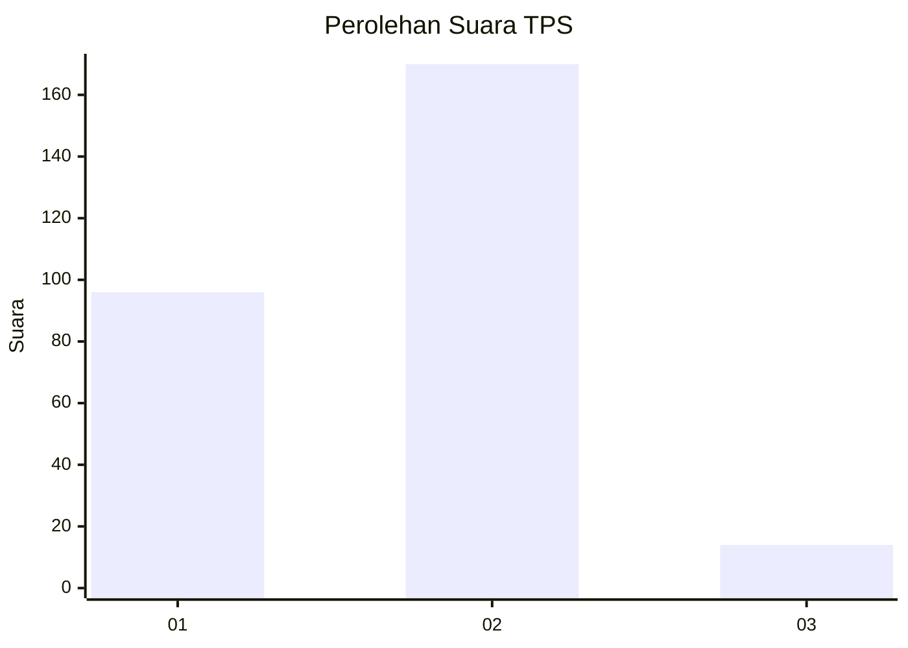
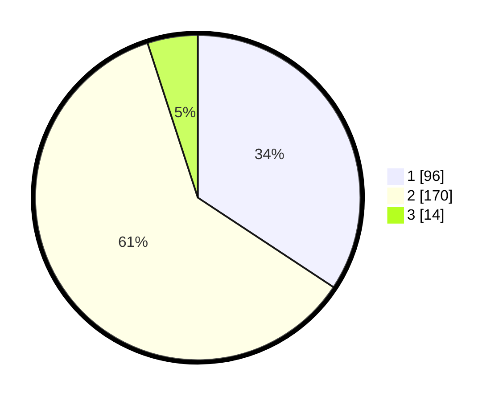

# Hasil

## Grafik

## Tabel

| No. | Nama Paslon    | Suara | Suara (raw) | Persentase |
|:--- |:-------------- | -----:| -----------:| ----------:|
| 1   | ANIES MUHAIMIN | 96    | [96][p-1]   | 34,29      |
| 2   | PRABOWO GIBRAN | 170   | [170][p-2]  | 60,71      |
| 3   | GANJAR MAHFUD  | 14    | [14][p-3]   | 5,00       |

[p-1]: https://github.com/gigit-pemilu/pemilu-2024-16-sumatera-selatan/blob/main/pilpres/hitung-suara/sub/16-sumatera-selatan/sub/07-banyuasin/sub/06-rambutan/sub/2015-sungai-dua/sub/004-tps/sub/paslon-1.txt
[p-2]: https://github.com/gigit-pemilu/pemilu-2024-16-sumatera-selatan/blob/main/pilpres/hitung-suara/sub/16-sumatera-selatan/sub/07-banyuasin/sub/06-rambutan/sub/2015-sungai-dua/sub/004-tps/sub/paslon-2.txt
[p-3]: https://github.com/gigit-pemilu/pemilu-2024-16-sumatera-selatan/blob/main/pilpres/hitung-suara/sub/16-sumatera-selatan/sub/07-banyuasin/sub/06-rambutan/sub/2015-sungai-dua/sub/004-tps/sub/paslon-3.txt

## Foto C Plano

https://sirekap-obj-formc.kpu.go.id/bd2b/pemilu/ppwp/16/07/06/20/15/1607062015004-20240214-212118--2c5249c7-f57b-4acb-89b8-b7261a7f2d27.jpg

https://sirekap-obj-formc.kpu.go.id/bd2b/pemilu/ppwp/16/07/06/20/15/1607062015004-20240215-093759--03e1fd13-39e1-4f50-86c6-20df428b3031.jpg

https://sirekap-obj-formc.kpu.go.id/bd2b/pemilu/ppwp/16/07/06/20/15/1607062015004-20240215-093950--f35875d5-2be0-45ed-ad71-f1a845ecb4f8.jpg

## Metadata

| Key        | Value               |
| ---------- | ------------------- |
| Time Stamp | 2024-02-15 18:30:25 |

