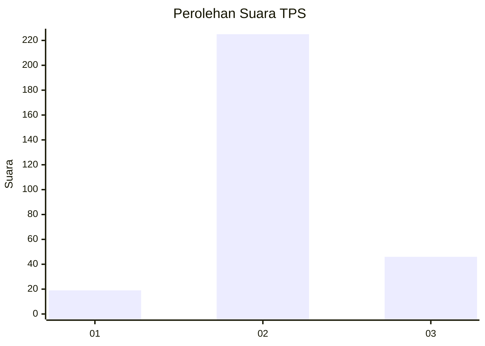
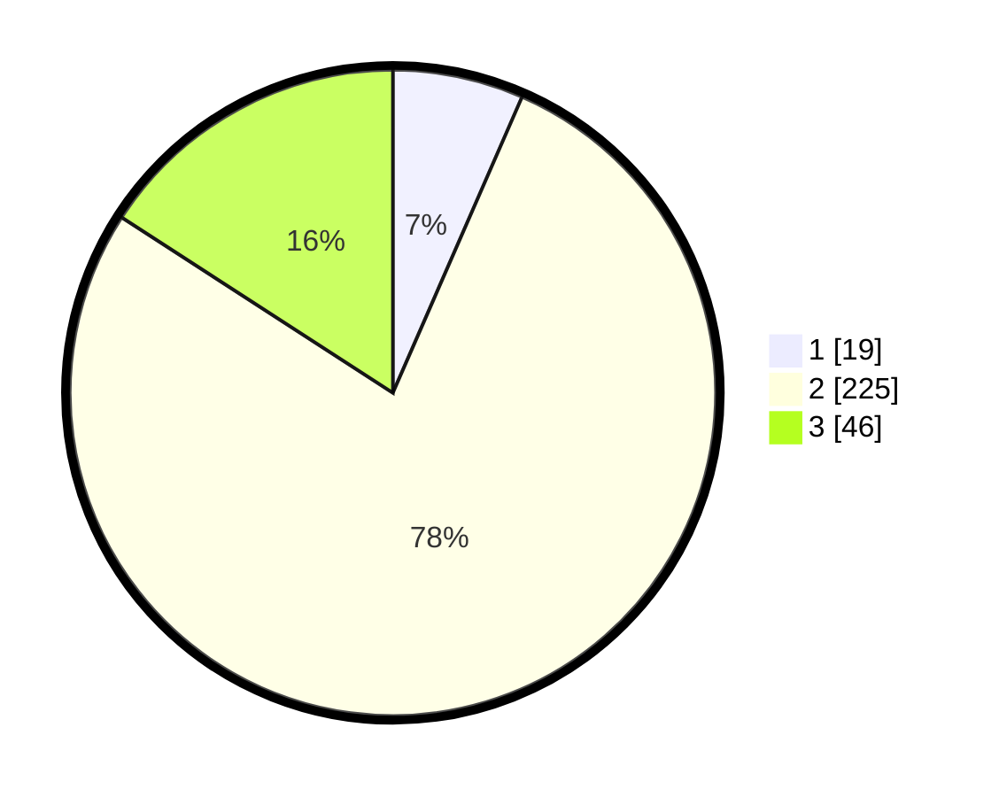

# Hasil

## Grafik

## Tabel

| No. | Nama Paslon    | Suara | Suara (raw) | Persentase |
|:--- |:-------------- | -----:| -----------:| ----------:|
| 1   | ANIES MUHAIMIN | 19    | [19][p-1]   | 6,55       |
| 2   | PRABOWO GIBRAN | 225   | [225][p-2]  | 77,59      |
| 3   | GANJAR MAHFUD  | 46    | [46][p-3]   | 15,86      |

[p-1]: https://github.com/gigit-pemilu/pemilu-2024-16-sumatera-selatan/blob/main/pilpres/hitung-suara/sub/16-sumatera-selatan/sub/07-banyuasin/sub/08-muara-telang/sub/2008-sumber-mulya/sub/004-tps/sub/paslon-1.txt
[p-2]: https://github.com/gigit-pemilu/pemilu-2024-16-sumatera-selatan/blob/main/pilpres/hitung-suara/sub/16-sumatera-selatan/sub/07-banyuasin/sub/08-muara-telang/sub/2008-sumber-mulya/sub/004-tps/sub/paslon-2.txt
[p-3]: https://github.com/gigit-pemilu/pemilu-2024-16-sumatera-selatan/blob/main/pilpres/hitung-suara/sub/16-sumatera-selatan/sub/07-banyuasin/sub/08-muara-telang/sub/2008-sumber-mulya/sub/004-tps/sub/paslon-3.txt

## Foto C Plano

https://sirekap-obj-formc.kpu.go.id/3154/pemilu/ppwp/16/07/08/20/08/1607082008004-20240215-034134--f05d60ec-e8fb-4594-ba10-059700dc85a4.jpg

https://sirekap-obj-formc.kpu.go.id/3154/pemilu/ppwp/16/07/08/20/08/1607082008004-20240215-034404--a853710a-7865-43c1-8670-3b1c598d9e2a.jpg

https://sirekap-obj-formc.kpu.go.id/3154/pemilu/ppwp/16/07/08/20/08/1607082008004-20240215-034515--dd6fb2e3-ec2a-45ae-9687-bf97922bf43c.jpg

## Metadata

| Key        | Value               |
| ---------- | ------------------- |
| Time Stamp | 2024-02-25 11:00:00 |

