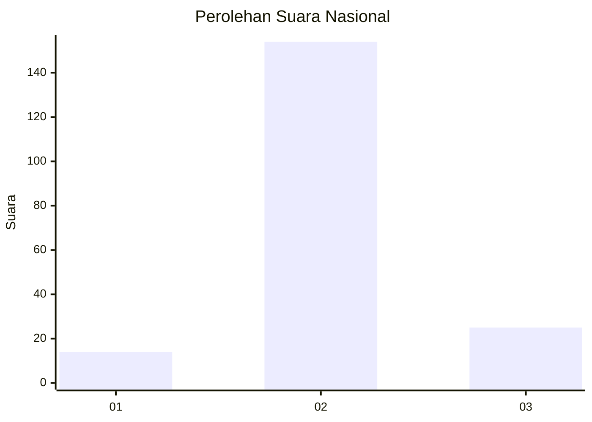
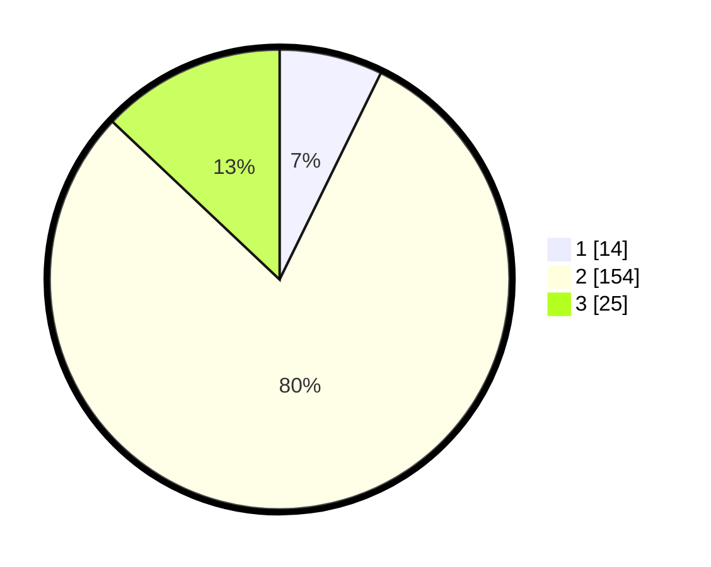

# Hasil

## Grafik

## Tabel

| No. | Nama Paslon    | Suara | Suara (raw) | Persentase |
|:--- |:-------------- | -----:| -----------:| ----------:|
| 1   | ANIES MUHAIMIN | 14    | [14][p-1]   | 7,25       |
| 2   | PRABOWO GIBRAN | 154   | [154][p-2]  | 79,79      |
| 3   | GANJAR MAHFUD  | 25    | [25][p-3]   | 12,95      |

[p-1]: https://github.com/gigit-pemilu/pemilu-2024/blob/main/pilpres/hitung-suara/sub/16-sumatera-selatan/sub/07-banyuasin/sub/08-muara-telang/sub/2009-sumber-hidup/sub/006-tps/sub/paslon-1.txt
[p-2]: https://github.com/gigit-pemilu/pemilu-2024/blob/main/pilpres/hitung-suara/sub/16-sumatera-selatan/sub/07-banyuasin/sub/08-muara-telang/sub/2009-sumber-hidup/sub/006-tps/sub/paslon-2.txt
[p-3]: https://github.com/gigit-pemilu/pemilu-2024/blob/main/pilpres/hitung-suara/sub/16-sumatera-selatan/sub/07-banyuasin/sub/08-muara-telang/sub/2009-sumber-hidup/sub/006-tps/sub/paslon-3.txt

## Foto C Plano

https://sirekap-obj-formc.kpu.go.id/0de6/pemilu/ppwp/16/07/08/20/09/1607082009006-20240214-213053--dcd0dbaa-95b7-4f5b-838c-989cd4af7b3b.jpg

https://sirekap-obj-formc.kpu.go.id/0de6/pemilu/ppwp/16/07/08/20/09/1607082009006-20240214-213346--3bceb73b-269d-4dca-92a5-ca04fc87e230.jpg

https://sirekap-obj-formc.kpu.go.id/0de6/pemilu/ppwp/16/07/08/20/09/1607082009006-20240214-213708--20a040e8-2184-43c9-b5b2-37598842586a.jpg

## Metadata

| Key        | Value               |
| ---------- | ------------------- |
| Time Stamp | 2024-02-15 23:29:50 |

