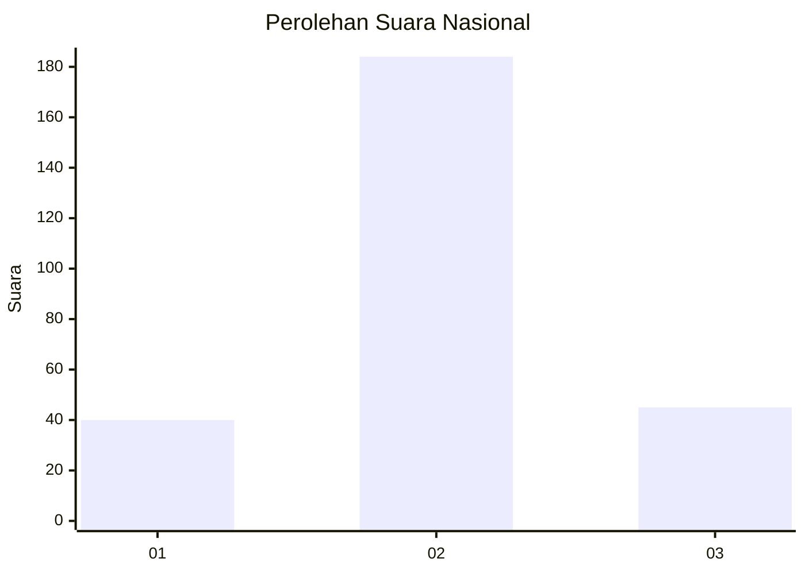
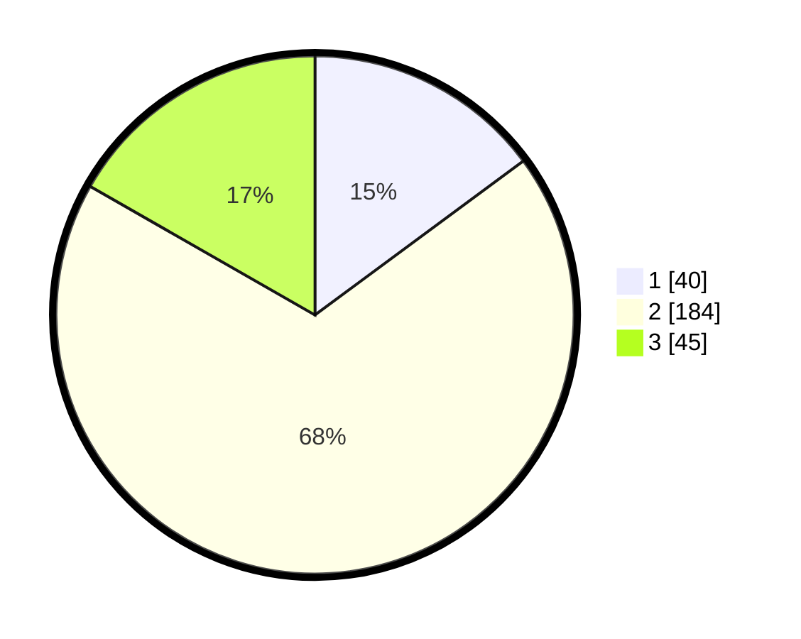

# Hasil

## Grafik

## Tabel

| No. | Nama Paslon    | Suara | Suara (raw) | Persentase |
|:--- |:-------------- | -----:| -----------:| ----------:|
| 1   | ANIES MUHAIMIN | 40    | [40][p-1]   | 14,87      |
| 2   | PRABOWO GIBRAN | 184   | [184][p-2]  | 68,40      |
| 3   | GANJAR MAHFUD  | 45    | [45][p-3]   | 16,73      |

[p-1]: https://github.com/gigit-pemilu/pemilu-2024/blob/main/pilpres/hitung-suara/sub/16-sumatera-selatan/sub/07-banyuasin/sub/08-muara-telang/sub/2015-panca-mukti/sub/002-tps/sub/paslon-1.txt
[p-2]: https://github.com/gigit-pemilu/pemilu-2024/blob/main/pilpres/hitung-suara/sub/16-sumatera-selatan/sub/07-banyuasin/sub/08-muara-telang/sub/2015-panca-mukti/sub/002-tps/sub/paslon-2.txt
[p-3]: https://github.com/gigit-pemilu/pemilu-2024/blob/main/pilpres/hitung-suara/sub/16-sumatera-selatan/sub/07-banyuasin/sub/08-muara-telang/sub/2015-panca-mukti/sub/002-tps/sub/paslon-3.txt

## Foto C Plano

https://sirekap-obj-formc.kpu.go.id/2ca2/pemilu/ppwp/16/07/08/20/15/1607082015002-20240215-002251--40338424-83c5-426a-a6cd-d665e4b4d11e.jpg

https://sirekap-obj-formc.kpu.go.id/2ca2/pemilu/ppwp/16/07/08/20/15/1607082015002-20240215-002256--729aa88d-db95-4d7e-8ecb-c422ec7198fd.jpg

https://sirekap-obj-formc.kpu.go.id/2ca2/pemilu/ppwp/16/07/08/20/15/1607082015002-20240215-002302--d119d008-c87f-4aa9-b9f2-920c6524059d.jpg

## Metadata

| Key        | Value               |
| ---------- | ------------------- |
| Time Stamp | 2024-02-15 22:00:27 |

