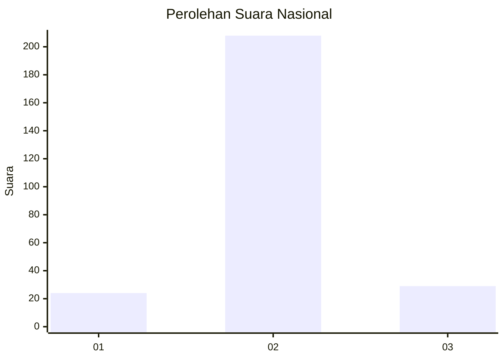
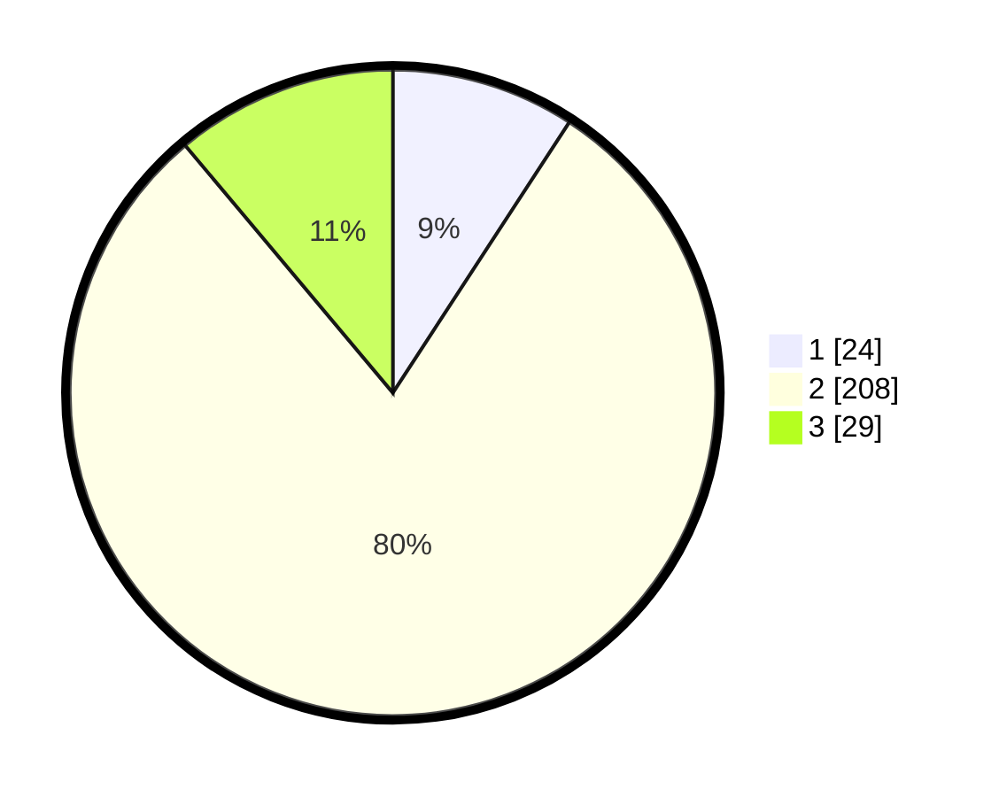

# Hasil

## Grafik

## Tabel

| No. | Nama Paslon    | Suara | Suara (raw) | Persentase |
|:--- |:-------------- | -----:| -----------:| ----------:|
| 1   | ANIES MUHAIMIN | 24    | [24][p-1]   | 9,20       |
| 2   | PRABOWO GIBRAN | 208   | [208][p-2]  | 79,69      |
| 3   | GANJAR MAHFUD  | 29    | [29][p-3]   | 11,11      |

[p-1]: https://github.com/gigit-pemilu/pemilu-2024/blob/main/pilpres/hitung-suara/sub/16-sumatera-selatan/sub/07-banyuasin/sub/08-muara-telang/sub/2015-panca-mukti/sub/004-tps/sub/paslon-1.txt
[p-2]: https://github.com/gigit-pemilu/pemilu-2024/blob/main/pilpres/hitung-suara/sub/16-sumatera-selatan/sub/07-banyuasin/sub/08-muara-telang/sub/2015-panca-mukti/sub/004-tps/sub/paslon-2.txt
[p-3]: https://github.com/gigit-pemilu/pemilu-2024/blob/main/pilpres/hitung-suara/sub/16-sumatera-selatan/sub/07-banyuasin/sub/08-muara-telang/sub/2015-panca-mukti/sub/004-tps/sub/paslon-3.txt

## Foto C Plano

https://sirekap-obj-formc.kpu.go.id/695f/pemilu/ppwp/16/07/08/20/15/1607082015004-20240214-221347--7c93fb16-e4c0-4158-8b64-980e8736ca21.jpg

https://sirekap-obj-formc.kpu.go.id/695f/pemilu/ppwp/16/07/08/20/15/1607082015004-20240214-221632--8e9d9031-d2a2-4ffc-84e0-43914e75a11b.jpg

https://sirekap-obj-formc.kpu.go.id/695f/pemilu/ppwp/16/07/08/20/15/1607082015004-20240214-221850--35fc2600-03ad-4eba-ace6-358d83c239f9.jpg

## Metadata

| Key        | Value               |
| ---------- | ------------------- |
| Time Stamp | 2024-02-15 23:29:50 |

