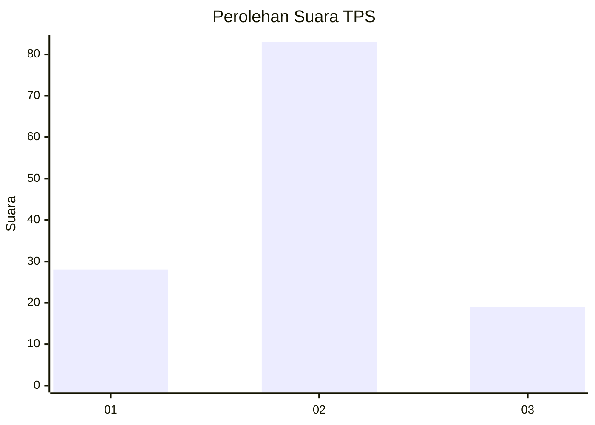
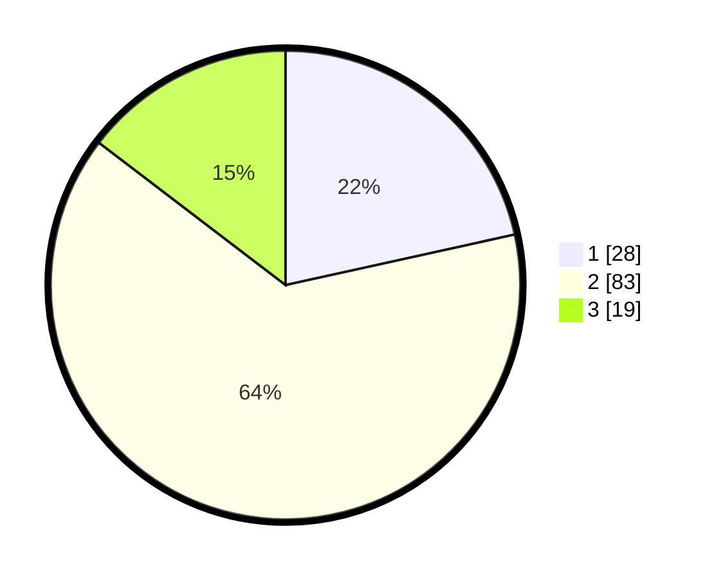

# Hasil

## Grafik

## Tabel

| No. | Nama Paslon    | Suara | Suara (raw) | Persentase |
|:--- |:-------------- | -----:| -----------:| ----------:|
| 1   | ANIES MUHAIMIN | 28    | [28][p-1]   | 21,54      |
| 2   | PRABOWO GIBRAN | 83    | [83][p-2]   | 63,85      |
| 3   | GANJAR MAHFUD  | 19    | [19][p-3]   | 14,62      |

[p-1]: https://github.com/gigit-pemilu/pemilu-2024-16-sumatera-selatan/blob/main/pilpres/hitung-suara/sub/16-sumatera-selatan/sub/07-banyuasin/sub/08-muara-telang/sub/2019-mekar-sari/sub/003-tps/sub/paslon-1.txt
[p-2]: https://github.com/gigit-pemilu/pemilu-2024-16-sumatera-selatan/blob/main/pilpres/hitung-suara/sub/16-sumatera-selatan/sub/07-banyuasin/sub/08-muara-telang/sub/2019-mekar-sari/sub/003-tps/sub/paslon-2.txt
[p-3]: https://github.com/gigit-pemilu/pemilu-2024-16-sumatera-selatan/blob/main/pilpres/hitung-suara/sub/16-sumatera-selatan/sub/07-banyuasin/sub/08-muara-telang/sub/2019-mekar-sari/sub/003-tps/sub/paslon-3.txt

## Foto C Plano

https://sirekap-obj-formc.kpu.go.id/22d9/pemilu/ppwp/16/07/08/20/19/1607082019003-20240215-023346--6108bd4a-8ede-4b24-bd43-df34260eb848.jpg

https://sirekap-obj-formc.kpu.go.id/22d9/pemilu/ppwp/16/07/08/20/19/1607082019003-20240215-023901--9118140b-21c5-44ef-b03d-c65f559ce337.jpg

https://sirekap-obj-formc.kpu.go.id/22d9/pemilu/ppwp/16/07/08/20/19/1607082019003-20240215-024224--d192c738-bd52-4b2f-b369-21ec810a9925.jpg

## Metadata

| Key        | Value               |
| ---------- | ------------------- |
| Time Stamp | 2024-02-15 22:30:27 |

