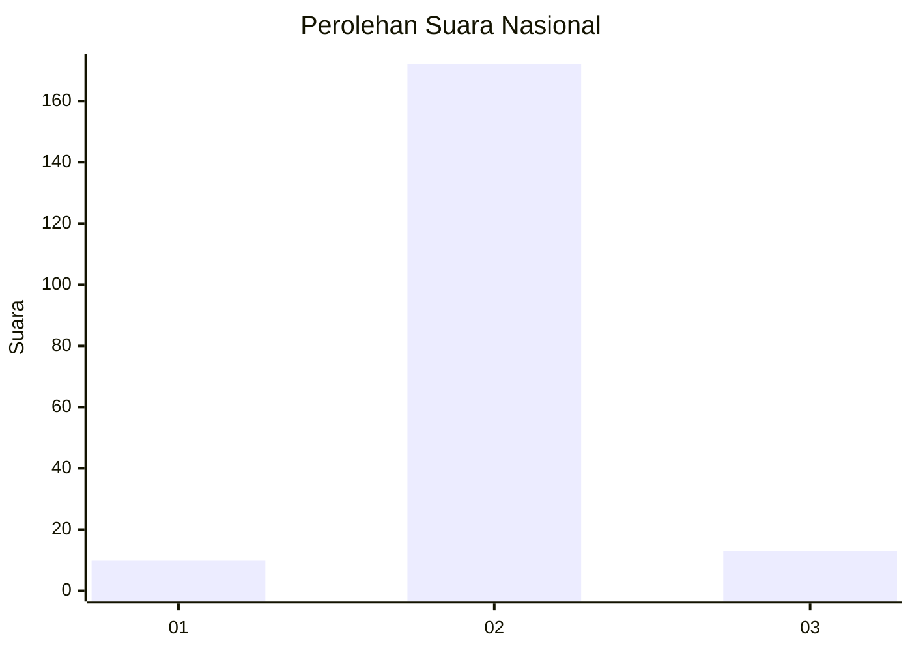
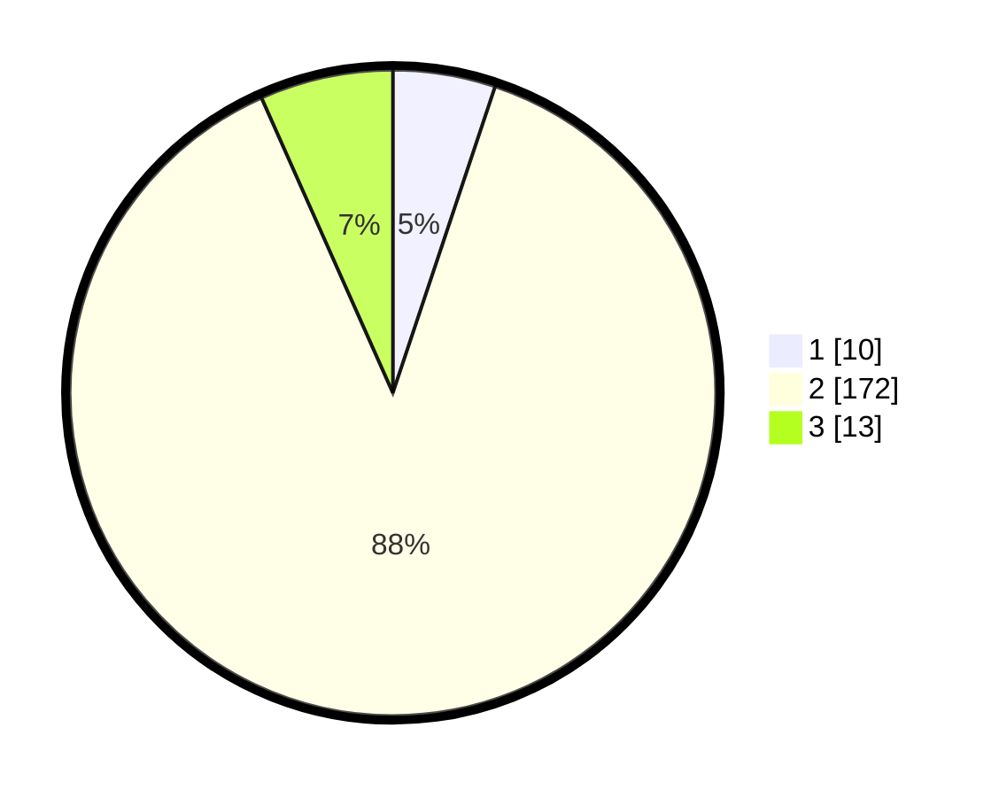

# Hasil

## Grafik

## Tabel

| No. | Nama Paslon    | Suara | Suara (raw) | Persentase |
|:--- |:-------------- | -----:| -----------:| ----------:|
| 1   | ANIES MUHAIMIN | 10    | [10][p-1]   | 5,13       |
| 2   | PRABOWO GIBRAN | 172   | [172][p-2]  | 88,21      |
| 3   | GANJAR MAHFUD  | 13    | [13][p-3]   | 6,67       |

[p-1]: https://github.com/gigit-pemilu/pemilu-2024/blob/main/pilpres/hitung-suara/sub/16-sumatera-selatan/sub/07-banyuasin/sub/08-muara-telang/sub/2026-upang-jaya/sub/009-tps/sub/paslon-1.txt
[p-2]: https://github.com/gigit-pemilu/pemilu-2024/blob/main/pilpres/hitung-suara/sub/16-sumatera-selatan/sub/07-banyuasin/sub/08-muara-telang/sub/2026-upang-jaya/sub/009-tps/sub/paslon-2.txt
[p-3]: https://github.com/gigit-pemilu/pemilu-2024/blob/main/pilpres/hitung-suara/sub/16-sumatera-selatan/sub/07-banyuasin/sub/08-muara-telang/sub/2026-upang-jaya/sub/009-tps/sub/paslon-3.txt

## Foto C Plano

https://sirekap-obj-formc.kpu.go.id/8e81/pemilu/ppwp/16/07/08/20/26/1607082026009-20240214-160110--eaa843b9-6fe3-4275-8f4b-e0ae80f06f4d.jpg

https://sirekap-obj-formc.kpu.go.id/8e81/pemilu/ppwp/16/07/08/20/26/1607082026009-20240214-155605--f92e1f10-a08b-4c92-85e5-d8e5bf329fa0.jpg

https://sirekap-obj-formc.kpu.go.id/8e81/pemilu/ppwp/16/07/08/20/26/1607082026009-20240214-155828--ab7ef7e0-47d1-48e0-8b15-a292c1cb1b79.jpg

## Metadata

| Key        | Value               |
| ---------- | ------------------- |
| Time Stamp | 2024-02-14 21:46:01 |

