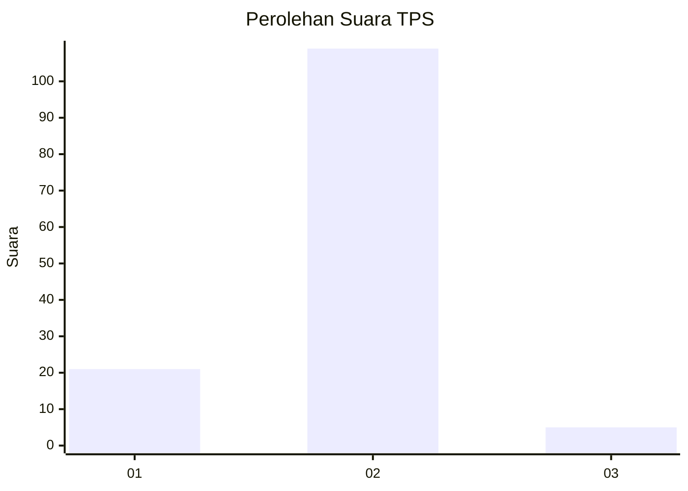
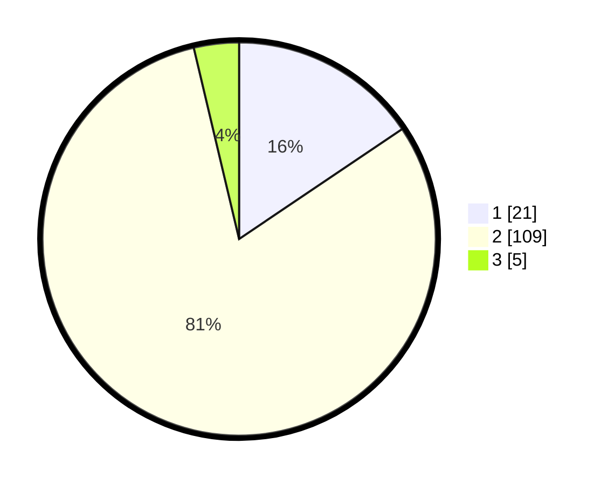

# Hasil

## Grafik

## Tabel

| No. | Nama Paslon    | Suara | Suara (raw) | Persentase |
|:--- |:-------------- | -----:| -----------:| ----------:|
| 1   | ANIES MUHAIMIN | 21    | [21][p-1]   | 15,56      |
| 2   | PRABOWO GIBRAN | 109   | [109][p-2]  | 80,74      |
| 3   | GANJAR MAHFUD  | 5     | [5][p-3]    | 3,70       |

[p-1]: https://github.com/gigit-pemilu/pemilu-2024-16-sumatera-selatan/blob/main/pilpres/hitung-suara/sub/16-sumatera-selatan/sub/07-banyuasin/sub/08-muara-telang/sub/2028-upang-cemara/sub/001-tps/sub/paslon-1.txt
[p-2]: https://github.com/gigit-pemilu/pemilu-2024-16-sumatera-selatan/blob/main/pilpres/hitung-suara/sub/16-sumatera-selatan/sub/07-banyuasin/sub/08-muara-telang/sub/2028-upang-cemara/sub/001-tps/sub/paslon-2.txt
[p-3]: https://github.com/gigit-pemilu/pemilu-2024-16-sumatera-selatan/blob/main/pilpres/hitung-suara/sub/16-sumatera-selatan/sub/07-banyuasin/sub/08-muara-telang/sub/2028-upang-cemara/sub/001-tps/sub/paslon-3.txt

## Foto C Plano

https://sirekap-obj-formc.kpu.go.id/7d15/pemilu/ppwp/16/07/08/20/28/1607082028001-20240215-101712--6c6c4b9a-caa0-483f-96ef-fd74fe64333f.jpg

https://sirekap-obj-formc.kpu.go.id/7d15/pemilu/ppwp/16/07/08/20/28/1607082028001-20240215-165917--e2e3a0d5-fb83-4af3-9465-29f8865e7eb4.jpg

https://sirekap-obj-formc.kpu.go.id/7d15/pemilu/ppwp/16/07/08/20/28/1607082028001-20240215-170038--7db9fdc6-6374-4c80-bf12-fd5e61aab644.jpg

## Metadata

| Key        | Value               |
| ---------- | ------------------- |
| Time Stamp | 2024-02-15 23:29:50 |

