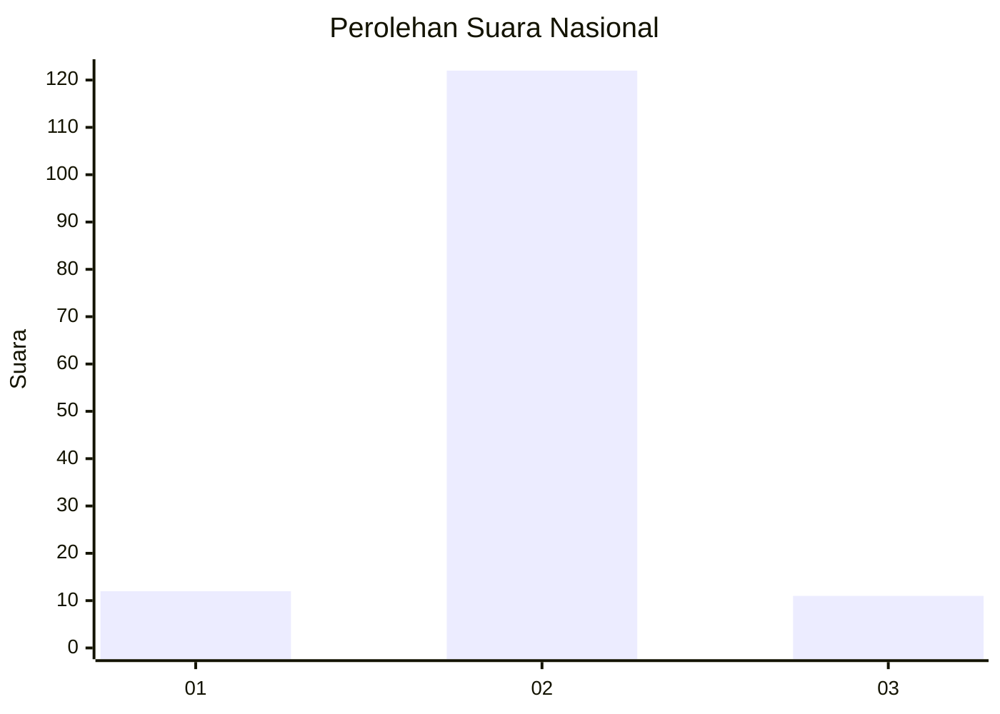
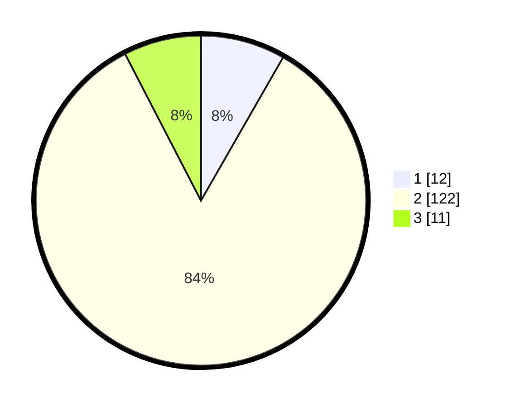

# Hasil

## Grafik

## Tabel

| No. | Nama Paslon    | Suara | Suara (raw) | Persentase |
|:--- |:-------------- | -----:| -----------:| ----------:|
| 1   | ANIES MUHAIMIN | 12    | [12][p-1]   | 8,28       |
| 2   | PRABOWO GIBRAN | 122   | [122][p-2]  | 84,14      |
| 3   | GANJAR MAHFUD  | 11    | [11][p-3]   | 7,59       |

[p-1]: https://github.com/gigit-pemilu/pemilu-2024/blob/main/pilpres/hitung-suara/sub/16-sumatera-selatan/sub/07-banyuasin/sub/08-muara-telang/sub/2028-upang-cemara/sub/002-tps/sub/paslon-1.txt
[p-2]: https://github.com/gigit-pemilu/pemilu-2024/blob/main/pilpres/hitung-suara/sub/16-sumatera-selatan/sub/07-banyuasin/sub/08-muara-telang/sub/2028-upang-cemara/sub/002-tps/sub/paslon-2.txt
[p-3]: https://github.com/gigit-pemilu/pemilu-2024/blob/main/pilpres/hitung-suara/sub/16-sumatera-selatan/sub/07-banyuasin/sub/08-muara-telang/sub/2028-upang-cemara/sub/002-tps/sub/paslon-3.txt

## Foto C Plano

https://sirekap-obj-formc.kpu.go.id/711c/pemilu/ppwp/16/07/08/20/28/1607082028002-20240214-230840--d61ddd75-b73a-41e3-8089-439cb9e26a84.jpg

https://sirekap-obj-formc.kpu.go.id/711c/pemilu/ppwp/16/07/08/20/28/1607082028002-20240214-230852--76c55462-19ec-4e43-a41a-1bb3416bda80.jpg

https://sirekap-obj-formc.kpu.go.id/711c/pemilu/ppwp/16/07/08/20/28/1607082028002-20240214-230854--4269d7b7-ad10-4739-9c03-61b393833db4.jpg

## Metadata

| Key        | Value               |
| ---------- | ------------------- |
| Time Stamp | 2024-02-15 23:29:50 |

