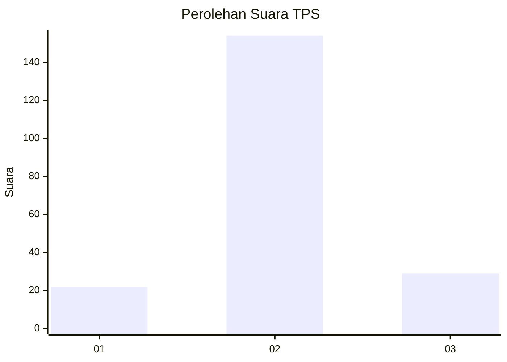
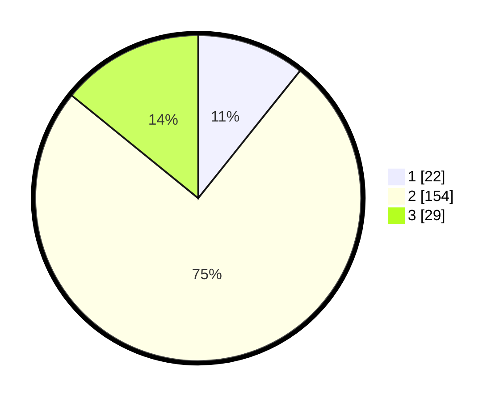

# Hasil

## Grafik

## Tabel

| No. | Nama Paslon    | Suara | Suara (raw) | Persentase |
|:--- |:-------------- | -----:| -----------:| ----------:|
| 1   | ANIES MUHAIMIN | 22    | [22][p-1]   | 10,73      |
| 2   | PRABOWO GIBRAN | 154   | [154][p-2]  | 75,12      |
| 3   | GANJAR MAHFUD  | 29    | [29][p-3]   | 14,15      |

[p-1]: https://github.com/gigit-pemilu/pemilu-2024-16-sumatera-selatan/blob/main/pilpres/hitung-suara/sub/16-sumatera-selatan/sub/07-banyuasin/sub/09-makarti-jaya/sub/1012-makarti-jaya/sub/003-tps/sub/paslon-1.txt
[p-2]: https://github.com/gigit-pemilu/pemilu-2024-16-sumatera-selatan/blob/main/pilpres/hitung-suara/sub/16-sumatera-selatan/sub/07-banyuasin/sub/09-makarti-jaya/sub/1012-makarti-jaya/sub/003-tps/sub/paslon-2.txt
[p-3]: https://github.com/gigit-pemilu/pemilu-2024-16-sumatera-selatan/blob/main/pilpres/hitung-suara/sub/16-sumatera-selatan/sub/07-banyuasin/sub/09-makarti-jaya/sub/1012-makarti-jaya/sub/003-tps/sub/paslon-3.txt

## Foto C Plano

https://sirekap-obj-formc.kpu.go.id/1fcc/pemilu/ppwp/16/07/09/10/12/1607091012003-20240214-155455--f63137f0-6a0c-448a-9084-ab2e58c19ea8.jpg

https://sirekap-obj-formc.kpu.go.id/1fcc/pemilu/ppwp/16/07/09/10/12/1607091012003-20240214-155228--7a4da8b2-c98c-4afd-b5f8-606babb21334.jpg

https://sirekap-obj-formc.kpu.go.id/1fcc/pemilu/ppwp/16/07/09/10/12/1607091012003-20240214-155713--c1689aa7-61c6-4f8f-9508-1bd7d04d97c2.jpg

## Metadata

| Key        | Value               |
| ---------- | ------------------- |
| Time Stamp | 2024-02-14 21:46:01 |

