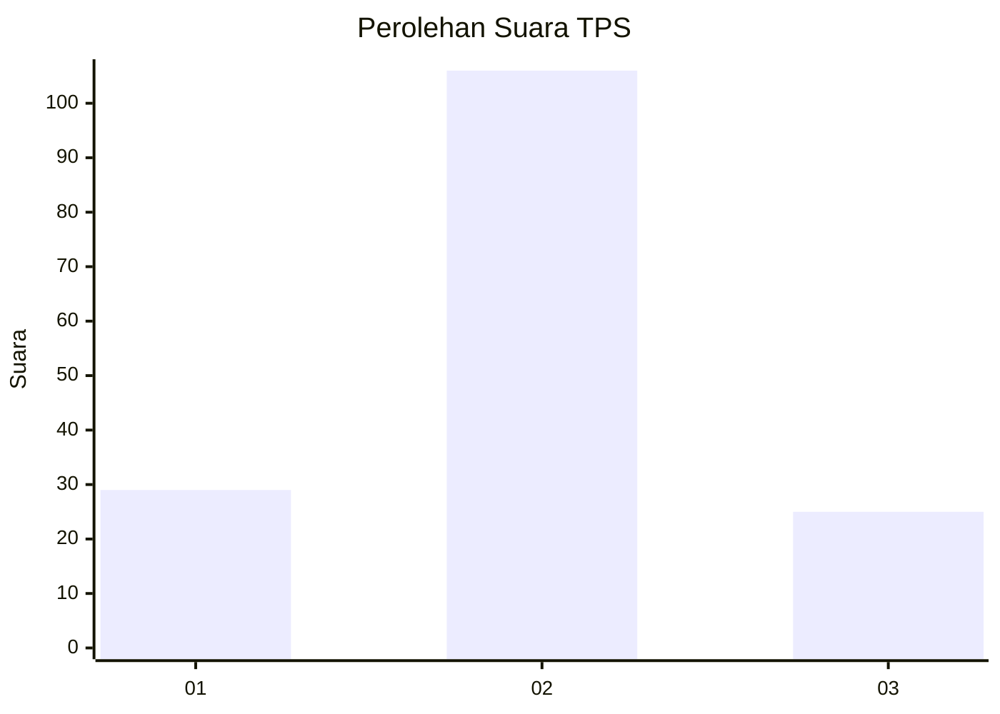
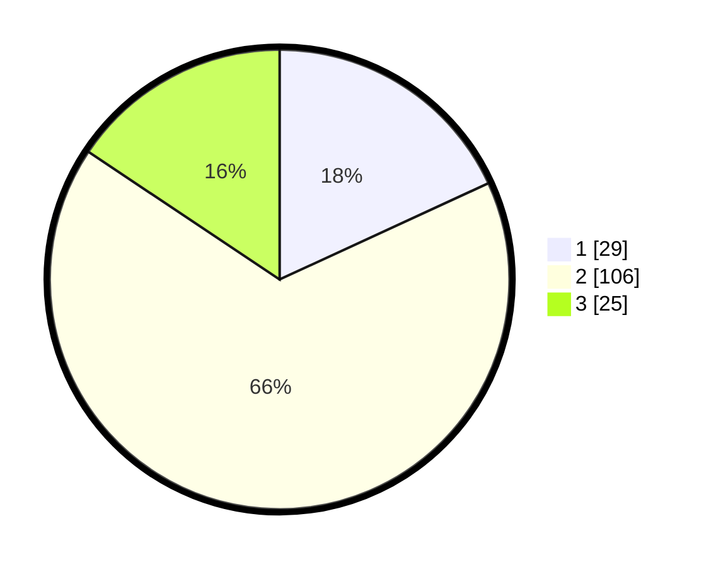

# Hasil

## Grafik

## Tabel

| No. | Nama Paslon    | Suara | Suara (raw) | Persentase |
|:--- |:-------------- | -----:| -----------:| ----------:|
| 1   | ANIES MUHAIMIN | 29    | [29][p-1]   | 18,13      |
| 2   | PRABOWO GIBRAN | 106   | [106][p-2]  | 66,25      |
| 3   | GANJAR MAHFUD  | 25    | [25][p-3]   | 15,63      |

[p-1]: https://github.com/gigit-pemilu/pemilu-2024-16-sumatera-selatan/blob/main/pilpres/hitung-suara/sub/16-sumatera-selatan/sub/07-banyuasin/sub/09-makarti-jaya/sub/1012-makarti-jaya/sub/004-tps/sub/paslon-1.txt
[p-2]: https://github.com/gigit-pemilu/pemilu-2024-16-sumatera-selatan/blob/main/pilpres/hitung-suara/sub/16-sumatera-selatan/sub/07-banyuasin/sub/09-makarti-jaya/sub/1012-makarti-jaya/sub/004-tps/sub/paslon-2.txt
[p-3]: https://github.com/gigit-pemilu/pemilu-2024-16-sumatera-selatan/blob/main/pilpres/hitung-suara/sub/16-sumatera-selatan/sub/07-banyuasin/sub/09-makarti-jaya/sub/1012-makarti-jaya/sub/004-tps/sub/paslon-3.txt

## Foto C Plano

https://sirekap-obj-formc.kpu.go.id/7b20/pemilu/ppwp/16/07/09/10/12/1607091012004-20240215-035221--4bf947c9-675c-4fa3-983c-1ffc4becedd3.jpg

https://sirekap-obj-formc.kpu.go.id/7b20/pemilu/ppwp/16/07/09/10/12/1607091012004-20240215-035230--95378051-78c3-4aca-9d59-60116d1de3d7.jpg

https://sirekap-obj-formc.kpu.go.id/7b20/pemilu/ppwp/16/07/09/10/12/1607091012004-20240215-035236--bb97801e-7847-490e-bd05-18dc9e2c89dc.jpg

## Metadata

| Key        | Value               |
| ---------- | ------------------- |
| Time Stamp | 2024-02-15 15:00:29 |

