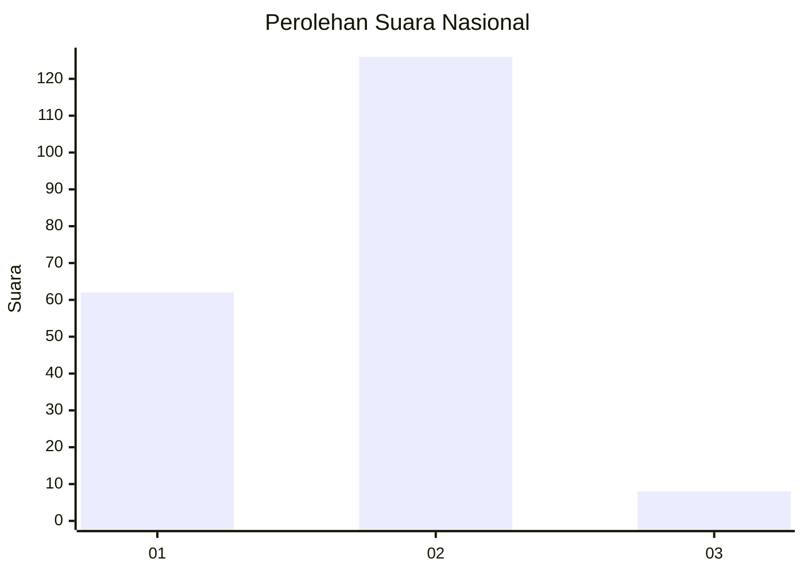
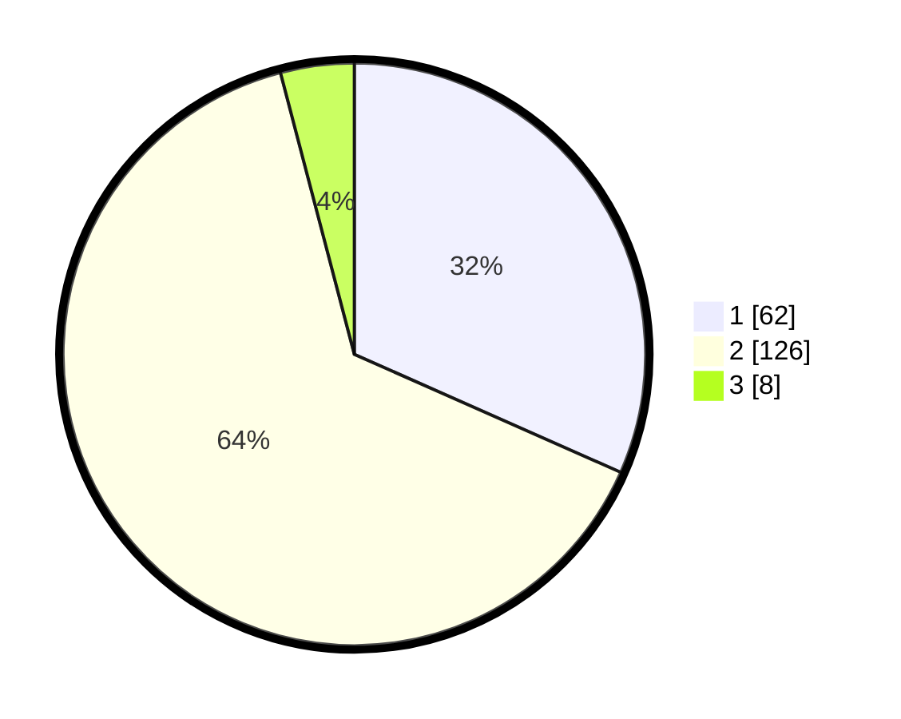

# Hasil

## Grafik

## Tabel

| No. | Nama Paslon    | Suara | Suara (raw) | Persentase |
|:--- |:-------------- | -----:| -----------:| ----------:|
| 1   | ANIES MUHAIMIN | 62    | [62][p-1]   | 31,63      |
| 2   | PRABOWO GIBRAN | 126   | [126][p-2]  | 64,29      |
| 3   | GANJAR MAHFUD  | 8     | [8][p-3]    | 4,08       |

[p-1]: https://github.com/gigit-pemilu/pemilu-2024/blob/main/pilpres/hitung-suara/sub/16-sumatera-selatan/sub/07-banyuasin/sub/09-makarti-jaya/sub/1012-makarti-jaya/sub/008-tps/sub/paslon-1.txt
[p-2]: https://github.com/gigit-pemilu/pemilu-2024/blob/main/pilpres/hitung-suara/sub/16-sumatera-selatan/sub/07-banyuasin/sub/09-makarti-jaya/sub/1012-makarti-jaya/sub/008-tps/sub/paslon-2.txt
[p-3]: https://github.com/gigit-pemilu/pemilu-2024/blob/main/pilpres/hitung-suara/sub/16-sumatera-selatan/sub/07-banyuasin/sub/09-makarti-jaya/sub/1012-makarti-jaya/sub/008-tps/sub/paslon-3.txt

## Foto C Plano

https://sirekap-obj-formc.kpu.go.id/b8eb/pemilu/ppwp/16/07/09/10/12/1607091012008-20240215-042649--972de3b0-a2c1-4e6c-a900-587116608507.jpg

https://sirekap-obj-formc.kpu.go.id/b8eb/pemilu/ppwp/16/07/09/10/12/1607091012008-20240215-030301--51b15c0c-7a7d-4b69-b81c-2f3595cb219c.jpg

https://sirekap-obj-formc.kpu.go.id/b8eb/pemilu/ppwp/16/07/09/10/12/1607091012008-20240215-030731--0091497d-5473-4f01-b66f-6fdf9789c7d9.jpg

## Metadata

| Key        | Value               |
| ---------- | ------------------- |
| Time Stamp | 2024-02-15 15:00:29 |

