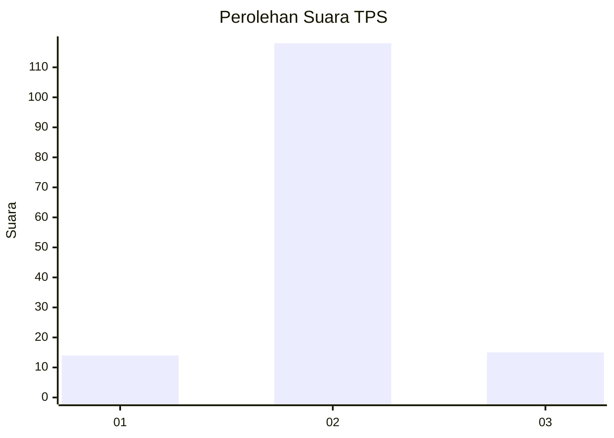
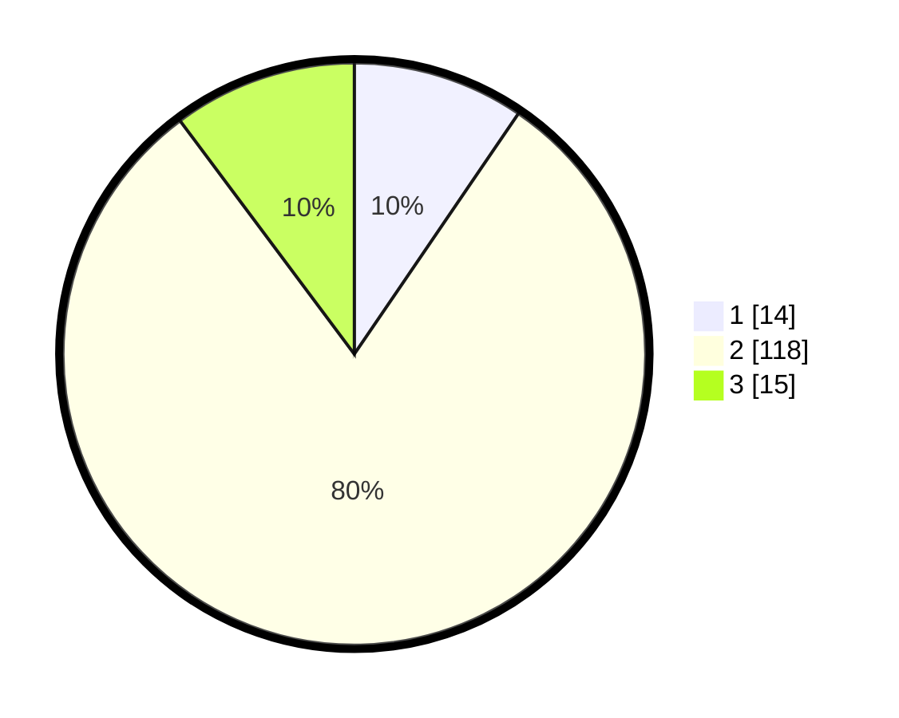

# Hasil

## Grafik

## Tabel

| No. | Nama Paslon    | Suara | Suara (raw) | Persentase |
|:--- |:-------------- | -----:| -----------:| ----------:|
| 1   | ANIES MUHAIMIN | 14    | [14][p-1]   | 9,52       |
| 2   | PRABOWO GIBRAN | 118   | [118][p-2]  | 80,27      |
| 3   | GANJAR MAHFUD  | 15    | [15][p-3]   | 10,20      |

[p-1]: https://github.com/gigit-pemilu/pemilu-2024-16-sumatera-selatan/blob/main/pilpres/hitung-suara/sub/16-sumatera-selatan/sub/07-banyuasin/sub/10-talang-kelapa/sub/1003-sukomoro/sub/006-tps/sub/paslon-1.txt
[p-2]: https://github.com/gigit-pemilu/pemilu-2024-16-sumatera-selatan/blob/main/pilpres/hitung-suara/sub/16-sumatera-selatan/sub/07-banyuasin/sub/10-talang-kelapa/sub/1003-sukomoro/sub/006-tps/sub/paslon-2.txt
[p-3]: https://github.com/gigit-pemilu/pemilu-2024-16-sumatera-selatan/blob/main/pilpres/hitung-suara/sub/16-sumatera-selatan/sub/07-banyuasin/sub/10-talang-kelapa/sub/1003-sukomoro/sub/006-tps/sub/paslon-3.txt

## Foto C Plano

https://sirekap-obj-formc.kpu.go.id/2ee8/pemilu/ppwp/16/07/10/10/03/1607101003006-20240215-043012--ba4f81fe-c7d7-417c-a04d-bbb1ba3b18fc.jpg

https://sirekap-obj-formc.kpu.go.id/2ee8/pemilu/ppwp/16/07/10/10/03/1607101003006-20240215-043231--807646b6-82f8-45c1-b11f-b994b1dc8d78.jpg

https://sirekap-obj-formc.kpu.go.id/2ee8/pemilu/ppwp/16/07/10/10/03/1607101003006-20240215-043301--7999c0b1-2fd8-432a-bf49-8be01e3bfd03.jpg

## Metadata

| Key        | Value               |
| ---------- | ------------------- |
| Time Stamp | 2024-02-15 15:00:29 |

