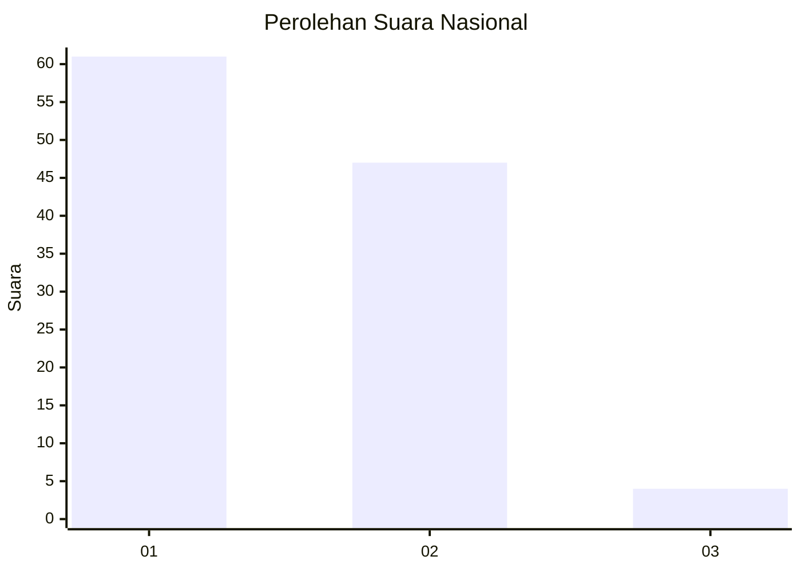
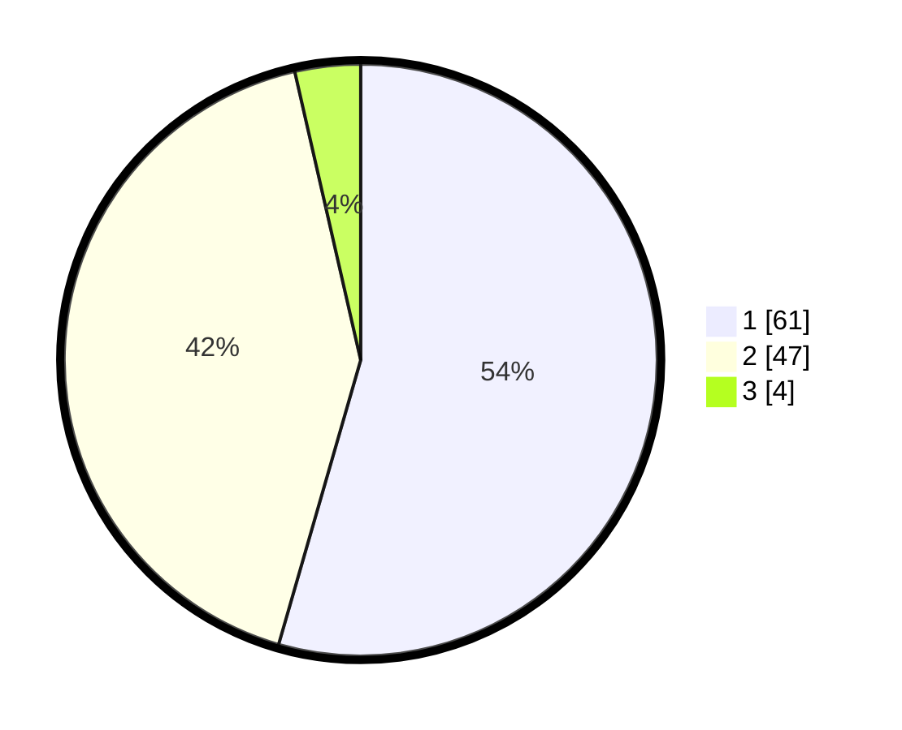

# Hasil

## Grafik

## Tabel

| No. | Nama Paslon    | Suara | Suara (raw) | Persentase |
|:--- |:-------------- | -----:| -----------:| ----------:|
| 1   | ANIES MUHAIMIN | 61    | [61][p-1]   | 54,46      |
| 2   | PRABOWO GIBRAN | 47    | [47][p-2]   | 41,96      |
| 3   | GANJAR MAHFUD  | 4     | [4][p-3]    | 3,57       |

[p-1]: https://github.com/gigit-pemilu/pemilu-2024/blob/main/pilpres/hitung-suara/sub/16-sumatera-selatan/sub/07-banyuasin/sub/10-talang-kelapa/sub/1004-sukajadi/sub/010-tps/sub/paslon-1.txt
[p-2]: https://github.com/gigit-pemilu/pemilu-2024/blob/main/pilpres/hitung-suara/sub/16-sumatera-selatan/sub/07-banyuasin/sub/10-talang-kelapa/sub/1004-sukajadi/sub/010-tps/sub/paslon-2.txt
[p-3]: https://github.com/gigit-pemilu/pemilu-2024/blob/main/pilpres/hitung-suara/sub/16-sumatera-selatan/sub/07-banyuasin/sub/10-talang-kelapa/sub/1004-sukajadi/sub/010-tps/sub/paslon-3.txt

## Foto C Plano

https://sirekap-obj-formc.kpu.go.id/85e5/pemilu/ppwp/16/07/10/10/04/1607101004010-20240224-154719--7bb6541e-ed55-4187-ac60-7d384e95ea8e.jpg

https://sirekap-obj-formc.kpu.go.id/85e5/pemilu/ppwp/16/07/10/10/04/1607101004010-20240223-205224--a28645d2-add7-4f66-9454-dd0ceef1501c.jpg

https://sirekap-obj-formc.kpu.go.id/85e5/pemilu/ppwp/16/07/10/10/04/1607101004010-20240223-203850--483a306c-6b6c-423e-a881-422259d74af2.jpg

## Metadata

| Key        | Value               |
| ---------- | ------------------- |
| Time Stamp | 2024-02-25 16:00:00 |

